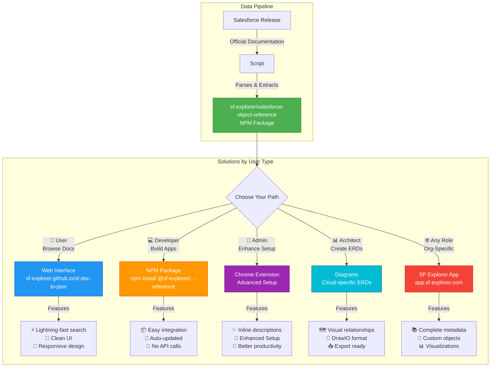
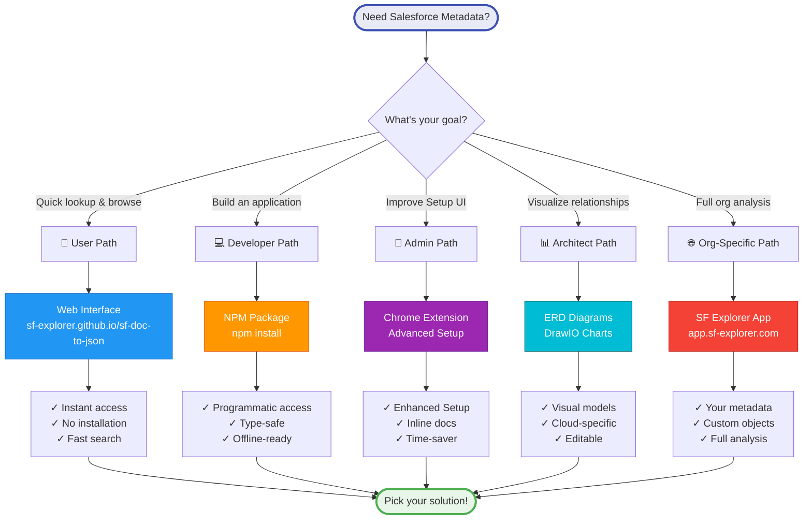

**Want to access Salesforce standard object and field descriptions without digging through Setup?**

There's a better way! After every Salesforce release, the SF Explorer team runs a script that parses the official documentation and publishes an npm package: **@sf-explorer/salesforce-object-reference**.

<!-- truncate -->

## 📊 Visual Overview

Here's how the SF Explorer ecosystem provides Salesforce metadata to different users:



## 🎯 The Challenge

As Salesforce developers and administrators, we often need quick access to standard object and field descriptions. But navigating through Setup or hunting through the official documentation can be time-consuming and inefficient.

That's why we built a comprehensive ecosystem of tools to make this information readily accessible—whether you're a user, developer, or administrator.

## 🚀 Solutions for Every Use Case

### 1. 📖 For Users: Lightning-Fast Documentation Browser

If you just want to **browse the documentation** with a really fast interface, check out:

**🔗 [https://sf-explorer.github.io/sf-doc-to-json/](https://sf-explorer.github.io/sf-doc-to-json/)**

This web interface provides instant access to all standard object and field descriptions with:
- ⚡ Lightning-fast search
- 🎨 Clean, intuitive UI
- 📱 Responsive design
- 🔍 Comprehensive metadata coverage

### 2. 💻 For Developers: NPM Package

If you're **building an application** that needs programmatic access to Salesforce metadata, you can consume the npm package directly:

```bash
npm install @sf-explorer/salesforce-object-reference
```

**Benefits:**
- 📦 Easy integration into your applications
- 🔄 Updated with each Salesforce release
- 🎯 Type-safe access to metadata
- 🚀 No API calls required

### 3. 🔧 For Admins: Chrome Extension

If you're an **administrator** who wants to add descriptions directly within Setup, install our Chrome extension that enhances your Setup experience:

**🔗 [SF Explorer Advanced Setup](https://github.com/sf-explorer/sf-explorer-advanced-setup/blob/main/readme.md)**

This extension:
- ✨ Enriches Setup with field descriptions
- 📝 Shows documentation inline
- 🎯 Improves productivity
- 💡 Makes configuration easier

### 4. 📊 For Architects: ERD Diagrams

If you need **Entity Relationship Diagrams (ERDs) by cloud** with DrawIO charts:

**🔗 [SF Explorer Diagrams](https://github.com/sf-explorer/app?tab=readme-ov-file#diagrams)**

Features:
- 🗺️ Cloud-specific ERDs
- 📐 DrawIO format for easy editing
- 🔗 Visual relationship mapping
- 📥 Export capabilities

### 5. 🌐 For Your Org: Custom Data Dictionary

And finally, if you want a **complete data dictionary with objects and fields specific to your org**, just connect to SF Explorer:

**🔗 [app.sf-explorer.com](https://app.sf-explorer.com)**

Get:
- 📚 Complete org metadata
- 🎨 Custom object documentation
- 🔍 Search across all metadata
- 📊 Relationship visualization
- 📝 Data dictionary exports

## 💰 All Free, Most Open Source!

The best part? **All of these tools are completely free**, and most are **open source**!

We believe in giving back to the Salesforce community by:
- 🆓 Providing free access to all tools
- 🌐 Open-sourcing the code
- 🔄 Keeping documentation up-to-date
- 🤝 Building for the community

## 🛠️ How It Works

Behind the scenes, here's what happens:

1. **After each Salesforce release**, our automated scripts parse the official Salesforce documentation
2. We **extract all standard object and field metadata** including descriptions, data types, and relationships
3. The data is **published as an npm package** (`@sf-explorer/salesforce-object-reference`)
4. All our tools and interfaces consume this package to provide **consistent, up-to-date information**

## 🎯 Choose Your Path



Depending on your role and needs, pick the solution that works best for you:

| Role | Use Case | Solution |
|------|----------|----------|
| 👤 User | Browse documentation | [Web Interface](https://sf-explorer.github.io/sf-doc-to-json/) |
| 💻 Developer | Build applications | [NPM Package](https://www.npmjs.com/package/@sf-explorer/salesforce-object-reference) |
| 🔧 Admin | Enhance Setup | [Chrome Extension](https://github.com/sf-explorer/sf-explorer-advanced-setup) |
| 📊 Architect | Create ERDs | [Diagrams](https://github.com/sf-explorer/app?tab=readme-ov-file#diagrams) |
| 🌐 Any | Org-specific docs | [SF Explorer](https://app.sf-explorer.com) |

## 🚀 Get Started Today

No matter which solution you choose, you'll have access to comprehensive Salesforce metadata documentation without the hassle of navigating through Setup or parsing official docs.

Try out the tools that fit your workflow and let us know what you think!

## 🤝 Join the Community

Have feedback or suggestions? We'd love to hear from you:

- ⭐ Star our repositories on [GitHub](https://github.com/sf-explorer)
- 🐛 Report issues or request features
- 💡 Contribute to the open-source projects
- 📢 Share with your Salesforce colleagues

---

*Making Salesforce metadata accessible to everyone, one tool at a time.* 🚀

