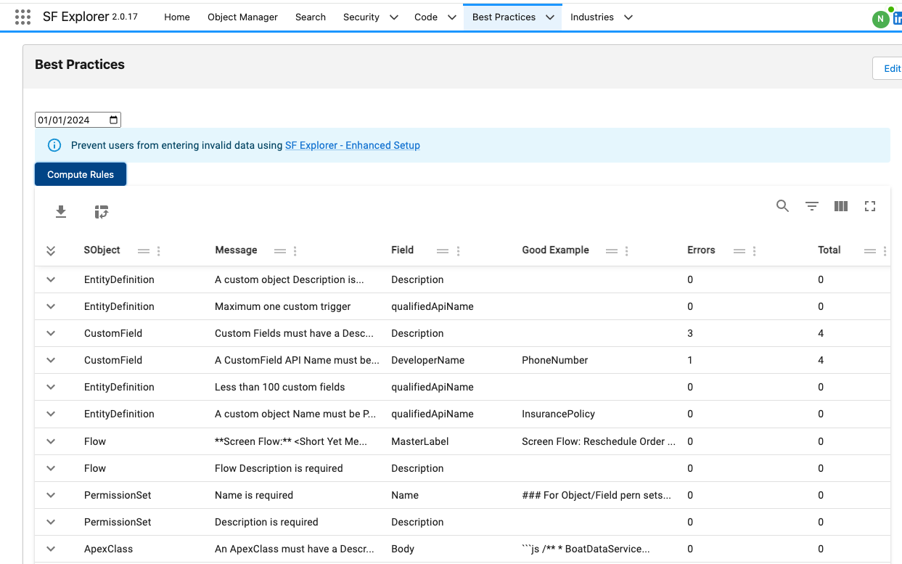
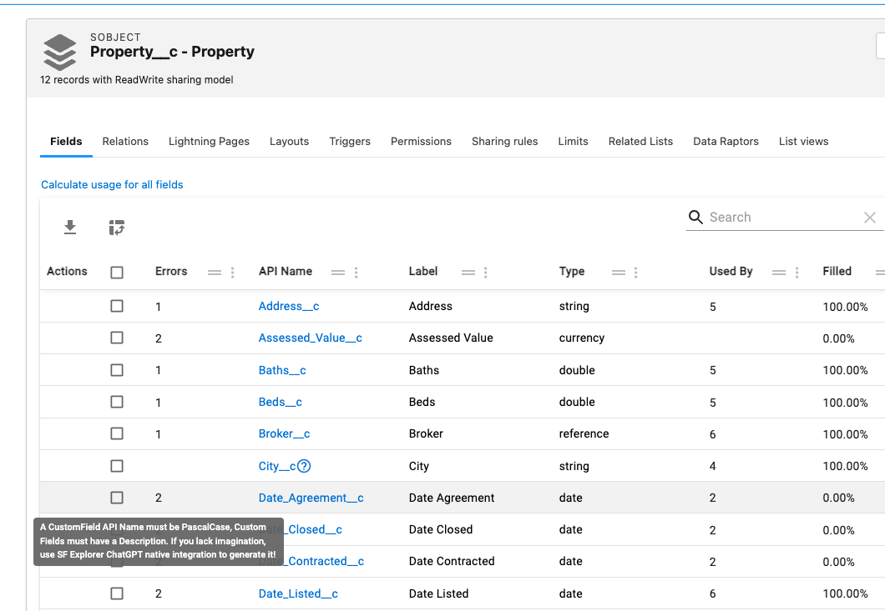
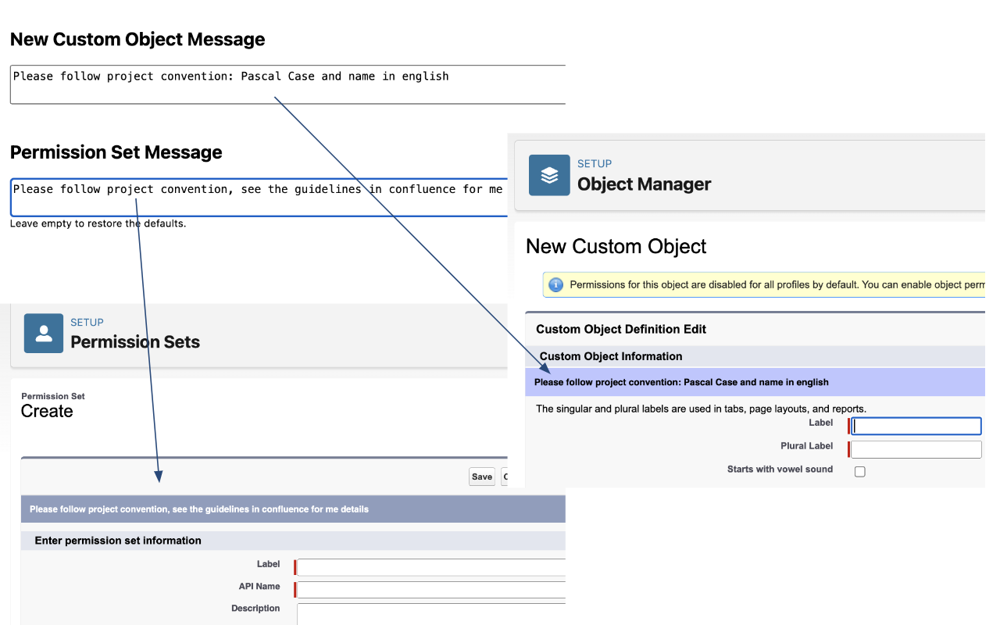
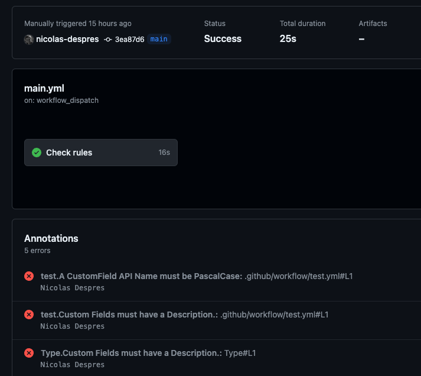

# Introduction

:::info
Let's bridge the gap between best practice theory and how we enforce it!
:::

**SF Explorer** allows you to define and perform simple checks on your orgs Data and Metadata in a simple yet flexible manner. 

You can access, run and configure those rules via **Devops > Best Practices**  
                                                      
 

:::info
You can run the report at a given date. Above 01/01/2024
:::

## UI integration
Once defined, errors will be showned contextually on your records as you navigate through SF Explorer:

 


## Setup Enhancement

Enhance your Salesforce setup with checks and best practices with a new chrome extension called [SF Explorer Advanced Setup](https://chromewebstore.google.com/detail/salesforce-explorer-enhan/bfbpegnljabcaknhmlfejadihhcndmfi?hl=en-US)

It adds custom message into your Salesforce setup screen to enforce your project rules are enforced. Your Design Authority should be pleased!
You can add a custom messages for:
* New Custom Object
* New Permission Set
Those messages are configurable in the option page.

* It prevent user from creating duplicate fields
* It shows similar fields when opening a custom field

 


## Command line integration

It is simple to integrate those rules in your current pipelines, for example with a Github Action:

 

Create a file named `.env` with the following content:

```bash
SFEXP_LOGIN=XXX # remove it to use SFDX instead
SFEXP_PASSWORD=XXX # Password+SecurityToken, remove it to use SFDX instead
LOGINURL=https://login.salesforce.com #or https://test.salesforce.com
DATE=TODAY  #or 2024-01-01
RULES=EntityDefinition,CustomField  #specify to only run rules on EntityDefinition and CustomField - remove param to check all rules
```
To connect with SFDX, don't use the `SFEXP_LOGIN`/`SFEXP_PASSWORD` env var.

Run the command:  
```cmd
npx @sf-explorer/devops.cli
```
The command will generate an output file name `testReport.xml` (in JUnit format).

## Ignore metadata
You can ignore specific errors with a file named `.sfexplorerignore` (using regex similar to a .gitignore file)
- ignore an author with @ and the author name
- ignore a record with its type and target

## Sample Rules on Basic Entities

### EntityDefinition
[A custom object Name must be in english and PascalCase](./Sample%20Rules/EntityDefinition/index.md)  
[A custom object Description is required](./Sample%20Rules/EntityDefinition/index.md)  
[Less than 100 custom fields](./Sample%20Rules/EntityDefinition/index.md)  
[Maximum one custom trigger per object](./Sample%20Rules/EntityDefinition/index.md)  
[Maximum 15 record types per object](./Sample%20Rules/EntityDefinition/index.md)  

### CustomField
[A CustomField API Name must be in english and PascalCase](./Sample%20Rules/CustomField/index.md)  
[Custom Fields must have a Description (at least 20 chars)](./Sample%20Rules/CustomField/index.md)  

### Flow
[Flow Description is required (at least 20 chars)](./Sample%20Rules/Flow/index.md)  
[Flow Label must be Short Yet Meaningful](./Sample%20Rules/Flow/index.md)  

### PermissionSet
[Name is following project convention](./Sample%20Rules/PermissionSet/index.md)  
[Description is required (more than 20 chars)](./Sample%20Rules/PermissionSet/index.md)  

### ApexClass
[An Apex class name must be PascalCase and use a correct Suffix](./Sample%20Rules/ApexClass/index.md)  
[An ApexClass must follow the best practices](./Sample%20Rules/ApexClass/index.md)  
[An ApexClass must have a Description](./Sample%20Rules/ApexClass/index.md)  
[An ApexClass must have an author](./Sample%20Rules/ApexClass/index.md)  
[Apex variables must be camelCase](./Sample%20Rules/ApexClass/index.md)  
[Apex methods must be camelCase](./Sample%20Rules/ApexClass/index.md)  

### LightningComponentResource
[An LWC must have an author](./Sample%20Rules/LightningComponentResource/index.md)  
[An LWC must have a description](./Sample%20Rules/LightningComponentResource/index.md)  

### FieldPermissions
[No field level security on Profiles (except System Administrator)](./Sample%20Rules/FieldPermissions/index.md)  

## Sample Rules on Omnistudio

### OmniUiCard
[Flexcards names must be pascal case](./Sample%20Rules/OmniUiCard/index.md)  
[Flexcards must have a description](./Sample%20Rules/OmniUiCard/index.md)  

### OmniProcess
[Omniscript Type should be camel case (for LWC compatibility)](./Sample%20Rules/OmniProcess/index.md)  
[Omniscript SubType must be PascalCase](./Sample%20Rules/OmniProcess/index.md)  
[Omniscripts must have a description](./Sample%20Rules/OmniProcess/index.md)  
[Omniscript must have less than 100 elements](./Sample%20Rules/OmniProcess/index.md)  

### OmniProcessElement
[Remote action and DataRaptor Actions must have a description](./Sample%20Rules/OmniProcessElement/index.md)  
[Set Values and Set Errors must start with Set+PascalCase](./Sample%20Rules/OmniProcessElement/index.md)  
[Remote Action must start with 'Invoke+PascalCase'](./Sample%20Rules/OmniProcessElement/index.md)  
[DataRaptor Extract must start with 'DRE+PascalCase'](./Sample%20Rules/OmniProcessElement/index.md)  
[DataRaptor Post must start with 'DRP+PascalCase'](./Sample%20Rules/OmniProcessElement/index.md)  
[DataRaptor Extract must start with 'IP+PascalCase'](./Sample%20Rules/OmniProcessElement/index.md)  

### OmniDataTransform
[DataRaptors must have a description](./Sample%20Rules/OmniDataTransform/index.md)  