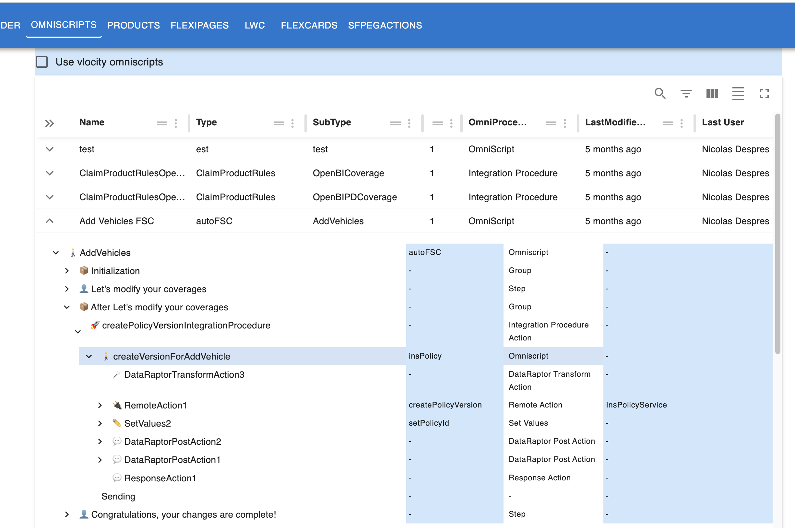

# Why Omnistudio Explorer?
- No overview of what is being called in what order without executing the process
- Omnistudio Screens are more intended for edition rather than view: it means that input fields are disabled but the screen is not appropriate for somebody trying to understand what is going on.
- No option to visualize the dependencies between the components
- Lack of interface between the components: how do I know what is the expected input and output
- Consolidate required user rights

## Example

Here is an example of a first notice of loss claim process involving various elements:

