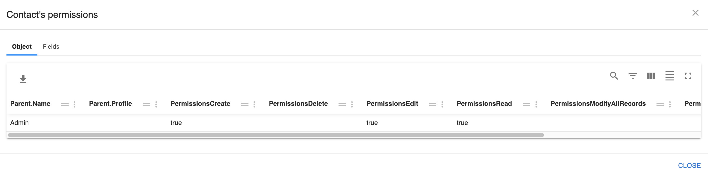

import D3Graphviz from '../../../src/components/D3Graphviz'

# Object Manager

:::tip
The best documentation is the one you don't write
:::

**SF Explorer Object Manager** retrieve the usage of your org objects and provide:
* 1️⃣ Grouping and filtering based on the different exposed attributes (category, usage, record types...) 
* 2️⃣ API Name and associated documentation - a click on the API Name provide extra detail on the object
* 3️⃣ Usage with associated percentage in org
* 4️⃣ The number of custom fields
* 5️⃣ **Available permissions** based on a given profile / list of permission set groups
* 6️⃣ Sharing model

Each element listed above can be clicked to provide additionnal detail - see below

 

### 1️⃣ Grouping and filtering

The proposed vizualisation is just an example - you can use excel like feature to regroup, sort or filter your data

### 2️⃣ Object detail

Your salesforce model can be complex like the **InsurancePolicy** FSC object below. 

<D3Graphviz value = 'InsurancePolicy' />

:::tip Interactive graph
A node can be click to zoom on the associated object. A tooltip is also providing additional contextual information.
:::

Note that the color of each node is associated to the selected profil/permission set group selected above (see 5️⃣ Object Permissions)

### 3️⃣ Nb records

Clicking on the number of record of a given object gives you a quick access to the query builder for you to search or compare records of that given object

 

### 4️⃣ Custom fields

Custom fields columns gives you information on the level of customization your object contains

### 5️⃣ Object Permissions

To ease the transition to permission set groups, **SF Explorer** let you pick a profile and a list of permission set group to view/compare/analyze the impact on your model.

 

 Once picked you can review the impact on each object with the `Permissions` column.

 

### 6️⃣ Sharing model

When the sharing model is Private or Public Read Only, SF Explorer provide a quick access the associated sharing table by clicking on the sharing rule

 

