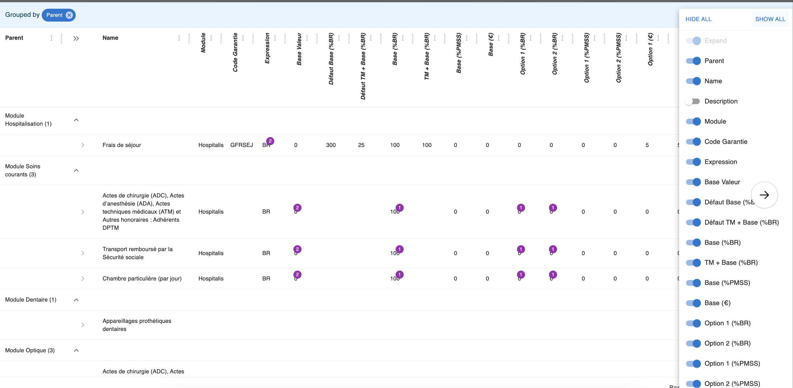

# Why Product Explorer?

The goal of Product explorer is to help the Product Specialist in his configuration work that can be complex by providing:
- An Helicopter View 
  - 360 degrees view of all layers, from product to attribute rule
- Dependency management
  - Visualize dependencies between components
- Visualize recent changes at glance
- Be alerted on configuration errors

## Product Class visualization

## Attribute Dependencies
