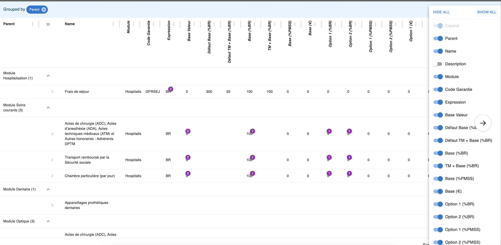
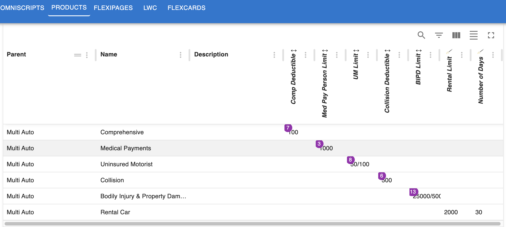

# Insurance Products

## Introduction

### Configurable systems in 2024
Nowadays systems are by design more and more configurable. Don’t get me wrong, this is great. However in many cases this also gives back a lot of responsibility to the end user. Over the years, developers have invented many tools to help them in their day to day work, such as:
* Code autocompletion
* Code reviews
* Deployment pipeline
* Automatic testing
* Linting
* and much more,...

Wait a minute… What do we provide to our end user who is supposed to do something as heavy as configuring an insurance product? Not always much.
This document is intended to explain how SF Explorer can help the product configurator in his day to day activity.

### Why Product Explorer?

The goal of **Product Explorer** is to help the Product Specialist in his configuration work that can be complex by providing:
- An Helicopter View 
  - 360 degrees view of all layers, from product to attribute rule
- Dependency management
  - Visualize dependencies between components
- Visualize recent changes at glance
- Be alerted on configuration errors

### Example

The below example show a product class with 4 different product instances using many attributes. It is a particular good fit because many attributes are reused between coverages (which is often the case). 

:::tip
As a best practice try to name your attributes with a common name. For example, don't use Collision Limit but only Limit. We know it is a collision limit because it is in the collision coverage.
:::

Here is what you **should not do** for example

