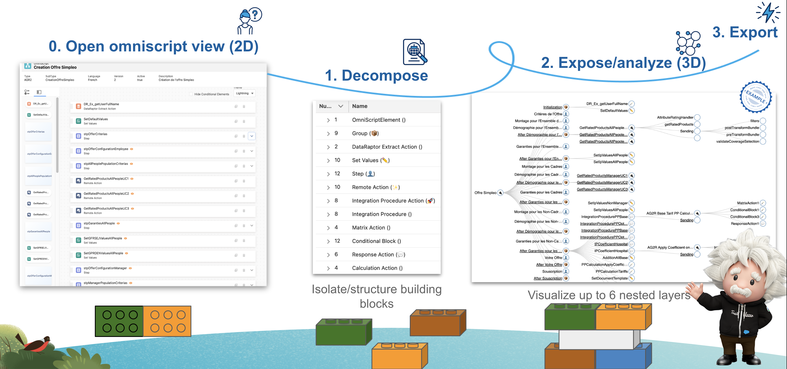
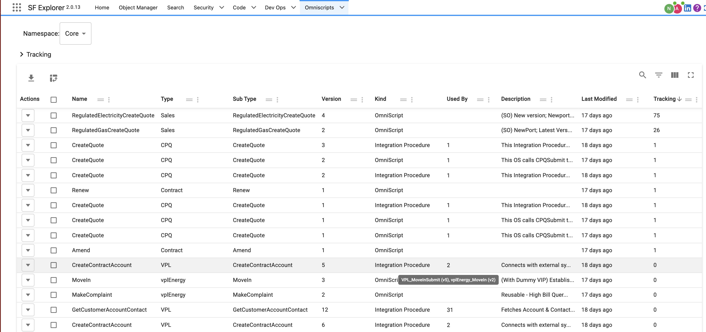
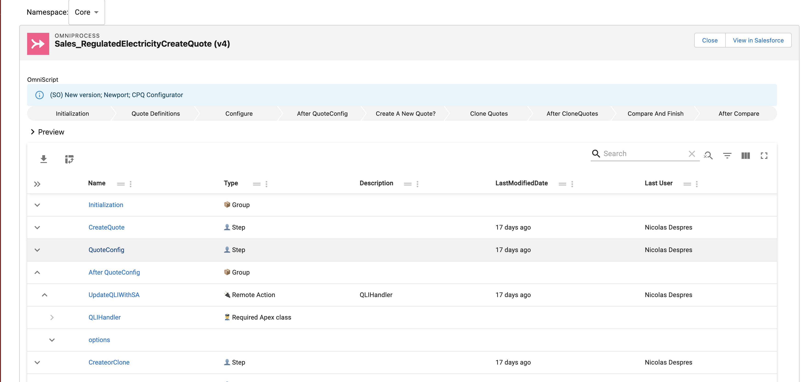

import LiteYouTubeEmbed from 'react-lite-youtube-embed'
import 'react-lite-youtube-embed/dist/LiteYouTubeEmbed.css'

# Omniscript Explorer

Omniscript explorer provides an overview of your omniscripts

I build Omniscript explorer to help resolve those issues, and in addition I am trying to:
- Consolidate required user rights
- Visualize the elapsed time on each step/construction element.

## Search Omniscripts/Integration Procedures

Omniscripts and Integrations Procedures are grouped together as they are the same technical object. You can find them by using the `Kind` column. 

:::info
If you are still on a vlocity omnistudio org, you can change the namespace from here.
:::

If you click on the `Used By` column you can find what `FlexCard` or other `Omniscript` use your given record.

## 5 min introduction video

Here is a quick recap:

<LiteYouTubeEmbed
              id="oMcpL_95YU4"
              params="autoplay=1&autohide=1&showinfo=0&rel=0"
              title="Omnistudio"
              poster="maxresdefault"
              webp
            />

