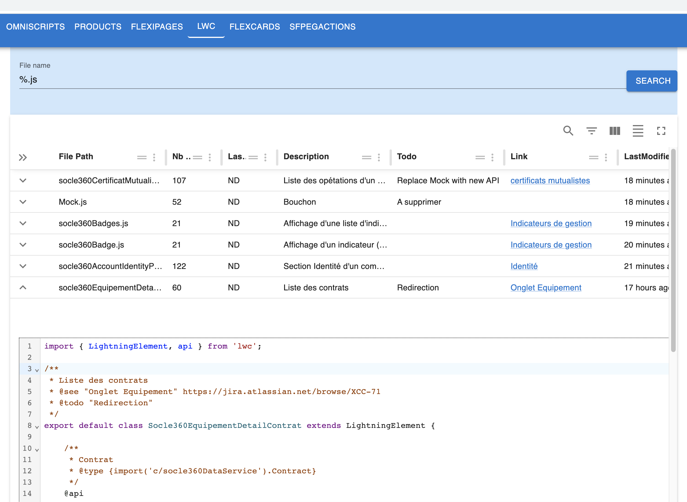
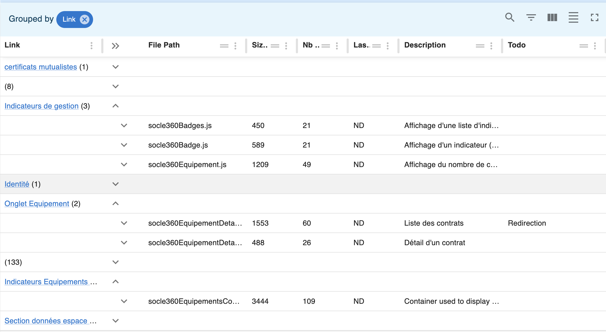

# LWC

## Introduction
SF Explorer parses your LWC contents to find [JS Docs](https://jsdoc.app/) annotations, 
This information is then available in the UI. The content can be changed from this screen as well.



In the above example you can see in particular
- description => Description column
- `@see` => we generate a link in the Link Column to serve as a reference
- `@todo` => will populate the Todo column

Various features like filtering and grouping are available, for example



## Example

```js
import { LightningElement, api } from 'lwc';

/**
 * Liste des contrats
 * @see "Onglet Equipement" https://jira.atlassian.net/browse/XCC-71
 * @todo "Redirection"
 */
export default class Socle360EquipementDetailContrat extends LightningElement {

    /**
     * Contrat 
     * @type {import('c/socle360DataService').Contract}
     */
    @api
    contract
}
```

## Compare Code

You can select 2 LWCs and compare them (works accross multiple orgs as well)