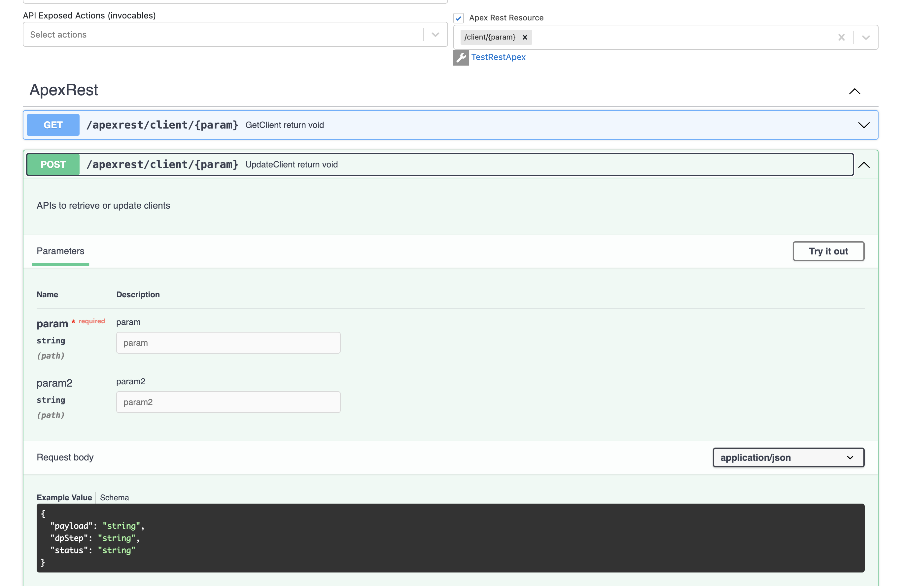
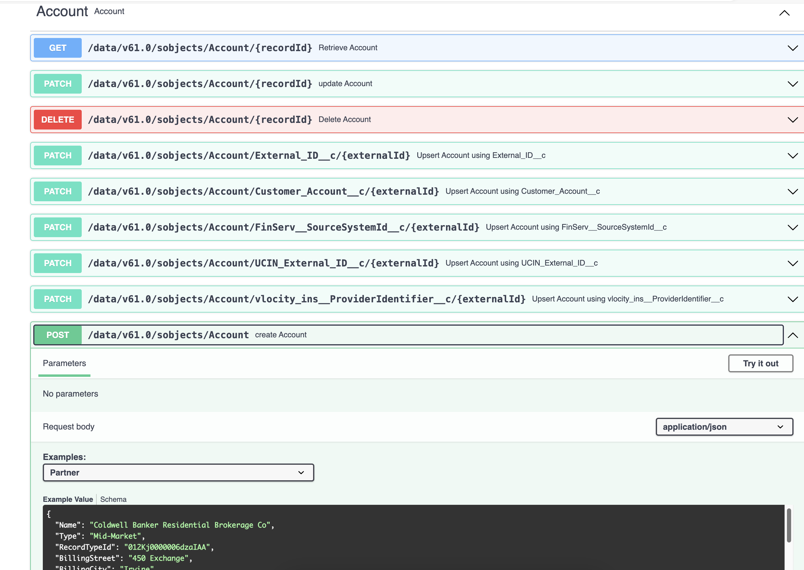

import LiteYouTubeEmbed from 'react-lite-youtube-embed'
import 'react-lite-youtube-embed/dist/LiteYouTubeEmbed.css';

# OpenAPI Generation

## Introduction
The [OpenAPI Specification (OAS)](https://learn.openapis.org/introduction.html) allows the description of a remote API accessible through HTTP or HTTP-like protocols. This description, which may be stored as one or more documents (such as local files or HTTP-accessible network resources), is called an OpenAPI Description (OAD)

SF Explorer Generate your org specific OpenAPI endpoints:
* Generate specific object endpoints
* Add custom apex
* Add custom and standard actions exposed (invocables)
* Try out mode available => run against your org
* Download spec


## RestApex
Using the following Apex:

```javascript
/**
  * APIs to retrieve or update clients
  */
@RestResource(urlMapping='/client/*')
global with sharing class SFIDirectDatapackAPI {
    
    @HttpPost
    global static void UpdateClient(string payload, string dpStep, string status)
    {
    }
    
    @HttpGet
    global static void GetClient(){}
}
```
Will result into the following spec:

 


## Specific objects

Supported features:
* Accurate examples generated from your org data
* Record types supported
* Upsert endpoints for all external ids
* Example provided with the composite API

 


## Demonstration
<LiteYouTubeEmbed
              id="OwdJAhcXNyo"
              params="autoplay=1&autohide=1&showinfo=0&rel=0"
              title="Demo OpenAPI"
              poster="maxresdefault"
              webp
            />