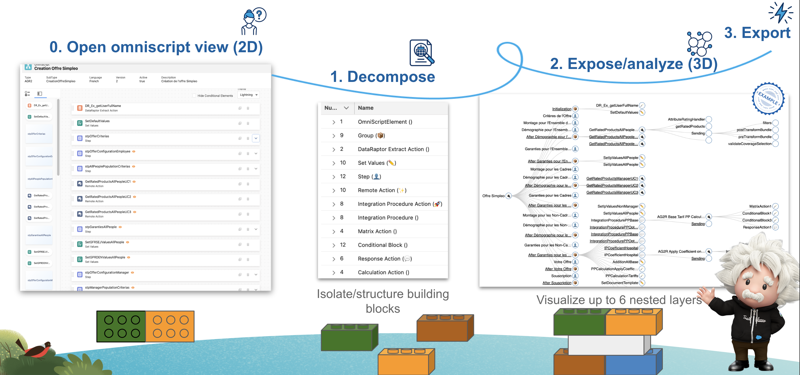

import LiteYouTubeEmbed from 'react-lite-youtube-embed'
import 'react-lite-youtube-embed/dist/LiteYouTubeEmbed.css'

# Omniscript Explorer

Omniscript explorer provides an overview of your omniscripts

I build Omniscript explorer to help resolve those issues, and in addition I am trying to:
- Consolidate required user rights
- Visualize the elapsed time on each step/construction element.

## Example

Here is an example of a first notice of loss claim process involving various elements:

<LiteYouTubeEmbed
              id="oMcpL_95YU4"
              params="autoplay=1&autohide=1&showinfo=0&rel=0"
              title="Omnistudio"
              poster="maxresdefault"
              webp
            />

