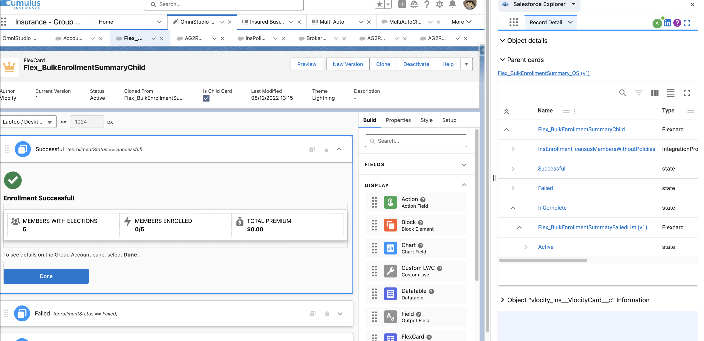

# Flexcard 

Flexcard explorer present how the flexcards are structured (parent>child>child...)

When you are on a Flexcard, right click anywhere in the screen and select 'Open SF Explorer Panel'. From the Panel Menu, select 'Record Detail' option if it is not already selected. You should see the detail about children and parents cards:

Note that the panel get refreshed when you navigate to another card.