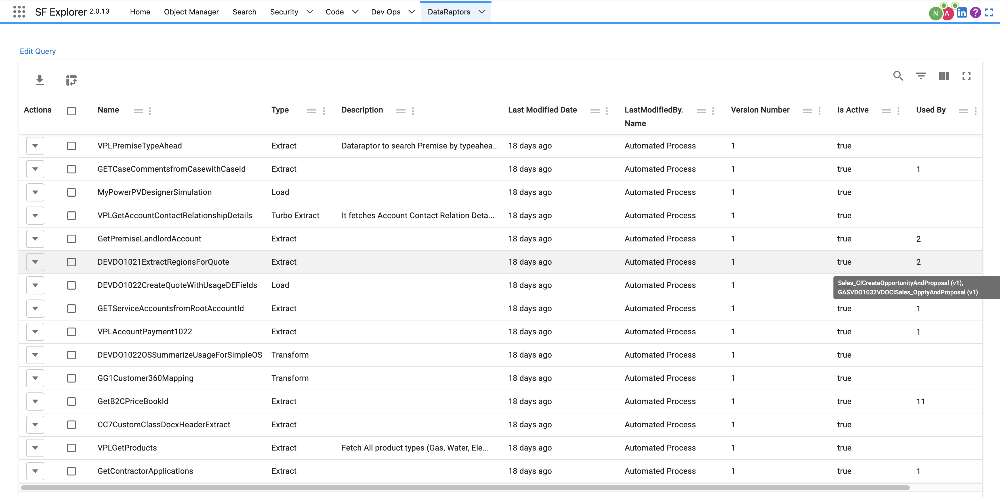
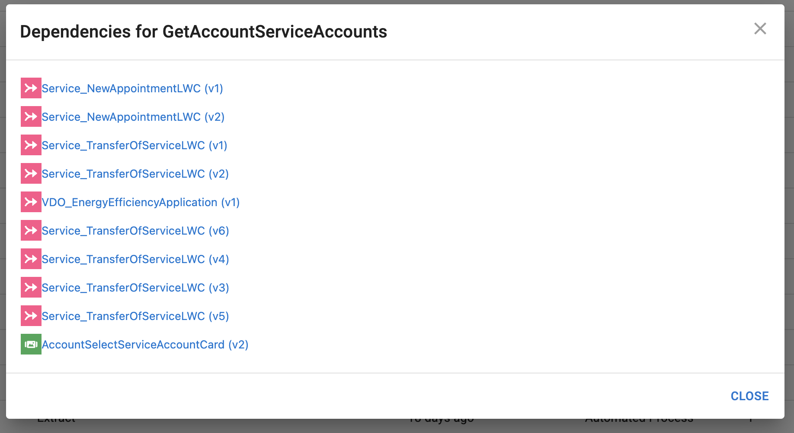
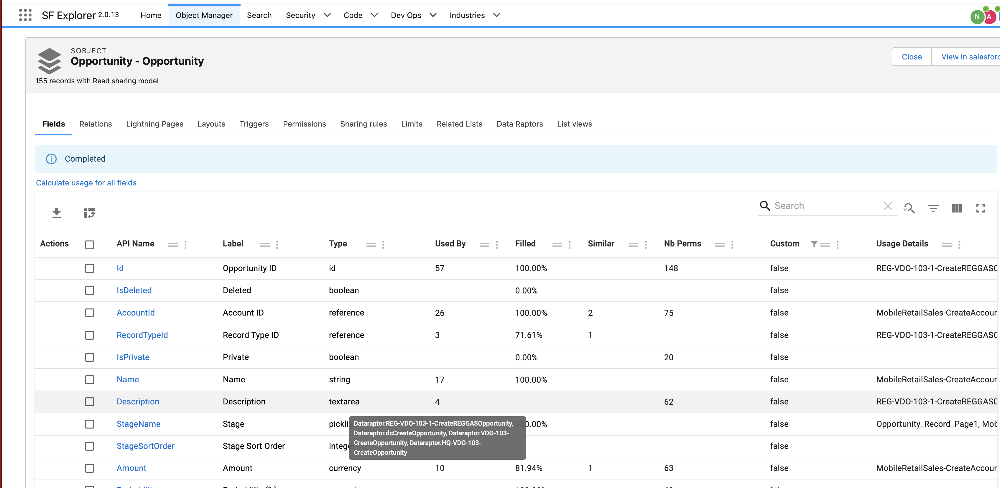
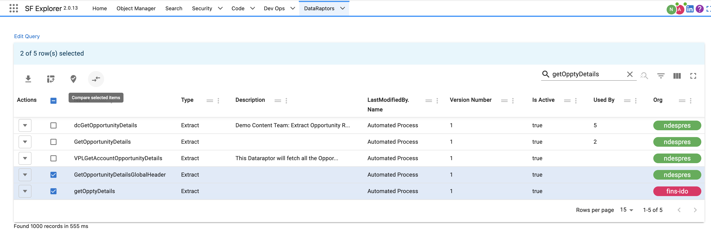
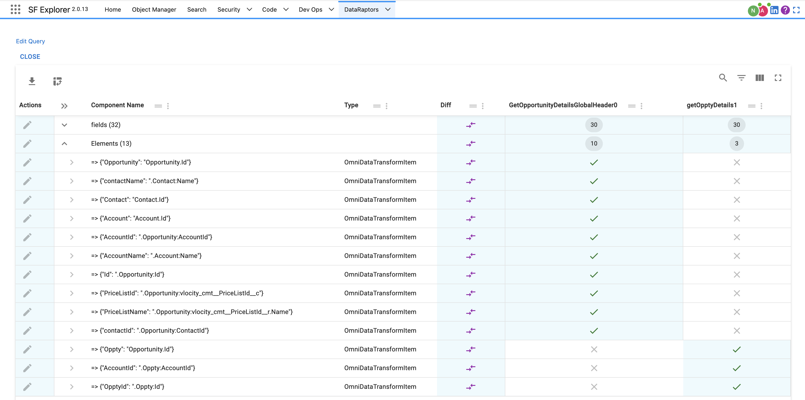

## Accesssing DataRaptor List

The Dataraptors can be accessed from:
- The **Dataraptors** menu under Industries entry point
- The **Object Manager**: this natively lets you explore the DataRaptors associated with a given object.
- You can also use the **Search** option and write your own query again the `OmnidataTransform` object

## Finding Dependencies
### Finding where my Dataraptor is used
To find the dependencies you can refer to the `Used by` column. It will brind all Omniscripts/Integration Procedures/flexcards that reference your DataRaptor.

If you click on the number you will be able to navigate to the given dependency:

### Finding what Dataraptor access/modify a given field
From the Object Manager if you click on `Calculate usage for all fields` you will be able to find dataraptor dependencies at field level.

## Comparing DataRaptors

Select multiple Dataraptors and click on `Compare Selected Items`

You can leave comments on each row that will be saved in your browser.

:::info
Any record can be compared this way
:::

## Testing DataRaptors
You can test your Dataraptors from here as well (only on Extract for now)

