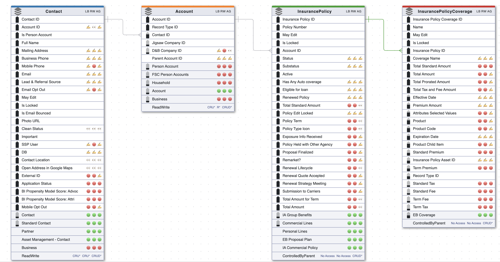
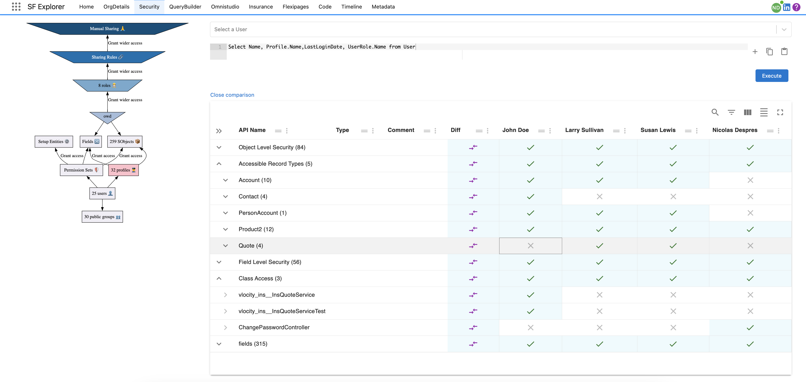

import LiteYouTubeEmbed from 'react-lite-youtube-embed'
import 'react-lite-youtube-embed/dist/LiteYouTubeEmbed.css';

# Security Model

:::info
**Saleforce Security Model** is very powerful. However often with such powerful configurable system it can be (very) **difficult to administer**.

:::

**SF Explorer** provide capabilities to explore the different layers of your security model by providing:

* An interactive UI to try to make the bridge between theory and practice
* User, Profile comparisons
* Action to empty a profile or remove an object from multiple profiles
* Excel like interface for deep analysis

 

 

## Demonstrations

### Overview
Here is quick overview (44s):
<LiteYouTubeEmbed
              id="_zkBEMZ-KxU"
              params="autoplay=1&autohide=1&showinfo=0&rel=0"
              title="Security with ERD"
              poster="maxresdefault"
              webp
            />

### Moving from Profile to PermissionSet Model
This video shows tools to help you create object level permission set model.
<LiteYouTubeEmbed
              id="Hf8SbbqBxfo"
              params="autoplay=1&autohide=1&showinfo=0&rel=0"
              title="From Profile to PermissionSet"
              poster="maxresdefault"
              webp
            />

### Other features
Some other important features:

<LiteYouTubeEmbed
              id="wtF5dZR9dmY"
              params="autoplay=1&autohide=1&showinfo=0&rel=0"
              title="Security"
              poster="maxresdefault"
              webp
            />

