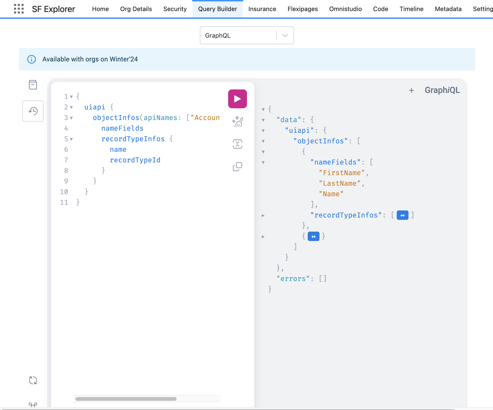

# GraphQL

GraphQL offers very interesting use cases for salesforce. A number of tools are available in the community and **SF Explorer** ships with a built in version of **GraphiQL** with the following advantages:
* No need to authenticate - as easy as it should be
* Sample queries to get you started  

To give it a try navigate to **Query Builder** and then select **GraphQL** in the dropdown:

 

:::info
This feature is available with orgs within **Winter'24**
:::

## Provided examples
If you open the history button you will find a number of queries to help you get started:
* Search Accounts and their opportunities
* QueryAccountsWithCriteria
* QueryCasesWithCriteria
* Object info for Account and Case

## Roadmap

:::info
In the next release SF Explorer will allow you to generate/read LWC using the graphQL wire adapter.
:::
