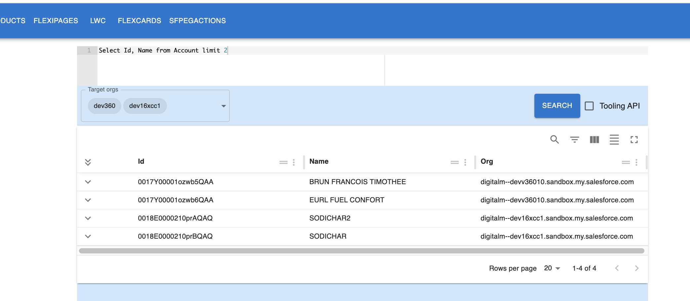
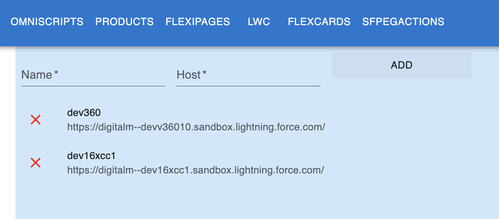

# Query Builder

## Multi Org Support (scheduled 0.0.8)

SF Explorer allows you to make queries accross multiple orgs

Create your org Alias into settings:

## Autocompletion

SF Explorer lets you write SOQL Query with object autocompletion. This feature will be enhanced in the futur with column autocompletion

