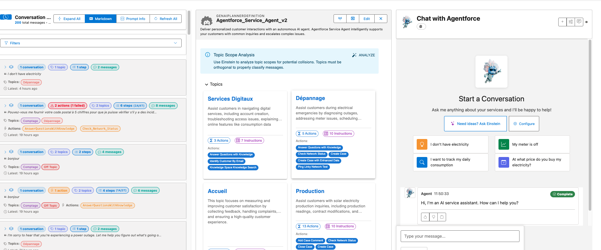

# GenAI Explorer

A comprehensive web application for exploring, testing, and monitoring Salesforce Generative AI capabilities including Agentforce, Einstein models, and Data Cloud insights.

## The Problem

**Humans and agents are meant to live together, yet we need better tools to understand what agents have done and, more importantly, why.**

As AI agents become integral to business operations, teams face key challenges:

### Understanding AI Behavior
- 🤔 **Complex Reasoning**: AI decision-making involves multiple stages and considerations
- 🔍 **Tracing Decisions**: Need to understand why agents chose specific actions or responses
- 📊 **Performance Visibility**: Token usage, timing, and quality metrics require analysis

### Testing & Validation
- 🧪 **Safe Testing**: Need controlled environments to validate agent behavior
- 🔄 **Iteration Speed**: Want to test and refine agents quickly
- 🐛 **Issue Reproduction**: Need to replay and debug specific interactions
- 📈 **Data Analysis**: AI data spans multiple objects and requires specialized queries

### Configuration Management
- 🗺️ **Component Relationships**: Understanding how agents, topics, and actions connect
- 📋 **Version Control**: Tracking which configurations are active vs. draft
- 🎯 **Impact Analysis**: Knowing what will be affected by changes

### Development Tools
- 🔧 **Specialized Needs**: AI development requires different tools than traditional Salesforce
- 💬 **Prompt Engineering**: Testing different models, prompts, and parameters
- 📊 **Analytics Access**: Analyzing conversation data for insights

**In short**: Teams need specialized tools to build, test, and optimize AI agents effectively.

## How GenAI Explorer Solves This

**GenAI Explorer is the DevTools for Salesforce AI** - bringing complete transparency, powerful debugging, and rapid iteration to AI development.

### 🔍 Complete Visibility
✅ **See Inside AI Reasoning**: Visual Atlas pipeline showing all 6 processing stages  
✅ **Track Every Decision**: View which topics matched, which actions executed, and why  
✅ **Live Performance Metrics**: Token usage, processing time, quality scores in real-time

### 🧪 Safe Testing Environment
✅ **Chat Without Risk**: Test agents locally before production  
✅ **Control Context**: Set session and message variables to simulate any scenario  
✅ **Replay Requests**: Reproduce any historical request with one click  
✅ **Edit & Test**: Modify prompts and compare results instantly

### 📊 Data-Driven Insights
✅ **Pre-Built Analytics**: 8+ ready-to-use Data Cloud queries  
✅ **Conversation History**: Filter and analyze all past conversations  
✅ **Export Capabilities**: Get data into Excel, JSON, or CSV instantly  
✅ **No SQL Required**: Visual query builder with auto-complete

### 🎨 Visual Understanding
✅ **ERD Diagrams**: See all AI objects and relationships  
✅ **Atlas Pipeline**: Interactive 6-stage reasoning visualization  
✅ **Interactive Boards**: Create documentation with drag-and-drop  
✅ **Configuration Browser**: Explore all agents, topics, actions at once

### ⚡ Developer Acceleration
✅ **Topic Collision Detection**: Einstein-powered overlap analysis  
✅ **AI Prompt Optimization**: Get improvement suggestions automatically  
✅ **Model Comparison**: Test GPT-4 vs GPT-4o Mini side-by-side  
✅ **Unified Interface**: Everything in one web app - no context switching

**Impact:** 
- 🚀 **80% faster testing** - minutes instead of hours
- 🔍 **70% faster debugging** - see exactly what went wrong
- 💰 **50-70% cost reduction** - optimize model selection
- 📚 **10x faster onboarding** - visual docs and live data

## Why We Built It

**Humans and agents are meant to live together.** But for this collaboration to succeed, we need transparency.

GenAI Explorer was created by Salesforce developers and AI engineers building Agentforce implementations who needed better tooling. The project started with a simple question:

> "How can we see what's happening inside an Agentforce conversation?"

From that question came a comprehensive toolkit that answers:
- **What did the agent do?** Which actions, topics, and data?
- **Why did it do that?** What reasoning led to those decisions?
- **How can we improve it?** Where are bottlenecks and optimization opportunities?

### Our Vision

**Today:** Salesforce Agentforce, Einstein, Data Cloud  
**Tomorrow:** Multi-platform AI agent support  
**Future:** A unified lens for understanding any AI agent, anywhere

**The goal:** Make AI agent behavior transparent and understandable, regardless of platform.

## Overview

GenAI Explorer is a web application designed for Salesforce administrators, developers, and AI engineers who need to interact with, test, and monitor Generative AI capabilities within their Salesforce orgs. It provides a unified interface for working with your organization's AI agents, understanding their configuration, and analyzing their performance.

## Single Purpose

**A developer and administrator tool for chatting with, testing, and monitoring Salesforce Agentforce and Einstein AI capabilities.**

## Key Capabilities

### 💬 Chat with Agentforce Agents
Have real-time conversations with your Agentforce agents, test scenarios, configure session variables, and analyze agent responses.

### 🤖 Configuration Explorer
Browse all AI Agents, Topics, Actions, and Prompts in your org with comprehensive entity relationship diagrams.

### 🧠 Atlas Reasoning Engine
Visualize the six-stage AI processing pipeline and understand how Salesforce processes AI queries.

### 🔬 Einstein Model Testing
Test and compare multiple Einstein AI models with custom prompts and parameter control.

### 🎨 Interactive Boards
Create visual workflows and documentation using drag-and-drop boards with AI-powered editing.

### ☁️ Data Cloud Integration
Execute queries and monitor AI data directly with pre-built analytics queries.

## Quick Start

### Installation Options

**Option 1: Web Application** (Recommended)  
Visit https://app.sf-explorer.com/gen-ai.html to use GenAI Explorer directly in your browser. No installation required - just connect to your Salesforce org using secure OAuth 2.0 authentication and start exploring.

**Option 2: Chrome Extension**  
For users who prefer browser integration, install from the [Chrome Web Store](https://chromewebstore.google.com/detail/genai-explorer/dopnhbkmnclgkeenfadmbcfllplbgcag) for side panel integration and context menu shortcuts.

### Getting Started

1. **Access** the web app at https://app.sf-explorer.com/gen-ai.html or install the Chrome extension
2. **Connect** to your Salesforce org using OAuth 2.0 authentication (requires a connected app)
3. **Explore** your AI agents, topics, and actions
4. **Chat** with your agents to test their behavior
5. **Monitor** performance using Data Cloud queries

## Who Should Use GenAI Explorer?

### For Administrators
- Monitor Agentforce agent performance
- Track conversation flows and user interactions
- Analyze agent usage patterns
- Troubleshoot configuration issues

### For Developers
- Test Einstein AI models during development
- Debug prompt templates and responses
- Explore GenAI Function Definitions
- Optimize token usage and costs

### For AI/ML Engineers
- Understand the Atlas reasoning pipeline
- Analyze AI model performance
- Monitor safety and compliance metrics
- Optimize retrieval strategies

### For Data Scientists
- Query Data Cloud for AI analytics
- Analyze conversation patterns
- Track feature usage statistics
- Export data for analysis

## Requirements

- **Browser**: Modern web browser (Chrome, Firefox, Safari, Edge)
- **Salesforce**: Org with Agentforce or Einstein AI features enabled
- **Permissions**: Appropriate access to AI metadata and Data Cloud

## Architecture

Built with modern web technologies:

- **React 18** - Modern UI framework
- **TypeScript** - Type-safe development
- **Salesforce Lightning Design System** - Native Salesforce UI/UX
- **React Flow** - Interactive visualizations
- **JSForce** - Salesforce API integration
- **Material-UI** - Additional UI components

## Privacy & Security

- 🔒 **Secure Authentication**: Official OAuth 2.0 flows
- 🏠 **No External Storage**: All data remains in your Salesforce org
- 🎯 **Direct API Calls**: Queries execute directly against your instance
- 💾 **Browser-Only Storage**: Preferences saved locally
- 🚫 **No Third-Party Services**: No data sent externally

## 📚 Feature Documentation

Explore the detailed documentation organized by category:

### 💬 Conversation

- **[Conversation History](./conversation-history)** - View, filter, and analyze all conversations
- **[Chat with Agents](./chat-with-agents)** - Have real-time conversations with your AI agents

### 🤖 Configuration & Analysis
- **[Configuration Explorer](./configuration-explorer)** - Browse agents, topics, actions, and prompts with ERD diagrams
- **[Topic Collision Analysis](./topic-collision-analysis)** - Detect and resolve overlapping topics to prevent routing issues

### 🛠️ Testing Center
- **[Adding Test Cases](./adding-test-cases)** - Create comprehensive test suites from scratch or real interactions
- **[Test Case Editing](./test-case-editing)** - Edit and manage AI agent test cases with smart comparison

### 🧠 AI Platform Understanding
- **[Atlas Reasoning Engine](./atlas-reasoning-engine)** - Understand the 6-stage AI processing pipeline
- **[Einstein Model Testing](./einstein-model-testing)** - Test and compare different AI models side-by-side

### 🛠️ Advanced Tools
- **[Request Replay & Debugging](./request-replay-debugging)** - Replay requests, edit prompts, and optimize AI responses
- **[Data Cloud Integration](./data-cloud-integration)** - Query and analyze AI data with pre-built queries

### ❓ Help & Support
- **[FAQ](./faq)** - Frequently asked questions and troubleshooting

---

**Built for the Salesforce community to unlock the full potential of Generative AI** 🚀

