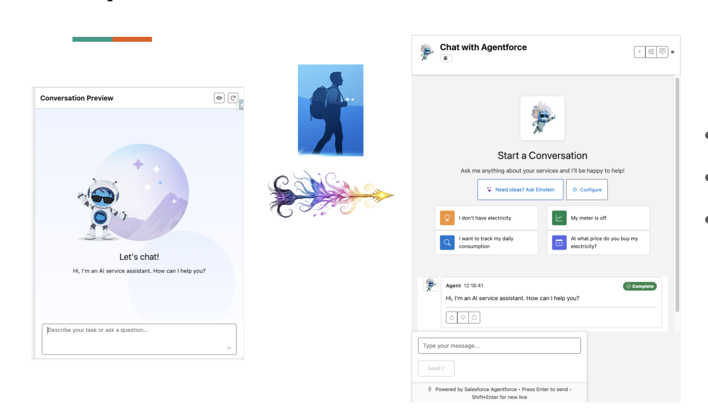

# Chat with Agentforce Agents

The primary feature of GenAI Explorer - have real-time conversations with your Agentforce agents directly from your browser.



## The Problem

**Testing and validating AI agents requires a safe environment where you can experiment without affecting production users.**

When building Agentforce implementations, teams face these challenges:

- 🤔 **Validation Uncertainty**: How do you verify an agent behaves correctly before going live?
- 🎯 **Scenario Testing**: Need to test specific customer contexts, edge cases, and error conditions
- 👁️ **Limited Insight**: Want to understand what the agent is thinking and which actions it chooses
- 🔄 **Context Testing**: Need to test with different user profiles, account types, and data scenarios
- 🐛 **Debugging Difficulty**: When something goes wrong, you need to trace through the entire conversation

**In short**: You need a controlled environment to thoroughly test and understand your agents before deployment.
- ❌ **Manual Debugging**: No way to replay or analyze past conversations
- ❌ **Slow Iteration**: Deploy, test, debug, repeat - very slow feedback loop

**Result:** Developers and admins struggle to validate agent behavior, leading to production issues and frustrated users.

## How GenAI Explorer Solves This

GenAI Explorer provides a **safe, interactive testing environment** where you can:

✅ **Chat in Real-Time**: Instant conversations without deployment - test locally before going live

✅ **Control Context**: Set session and message variables to simulate any user scenario

✅ **See Everything**: View cited references, actions invoked, and reasoning steps

✅ **Replay & Debug**: Access complete conversation history with filtering and analysis

✅ **Fast Iteration**: Test changes immediately, no deployment cycle needed

✅ **Multiple Scenarios**: Test edge cases, error handling, and different user types in minutes

**Impact:** Reduce testing time by 80%, catch issues before production, and build confidence in your agent's behavior.

## Overview

The Chat interface allows you to test and interact with any Agentforce agent configured in your Salesforce org. You can start conversations, configure context, view cited references, and analyze agent responses in real-time.

## Getting Started

### 1. Select an Agent

From the main interface:
1. Click on **"Chat"** in the navigation
2. Choose an agent from the **Agent Browser**
3. The agent details will display, including:
   - Agent name and description
   - Associated topics
   - Available actions
   - Configuration status

### 2. Start a Conversation

Click **"Start Chat Session"** to create a new conversation with the selected agent.

Each session is independent and maintains its own context and history.

## Chat Features

### Live Chat Interface

Send messages and receive real-time responses from your Agentforce agent:

```
You: How can I help customers with returns?
Agent: I can help you process customer returns. First, I'll need to know...
```

**Key Features:**
- Real-time message streaming
- Markdown formatting support
- Rich media responses
- Inline citations

### Session Variables

Configure context variables that persist throughout the conversation:

**Example Session Variables:**
```json
{
  "customerId": "001xx000001234AAA",
  "accountType": "Premium",
  "region": "North America"
}
```

**To Set Session Variables:**
1. Click **"Configure Session Variables"**
2. Add key-value pairs
3. Save and continue chatting

The agent will use these variables to personalize responses and make better decisions.

### Message Variables

Pass dynamic data with individual messages:

**Example Message Variables:**
```json
{
  "orderId": "ORD-12345",
  "amount": "299.99"
}
```

**To Use Message Variables:**
1. Enter your message text
2. Click **"Add Variables"**
3. Provide variable key-value pairs
4. Send the message

### Cited References

View sources and data the agent used to generate responses:

<!--  -->

Each response can include:
- **Knowledge Articles** - Referenced documentation
- **Data Records** - Salesforce records used
- **External Sources** - APIs or external data
- **Prompt Context** - System prompts used

**To View Citations:**
1. Look for the citation indicator on agent messages
2. Click to expand the citations panel
3. See all sources with links to original records

### Multi-Turn Conversations

The agent maintains context across multiple exchanges:

```
Turn 1:
You: What's the status of order 12345?
Agent: Order 12345 is currently in transit...

Turn 2:
You: When will it arrive?
Agent: Based on the shipping information, it should arrive on Friday...

Turn 3:
You: Can you expedite it?
Agent: Yes, I can expedite that order for you. Let me process that...
```

### Conversation History

Browse and replay past conversations:

**Features:**
- View all past sessions
- Filter by agent, date, or topic
- Replay entire conversations
- Export conversation logs
- Analyze conversation patterns

**To Access History:**
1. Click **"Conversation History"**
2. Select a past session
3. View the complete conversation thread
4. Optionally continue the conversation

## Advanced Features

### Testing Different Scenarios

Create multiple sessions to test different use cases:

**Test Scenario 1: New Customer**
```json
Session Variables:
{
  "customerType": "new",
  "hasAccount": false
}
```

**Test Scenario 2: Premium Customer**
```json
Session Variables:
{
  "customerType": "existing",
  "accountTier": "premium",
  "loyaltyPoints": 5000
}
```

### Real-Time Performance Monitoring

Monitor agent response times and quality:

- **Response Time**: Time to first token and total response
- **Token Usage**: Input and output tokens consumed
- **Actions Invoked**: Functions called by the agent
- **Context Size**: Amount of context used
- **Quality Score**: AI-generated quality assessment

### Session Management

Manage multiple active sessions:

**Actions:**
- **Pause/Resume** - Temporarily pause a session
- **End Session** - Gracefully close a session
- **Fork Session** - Create a new session with copied context
- **Share Session** - Export session details

### Debug Mode

Enable debug mode to see additional technical details:

**Debug Information Includes:**
- Raw API requests and responses
- Prompt templates used
- Token counts and timing
- Model parameters
- Error details and stack traces

**To Enable Debug Mode:**
1. Click the settings icon
2. Toggle **"Debug Mode"**
3. Chat messages will now include debug panels

## Best Practices

### 1. Use Session Variables for Context
Set consistent context at the session level rather than repeating it in each message.

**Good:**
```json
Session Variables: { "customerId": "001xx..." }
Message: "What are this customer's open cases?"
```

**Less Efficient:**
```
Message: "What are the open cases for customer 001xx...?"
```

### 2. Test Edge Cases
Create sessions with unusual or edge-case variables to ensure your agent handles them gracefully.

### 3. Monitor Citations
Always check what sources the agent is using to verify accuracy and relevance.

### 4. Use Conversation History
Review past conversations to identify patterns and improvement opportunities.

### 5. Test Incrementally
Start with simple queries and gradually increase complexity to isolate issues.

## Common Use Cases

### Customer Service Testing
```
Session: { "customerId": "001...", "accountType": "Premium" }

Test 1: "I need to return an item"
Test 2: "Where is my order?"
Test 3: "I have a billing question"
```

### Sales Enablement
```
Session: { "opportunityId": "006...", "stage": "Proposal" }

Test 1: "What's the next best action?"
Test 2: "Show me similar won deals"
Test 3: "Generate a proposal summary"
```

### Technical Support
```
Session: { "caseId": "500...", "product": "Enterprise" }

Test 1: "Diagnose this error"
Test 2: "Suggest troubleshooting steps"
Test 3: "Find related knowledge articles"
```

## Troubleshooting

### Agent Not Responding
- Verify the agent is active in your org
- Check your Salesforce permissions
- Ensure Data Cloud is enabled
- Review session variables for errors

### Slow Response Times
- Reduce context size
- Simplify queries
- Check Data Cloud query performance
- Monitor token usage

### Unexpected Responses
- Review cited references
- Check prompt templates
- Verify topic configuration
- Enable debug mode for details

### Session Errors
- Clear browser cache
- Re-authenticate to Salesforce
- Check API limits
- Review error logs in debug mode

## Next Steps

- [Configuration Explorer](./2-configuration-explorer.md) - Understand your agent setup
- [Atlas Reasoning Engine](./3-atlas-reasoning-engine.md) - See how queries are processed
- [Data Cloud Integration](./6-data-cloud-integration.md) - Analyze conversation data

---

**Have questions?** See the [FAQ](./9-faq.md)

