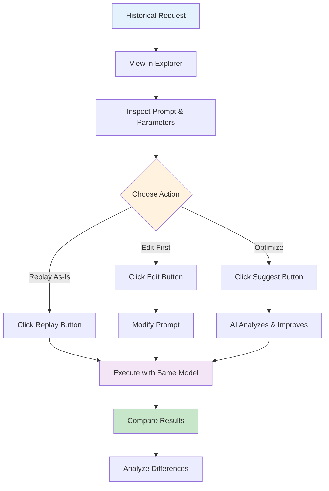
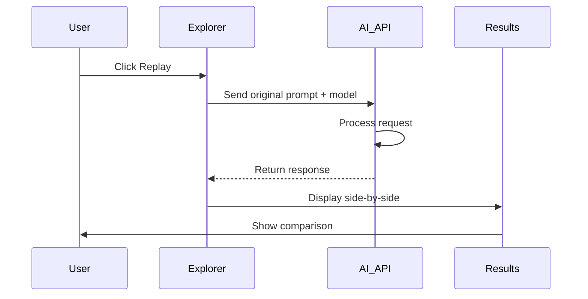
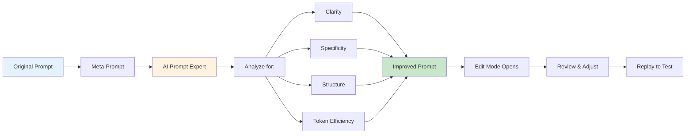
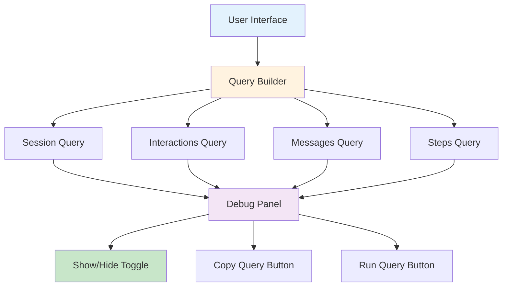
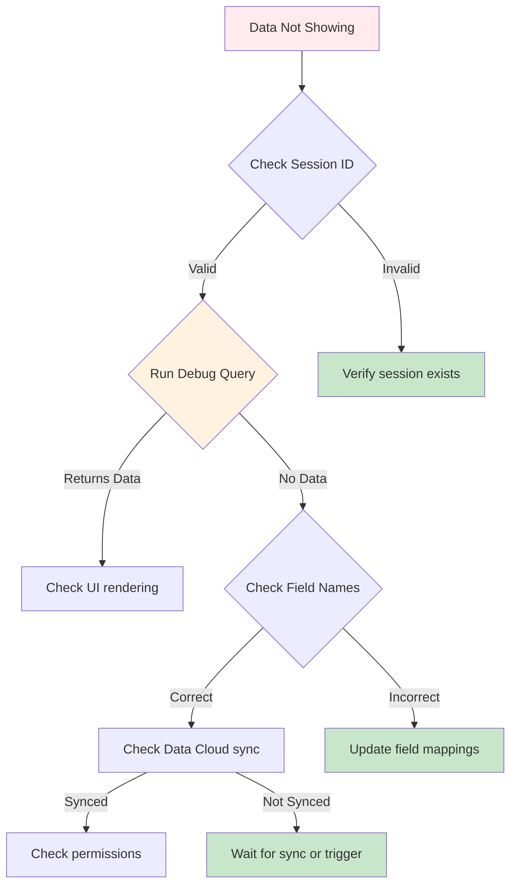

# Request Replay & Debugging Tools

Advanced debugging and testing features for analyzing and replaying GenAI requests.


## The Problem

**Debugging and optimizing AI responses requires the ability to replay requests, experiment with variations, and compare results.**

Teams need to:

- 🔄 **Replay Historical Requests**: Re-run past conversations to verify fixes or test improvements
- 🔬 **Experiment Safely**: Test prompt variations without affecting production
- 📊 **Compare Results**: See how different prompts or models respond to the same input
- 🎯 **Optimize Iteratively**: Refine prompts based on actual results
- 🐛 **Debug Systematically**: Isolate which part of a request caused an issue
- ⚡ **Speed Up Testing**: Validate changes without waiting for real user traffic

**In short**: You need a testing lab to iterate on AI requests and validate improvements before deployment.

## How GenAI Explorer Solves This

GenAI Explorer provides **complete request replay and debugging** with:

✅ **Request Replay**: Replay any historical GenAI request exactly as it was
   - Same prompt, same model, same parameters
   - Compare original vs new responses side-by-side
   - Verify bug fixes instantly

✅ **Prompt Editing**: Edit prompts before replaying to test variations
   - A/B test different approaches
   - Optimize for clarity and efficiency
   - Fix issues quickly without deployment

✅ **AI-Powered Optimization**: Use AI to suggest prompt improvements
   - Einstein analyzes your prompt for clarity, specificity, structure, and token efficiency
   - Get improved version automatically
   - Learn best practices through suggestions

✅ **Debug Query Builder**: See exact SQL queries being executed
   - Copy queries to run in Data Cloud
   - Understand data flow completely
   - Troubleshoot data issues efficiently

✅ **Side-by-Side Comparison**: View original vs replay results with metrics
   - Response quality differences
   - Token usage changes
   - Processing time comparison

**Impact:** Reduce debugging time by 80%, optimize prompts with confidence, and iterate 10x faster on AI improvements.

## Overview

GenAI Explorer provides powerful debugging tools that let you inspect, replay, and optimize AI requests in real-time. These features are essential for troubleshooting, performance optimization, and prompt engineering.

## Key Features

### 🔁 Request Replay
Replay any historical GenAI request to:
- Test prompt changes without affecting production
- Compare model outputs over time
- Verify bug fixes and improvements
- Train and validate prompts

### ✏️ Prompt Editing
Edit prompts before replaying to:
- Fix issues quickly
- Test variations A/B style
- Optimize for token efficiency
- Improve response quality

### 🤖 AI-Powered Prompt Optimization
Use AI to suggest prompt improvements automatically considering:
- Clarity and specificity
- Structure and formatting
- Context and examples
- Token efficiency

### 🔍 Debug Query Builder
See the exact SQL queries being executed for:
- Conversations and interactions
- Messages and steps
- Session data
- Performance metrics

## Request Replay Feature

### How It Works



### Accessing Historical Requests

**Step 1: Navigate to Data Cloud Queries**
1. Open **Atlas Reasoning Engine**
2. Click **Query Lab** tab
3. Select "Recent Requests Tracking" query
4. Execute to see recent GenAI requests

**Step 2: Select a Request**
1. Click on any request from the results
2. View complete details:
   - Original prompt (or masked prompt)
   - Model and parameters
   - Token usage
   - Safety scores
   - Timestamp

**Step 3: Replay Controls**
You'll see three action buttons:

```
┌─────────────────────────────────────────┐
│  [▶️ Replay]  [✏️ Edit]  [🤖 Suggest]  │
└─────────────────────────────────────────┘
```

### Button Actions

#### 1. Replay Button (▶️)
**Purpose:** Replay the request exactly as it was

**When to Use:**
- Verify if a bug still exists
- Compare current model behavior vs historical
- Test infrastructure changes
- Validate fixes

**What Happens:**


**Result:**
- Original response (from history)
- New response (from replay)
- Comparison highlighting differences

#### 2. Edit Button (✏️)
**Purpose:** Modify the prompt before replaying

**When to Use:**
- Test prompt variations
- Fix known issues
- Add context or constraints
- Optimize for better results

**What Happens:**
1. Prompt becomes editable
2. Make your changes
3. Click Replay to test
4. Click Undo to revert

**Example Workflow:**
```
Original Prompt:
"Tell me about this customer"

Edited Prompt:
"Provide a concise summary of this customer including:
- Account status
- Recent orders (last 30 days)
- Open cases
- Renewal date"

→ Click Replay to test improved prompt
```

#### 3. Suggest Button (🤖)
**Purpose:** Use AI to suggest prompt improvements

**When to Use:**
- Prompt is unclear or vague
- Want to optimize token usage
- Need better structure
- Seeking best practices

**What Happens:**



**Meta-Prompt Used:**
```
You are an AI prompt engineering expert. Analyze the following prompt 
and suggest improvements to make it clearer, more specific, and more 
effective. Consider:
- Clarity and specificity
- Structure and formatting
- Context and examples
- Token efficiency

Original prompt:
"""
[Your prompt here]
"""

Provide an improved version of the prompt. Only return the improved 
prompt text, without explanations.
```

**Example Transformation:**

**Before (Vague):**
```
Help with order
```

**After AI Suggestion (Specific):**
```
Please provide the following information about the customer's order:

1. Order Status: Current state (e.g., Processing, Shipped, Delivered)
2. Tracking Number: If available and order has shipped
3. Estimated Delivery: Expected delivery date and time window
4. Items Ordered: List of products with quantities
5. Order Total: Final amount including tax and shipping

Format the response in a clear, customer-friendly manner.
```

### Comparison View

After replaying, see a side-by-side comparison:

```
┌─────────────────────────────────────────────────────────────┐
│ Original Response          │ New Response                   │
│ (Historical)               │ (Replayed)                     │
├────────────────────────────┼────────────────────────────────┤
│ Your order is on the way   │ Your order #12345 is currently │
│                            │ in transit. Tracking: 1Z999AA  │
│                            │ Estimated delivery: Friday     │
└────────────────────────────┴────────────────────────────────┘

📊 Metrics:
   Original: 250 tokens | 1.2s
   New:      280 tokens | 1.1s
   
🎯 Changes Detected:
   ✓ More specific information provided
   ✓ Tracking number included
   ✓ Delivery estimate added
   ⚠️ Token usage increased by 12%
```

## Debug Query Builder

### Overview

See the exact SQL being executed behind the scenes for complete transparency and debugging.



### Accessing Debug Queries

**In Any Session View:**
1. Look for the "🔽 Hide Debug Queries" button at the top
2. Click to toggle query visibility
3. See queries for current tab (Overview, Interactions, Messages, Steps)

**Debug Panel Components:**

```
┌───────────────────────────────────────────────────────────┐
│ 🔍 Query Being Executed:                                  │
│                                                            │
│ ┌──────────────────────────────────────────────────────┐ │
│ │ SELECT ssot__Id__c, ssot__MessageText__c,            │ │
│ │        ssot__MessageRole__c, ssot__Timestamp__c      │ │
│ │ FROM ssot__AiAgentInteractionMessage__dlm            │ │
│ │ WHERE ssot__AiAgentInteractionId__c IN (             │ │
│ │   SELECT ssot__Id__c                                 │ │
│ │   FROM ssot__AiAgentInteraction__dlm                │ │
│ │   WHERE ssot__AiAgentSessionId__c = 'a4j5g...'     │ │
│ │ )                                                     │ │
│ │ ORDER BY ssot__Timestamp__c ASC                     │ │
│ │                                                      │ │
│ │ [📋 Copy]  [▶️ Run Query]                            │ │
│ └──────────────────────────────────────────────────────┘ │
└───────────────────────────────────────────────────────────┘
```

### Query Examples

#### 1. Load Session Interactions
```sql
SELECT 
  ssot__Id__c, 
  ssot__AiAgentInteractionType__c, 
  ssot__TopicApiName__c, 
  ssot__StartTimestamp__c, 
  ssot__EndTimestamp__c
FROM ssot__AiAgentInteraction__dlm
WHERE ssot__AiAgentSessionId__c = '{sessionId}'
ORDER BY ssot__StartTimestamp__c ASC
```

#### 2. Load Conversation Messages
```sql
SELECT 
  m.ssot__Id__c, 
  m.ssot__MessageText__c, 
  m.ssot__MessageRole__c, 
  m.ssot__Timestamp__c, 
  m.ssot__TokenCount__c
FROM ssot__AiAgentInteractionMessage__dlm m
WHERE m.ssot__AiAgentInteractionId__c IN (
  SELECT ssot__Id__c 
  FROM ssot__AiAgentInteraction__dlm
  WHERE ssot__AiAgentSessionId__c = '{sessionId}'
)
ORDER BY m.ssot__Timestamp__c ASC
```

#### 3. Load Processing Steps
```sql
SELECT 
  s.ssot__Id__c, 
  s.ssot__StepType__c, 
  s.ssot__ActionName__c,
  s.ssot__StartTimestamp__c,
  s.ssot__EndTimestamp__c,
  s.ssot__ErrorMessage__c
FROM ssot__AiAgentInteractionStep__dlm s
WHERE s.ssot__AiAgentInteractionId__c IN (
  SELECT ssot__Id__c 
  FROM ssot__AiAgentInteraction__dlm
  WHERE ssot__AiAgentSessionId__c = '{sessionId}'
)
ORDER BY s.ssot__StartTimestamp__c ASC
```

### Using Debug Queries

**Copy Query:**
1. Click "📋 Copy" button
2. Query is copied to clipboard
3. Paste into:
   - Data Cloud Query Lab
   - Salesforce Developer Console
   - External SQL tools

**Run Query:**
1. Click "▶️ Run Query" button
2. Query executes in Data Cloud
3. Results displayed below
4. Can export results to CSV

**Troubleshooting with Queries:**



## Advanced Debugging Workflows

### Workflow 1: Debug Missing Conversation Data

**Problem:** Session shows no interactions

**Steps:**
1. Open session in Explorer
2. Click "Show Debug Queries"
3. Copy the Interactions query
4. Run in Data Cloud Query Lab
5. Analyze results:
   - **0 rows**: Session hasn't synced yet
   - **Rows exist**: UI rendering issue
   - **Error**: Field name mismatch

### Workflow 2: Compare Model Responses

**Problem:** Want to test if GPT-4 performs better than GPT-4o-mini

**Steps:**
1. Find a representative request in Query Lab
2. Click to open request details
3. Click "Replay" → Note response
4. Click "Edit"
5. Change `model__c` reference mentally (or note it)
6. Run same prompt with different model
7. Compare:
   - Response quality
   - Token usage
   - Processing time
   - Cost implications

### Workflow 3: Optimize High-Token Prompts

**Problem:** Request uses too many tokens (expensive)

**Steps:**
1. Find high-token request in Query Lab
2. Sort by `totalTokens__c` descending
3. Open top request
4. Click "Suggest" button
5. AI analyzes and suggests optimized version
6. Review suggestions:
   - Removed redundancy
   - More concise language
   - Better structure
   - Fewer tokens
7. Click "Replay" to verify
8. Compare token usage:
   - Before: 1,500 tokens
   - After: 800 tokens
   - Savings: 47%

### Workflow 4: Trace Request Through Pipeline

**Problem:** Need to understand full request flow

**Steps:**
1. Open request in Explorer
2. Note `gatewayRequestId__c`
3. Switch to Atlas Reasoning Engine
4. Use "Complete Reasoning Trace" query
5. Filter by request ID
6. See all 6 stages:
   - Stage 1: Chit-Chat Detection
   - Stage 2: Query Evaluation
   - Stage 3: Context Refinement
   - Stage 4: Query Planning
   - Stage 5: Advanced Retrieval
   - Stage 6: Safety Gates
7. Identify bottleneck or issue
8. Optimize that specific stage

## Best Practices

### 1. Request Replay
✅ **DO:**
- Test in sandbox first
- Compare side-by-side
- Document changes made
- Track performance metrics
- Test edge cases

❌ **DON'T:**
- Replay in production without testing
- Change multiple variables at once
- Ignore token cost implications
- Skip comparison analysis

### 2. Prompt Optimization
✅ **DO:**
- Use AI suggestions as starting point
- Test optimized prompts thoroughly
- Measure token savings
- Validate quality maintained
- Document improvements

❌ **DON'T:**
- Blindly accept AI suggestions
- Optimize for tokens at expense of quality
- Skip A/B testing
- Forget context requirements

### 3. Debug Query Usage
✅ **DO:**
- Copy queries for documentation
- Share queries with team
- Run queries in Query Lab for deeper analysis
- Check permissions if queries fail
- Verify field names match your org

❌ **DON'T:**
- Modify production data via queries
- Expose sensitive data in query results
- Run queries without understanding them
- Ignore query performance

## Performance Tips

### 1. Replay Optimization
- **Cache responses** during testing to avoid redundant API calls
- **Batch replay** multiple variations to compare efficiently
- **Use cheaper models** (GPT-4o-mini) for initial testing
- **Set token limits** to prevent runaway costs

### 2. Query Optimization  
- **Add date filters** to limit data scanned
- **Use indexed fields** for WHERE clauses
- **Limit results** with `LIMIT` clause
- **Avoid SELECT *** on large tables

### 3. Debugging Efficiency
- **Start with recent data** (LAST_N_DAYS:7)
- **Filter by session ID** when possible
- **Use query builder** to validate syntax
- **Export results** for offline analysis

## Troubleshooting

### Issue: Replay Button Disabled

**Causes:**
- No AI mode configured (OpenAI, Einstein, etc.)
- No prompt available (masked or null)
- Already replaying (button shows "Replaying...")

**Solution:**
1. Configure AI mode in Settings
2. Verify prompt field has data
3. Wait for current replay to complete

### Issue: Suggest Button Returns Poor Suggestions

**Causes:**
- Original prompt is already optimal
- AI misunderstood context
- Model used for suggestions needs tuning

**Solution:**
1. Edit suggestion manually
2. Try suggesting again
3. Use as inspiration, not final version

### Issue: Debug Queries Show No Data

**Causes:**
- Data Cloud sync delay
- Incorrect session ID
- Field name mismatch
- Permission issues

**Solution:**
1. Wait 5 minutes for sync
2. Verify session ID is correct
3. Check field names in SSOT schema
4. Verify Data Cloud access

## Next Steps

- [Atlas Reasoning Engine](./3-atlas-reasoning-engine.md) - Understand the 6-stage pipeline
- [Data Cloud Integration](./6-data-cloud-integration.md) - Advanced querying

