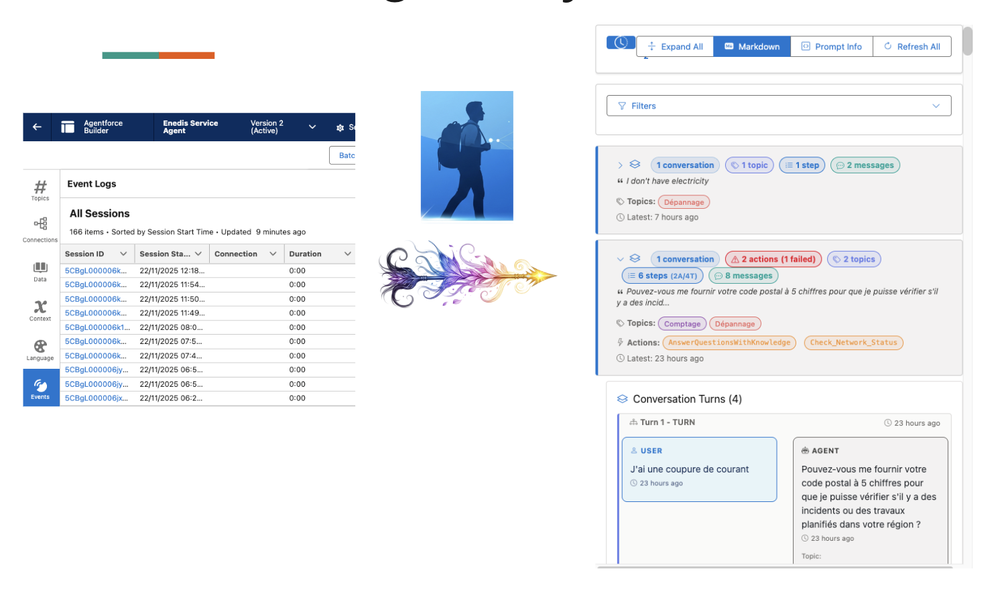
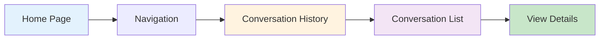
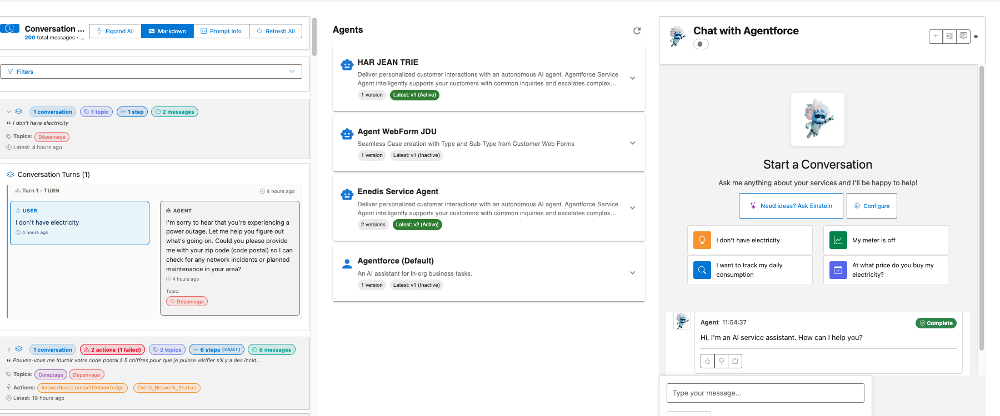

# Conversation History

View, filter, and analyze all historical conversations with your Agentforce agents.



## The Problem

**Understanding how your agents are performing requires visibility into past conversations, including successful interactions and errors.**

Teams need to:

- 📊 **Monitor Quality**: Review conversations to ensure agents are responding appropriately
- 🐛 **Debug Issues**: Investigate specific conversations where users reported problems
- 📈 **Analyze Patterns**: Identify common queries, popular topics, and frequent errors
- 🔍 **Filter Effectively**: Find specific conversations by date, errors, or content
- ✅ **Audit Behavior**: Review agent decisions for compliance and governance
- 📤 **Share Insights**: Export conversations for team review or stakeholder updates

**In short**: You need a centralized view of all conversations to monitor, debug, and improve your agent implementations.

## How GenAI Explorer Solves This

GenAI Explorer provides **comprehensive conversation analytics** with:

✅ **Complete Conversation View**: See all sessions, messages, topics, and actions in one place

✅ **Advanced Filtering**: Find exactly what you need
   - Text search across all content
   - Date range filters (From/To)
   - Error-only conversations
   - By topic or agent
   - Clear all filters with one click

✅ **Visual Filter Badges**: Active filters shown as colored badges for clarity

✅ **Expanded Details**: Click any conversation to see
   - Full message timeline
   - Topics invoked
   - Actions executed (success/failure)
   - Step-by-step processing
   - Error messages with context

✅ **Analytics & Insights**: Built-in metrics
   - Total conversations, interactions, messages
   - Average turns per session
   - Failed action rates
   - Performance trends

✅ **Export Capabilities**: Export to JSON, CSV, or Text for reporting

**Impact:** Review quality in minutes, debug issues 5x faster, and gain actionable insights into agent performance and user patterns.

## Overview

The Conversation History feature provides a comprehensive view of all past interactions with your Agentforce agents. It's an essential tool for monitoring agent performance, debugging issues, analyzing user patterns, and ensuring quality customer service.

## Key Features

### 📊 Complete Conversation View
- **All Sessions**: See every conversation across all agents
- **Message Details**: Full transcript with timestamps
- **Topic Information**: Which topics were invoked
- **Action Tracking**: What actions were executed
- **Error Visibility**: Failed actions and error messages

### 🔍 Advanced Filtering


- **Text Search**: Search across all conversation content
- **Date Range**: Filter by time period (From/To dates)
- **Error Filter**: Show only conversations with errors
- **Topic Filter**: Filter by specific topics
- **Agent Filter**: Filter by specific agents/planners

### 📈 Analytics & Insights
- **Total Statistics**: Messages, interactions, and sessions count
- **Performance Metrics**: Response times and success rates
- **Usage Patterns**: Most active topics and actions
- **Error Analysis**: Failure rates and common issues

## Accessing Conversation History

### From the Home Page



1. Open GenAI Explorer
2. Navigate to **Home** or **Agentforce**
3. Look for the **"Conversation History"** section
4. Browse the list of conversations

### Navigation Options

**Main View:**
- **Home → Conversation History** - All conversations across all agents
- **Agent Details → Conversations** - Conversations for specific agent
- **Atlas → Query Lab → Recent Requests** - Technical request view

## Using Filters

### Text Search

**Search across:**
- User messages
- Agent responses
- Topic names
- Action names
- Error messages

**How to use:**
1. Type your search term in the search box
2. Results filter automatically as you type
3. Search is case-insensitive
4. Supports partial matches

**Example Searches:**
- `"order"` - Find all conversations about orders
- `"error"` - Find conversations with errors
- `"refund"` - Find refund-related conversations

### Date Range Filter

**Filter by conversation date:**

```
┌─────────────────────────────────────────┐
│ From: [2024-01-01]  To: [2024-01-31]   │
└─────────────────────────────────────────┘
```

**Options:**
- **From Date Only**: Show conversations from this date forward
- **To Date Only**: Show conversations up to this date
- **Both Dates**: Show conversations in the date range

**Date Handling:**
- From Date: Includes entire day (00:00:00 start)
- To Date: Includes entire day (23:59:59 end)
- Dates are inclusive

**Use Cases:**
- Monthly reviews: Set first and last day of month
- Incident investigation: Set date range around incident
- Performance analysis: Compare different time periods

### Error Filter

**Show only conversations with errors:**

```
☑️ Show only conversations with errors
```

**What counts as an error:**
- Failed action executions
- API errors
- Timeout errors
- Data validation errors
- Permission errors

**When to use:**
1. **Troubleshooting**: Find problematic conversations quickly
2. **Quality Assurance**: Review all failures
3. **Pattern Detection**: Identify recurring issues
4. **Root Cause Analysis**: Investigate error causes

### Topic Filter

**Filter by specific topics:**

```
Topic: [Select Topic ▼]
       - Billing Inquiries
       - Technical Support
       - Account Management
       - Order Status
```

**Use Cases:**
- Analyze specific topic performance
- Review topic-specific conversations
- Compare topics against each other
- Identify topic-specific issues

### Agent/Planner Filter

**Filter by agent:**

```
Agent: [Select Agent ▼]
       - Service Agent v2
       - Sales Agent v1
       - Support Agent v3
```

**Use Cases:**
- Compare agent versions
- Test new agent configurations
- Isolate agent-specific issues
- Agent performance analysis

### Clear All Filters

**Reset all filters at once:**

```
[🗑️ Clear All Filters]
```

**Clears:**
- Text search
- Date range (From/To)
- Error filter checkbox
- Topic selection
- Agent/Planner selection

## Filter Badges

Active filters display as badges in the header:

```
┌─────────────────────────────────────────────────────┐
│ Conversation History                                 │
│                                                      │
│ 🔴 With Errors  🔵 Jan 1 - Jan 31  🟢 Billing      │
└─────────────────────────────────────────────────────┘
```

**Badge Colors:**
- 🔴 **Red**: Error filter active
- 🔵 **Blue**: Date range active
- 🟢 **Green**: Topic/Agent filter active

Click any badge to remove that filter.

## Conversation Details

### Expanded View

Click on any conversation to expand and see:



**1. Header Information:**
- Conversation ID
- Start and end timestamps
- Duration
- Agent name and version

**2. Statistics:**
- Total messages exchanged
- Number of topics invoked
- Actions executed
- Steps taken (Action/Topic steps)

**3. Topics Used:**
```
Topics:
• Billing Inquiries
• Account Management
```

**4. Actions Executed:**
```
Actions:
• GetOrderStatus ✓
• ProcessRefund ❌ (Failed)
• SendConfirmationEmail ✓
```

**5. Message Timeline:**

```
┌─────────────────────────────────────────┐
│ 👤 USER (2:30 PM)                       │
│ I need help with my order               │
└─────────────────────────────────────────┘

┌─────────────────────────────────────────┐
│ 🤖 AGENT (2:30 PM)                      │
│ I'll help you with your order. Let me   │
│ check the status for you.               │
└─────────────────────────────────────────┘

┌─────────────────────────────────────────┐
│ 🤖 AGENT (2:30 PM)                      │
│ Your order #12345 is in transit...      │
└─────────────────────────────────────────┘
```

**6. Step Details:**
```
Step 1: TOPIC_MATCH → Billing Inquiries (1.2s)
Step 2: ACTION → GetOrderStatus (0.8s)
Step 3: TOPIC_MATCH → Order Status (0.5s)
Step 4: GENERATION → Response Generated (2.1s)
```

## Viewing Options

### Expand/Collapse Controls

**Expand All Button:**
```
[⬇️ Expand All]
```
Opens all conversations at once to see full details.

**Individual Expansion:**
Click on any conversation header to toggle its expansion.

### Display Options

**Markdown Rendering:**
```
[📝 Markdown] Toggle
```
Enable/disable markdown formatting in agent responses.

**Prompt Info:**
```
[ℹ️ Prompt Info] Toggle
```
Show/hide system prompts and instructions used.

**Refresh:**
```
[🔄 Refresh All]
```
Reload conversations and get latest data.

## Analytics & Insights

### Summary Statistics

At the top of the page:

```
┌─────────────────────────────────────────────────────┐
│ 200 total messages • 103 interactions • 66 sessions │
└─────────────────────────────────────────────────────┘
```

**After Filtering:**
```
┌─────────────────────────────────────────────────────┐
│ Showing 15 conversations matching your filters       │
│ 45 messages • 23 interactions • 15 sessions         │
└─────────────────────────────────────────────────────┘
```

### Performance Metrics

**Available at bottom of page:**

```
┌──────────────────────────────────────┐
│ 📊 Analytics                         │
│                                      │
│ Total Sessions:        66            │
│ Total Interactions:    103           │
│ Avg Turns/Session:     1.6           │
│ Failed Actions:        19 (18%)      │
└──────────────────────────────────────┘
```

## Use Cases

### 1. Quality Assurance Review

**Goal:** Review recent agent conversations for quality

**Steps:**
1. Set date range to last 7 days
2. Browse conversations
3. Check agent response quality
4. Look for incorrect information
5. Identify training needs

### 2. Error Investigation

**Goal:** Debug why certain conversations fail

**Steps:**
1. Enable "With Errors" filter
2. Review failed conversations
3. Check error messages in steps
4. Identify patterns (same action failing?)
5. Fix configuration or data issues

### 3. Topic Performance Analysis

**Goal:** Understand how well a topic is performing

**Steps:**
1. Filter by specific topic
2. Review all conversations for that topic
3. Check success rate
4. Analyze response times
5. Identify improvement opportunities

### 4. Agent Comparison

**Goal:** Compare two agent versions

**Steps:**
1. Filter by Agent v1, note metrics
2. Filter by Agent v2, note metrics
3. Compare:
   - Success rates
   - Response times
   - Error rates
   - User satisfaction patterns

### 5. Usage Pattern Analysis

**Goal:** Understand when and how agents are used

**Steps:**
1. Review conversations across date ranges
2. Identify peak usage times
3. Common topics and questions
4. Seasonal patterns
5. Capacity planning insights

## Advanced Filtering Combinations

### Example: Recent Billing Errors

```
Filters:
✅ Date Range: Last 7 days
✅ Topic: Billing Inquiries
✅ With Errors: Yes

Result: All failed billing conversations in the past week
```

### Example: Successful Sales Conversations This Month

```
Filters:
✅ Date Range: This month
✅ Agent: Sales Agent v2
❌ With Errors: No (unchecked)
✅ Search: "purchase" OR "buy"

Result: All successful sales-related conversations
```

### Example: High-Value Customer Interactions

```
Filters:
✅ Search: "premium" OR "vip"
✅ Date Range: Last 30 days
❌ With Errors: No

Result: All premium customer conversations without issues
```

## Exporting Conversations

### Export Options

**1. Individual Conversation:**
- Click conversation
- Click export icon
- Choose format: JSON, CSV, or Text

**2. Filtered Results:**
- Apply your filters
- Click "Export Filtered"
- All matching conversations export

**3. Full History:**
- No filters applied
- Click "Export All"
- Complete conversation history

### Export Formats

**JSON:**
```json
{
  "sessionId": "a4j5g000...",
  "startTime": "2024-01-15T14:30:00Z",
  "messages": [...],
  "interactions": [...],
  "steps": [...]
}
```

**CSV:**
```csv
SessionID,Timestamp,Role,Message,Topic,Action,Error
a4j5g...,2024-01-15 14:30,USER,"Help with order",,
a4j5g...,2024-01-15 14:30,AGENT,"Let me check",Billing,GetOrder,
```

**Text:**
```
Conversation: a4j5g000...
Date: January 15, 2024 2:30 PM

USER: Help with my order
AGENT: Let me check your order status...
```

## Best Practices

### 1. Regular Review
✅ **DO:**
- Review conversations weekly
- Check error rates regularly
- Monitor topic performance
- Track improvement trends

❌ **DON'T:**
- Wait for issues to escalate
- Ignore error patterns
- Skip regular audits

### 2. Effective Filtering
✅ **DO:**
- Start broad, then narrow
- Use date ranges for context
- Combine multiple filters
- Save common filter combinations

❌ **DON'T:**
- Apply too many filters at once
- Filter so narrowly you miss patterns
- Forget to clear filters between searches

### 3. Error Analysis
✅ **DO:**
- Use error filter first
- Group errors by type
- Track resolution status
- Document fixes applied

❌ **DON'T:**
- Ignore low-frequency errors
- Assume one-off errors
- Skip root cause analysis

### 4. Performance Monitoring
✅ **DO:**
- Track metrics over time
- Compare periods
- Set benchmarks
- Alert on degradation

❌ **DON'T:**
- React to single conversations
- Ignore seasonal patterns
- Skip context analysis

## Troubleshooting

### Issue: No Conversations Showing

**Possible Causes:**
- Filters too restrictive
- No data synced yet
- Date range excludes all data
- Permission issues

**Solutions:**
1. Click "Clear All Filters"
2. Check date range is reasonable
3. Wait for Data Cloud sync (5 min)
4. Verify Data Cloud access

### Issue: Missing Message Content

**Possible Causes:**
- PII masking enabled
- Data not fully synced
- Permissions limited

**Solutions:**
1. Check PII settings
2. Wait for full sync
3. Verify field-level security

### Issue: Slow Loading

**Possible Causes:**
- Too many conversations
- No date range filter
- Large message content

**Solutions:**
1. Add date range filter
2. Limit to last 30 days
3. Use search to narrow results
4. Export for offline analysis

## Next Steps

- [Request Replay & Debugging](./11-request-replay-debugging.md) - Debug specific conversations
- [Data Cloud Integration](./6-data-cloud-integration.md) - Advanced queries
- [Atlas Reasoning Engine](./3-atlas-reasoning-engine.md) - Understanding AI processing stages

