# Topic Collision Analysis

Use Einstein AI to detect and resolve overlapping topics that could cause message routing issues.

<!--  -->


## The Problem

**As your agent implementation grows with more topics, ensuring they don't overlap or conflict becomes increasingly complex.**

Teams need to:

- 🎯 **Prevent Routing Confusion**: Ensure each user message is routed to the correct, most specific topic
- 🔍 **Identify Overlaps**: Detect when multiple topics could handle the same query
- ⚖️ **Maintain Consistency**: Provide predictable, reliable responses to users
- 📊 **Scale Confidently**: Add new topics without breaking existing routing
- 🎨 **Optimize Scope**: Define clear boundaries for each topic's responsibility
- ✅ **Validate Changes**: Test topic updates before deploying to production

**In short**: You need a way to ensure your topics are orthogonal (non-overlapping) so users get routed to the right place every time.

## How GenAI Explorer Solves This

GenAI Explorer uses **Einstein AI analysis** to:

✅ **Automatic Detection**: Einstein analyzes all topic pairs and identifies overlaps with precision scores

✅ **Overlap Scoring**: See exactly how much topics overlap (0-100%) and why

✅ **Root Cause Analysis**: Einstein explains why topics collide with clear reasoning

✅ **Specific Resolutions**: Get 2-3 actionable suggestions per collision (merge, refine scope, add exclusions)

✅ **Visual Comparison**: See overlapping vs orthogonal topics side-by-side with diagrams

✅ **Resolution Strategies**: Learn 5 proven approaches to fix collisions (scope refinement, merging, exclusions, splitting, hierarchy)

**Impact:** Achieve 95%+ topic classification accuracy, eliminate routing inconsistencies, and build reliable agents users can trust.

## Overview

The Topic Collision Analysis feature uses Einstein AI to detect when multiple topics in a GenAI Planner have overlapping scopes. Since topics are used to classify incoming messages, they must be **orthogonal** (non-overlapping) to ensure proper message routing and classification.

## Why This Matters

When topics have overlapping scopes:
- **Classification Ambiguity**: A single user message could match multiple topics
- **Routing Failures**: The system cannot determine which topic should handle the message
- **Inconsistent Behavior**: Similar messages may be routed to different topics unpredictably
- **Poor User Experience**: Users receive incorrect or incomplete responses

```mermaid
graph LR
    subgraph "Overlapping Topics Problem"
        User[User Query: Product help request] --> T1{Topic 1: Customer Support}
        User --> T2{Topic 2: Product Inquiries}
        T1 -.overlap 75%.-> Confusion[Classification Confusion]
        T2 -.overlap 75%.-> Confusion
        Confusion --> Bad[Inconsistent Routing]
    end
    
    subgraph "Orthogonal Topics Solution"
        User2[User Query: Product help request] --> Decision{Clear Classification}
        Decision -->|Technical Issue| Tech[Topic: Technical Support]
        Decision -->|Pre-sale Question| Sales[Topic: Sales Inquiries]
        Tech --> Good1[Consistent Routing ✓]
        Sales --> Good2[Consistent Routing ✓]
    end
    
    style Confusion fill:#ffebee
    style Bad fill:#ffcdd2
    style Good1 fill:#c8e6c9
    style Good2 fill:#c8e6c9
    style Decision fill:#fff3e0
```



## How It Works


### 1. Analysis Trigger
When viewing a GenAI Planner, you'll see an alert prompting you to analyze topics:

```
Topic Scope Analysis
Use Einstein to analyze topic scopes for potential collisions. 
Topics must be orthogonal to properly classify messages.
[Analyze Button]
```

### 2. Einstein Analysis Process
When clicked, the system:
1. **Gathers Topic Information**: Collects all topic metadata including:
   - Master Label and Developer Name
   - Description
   - Scope definition
   - Plugin Type

2. **Calls Einstein API**: Sends a structured prompt asking Einstein to:
   - Compare each pair of topics
   - Calculate overlap scores (0.0 to 1.0)
   - Identify why topics overlap
   - Suggest specific resolutions

3. **Displays Results**: Shows a comprehensive analysis with actionable recommendations

### 3. Analysis Results

#### No Collisions Detected ✓
```
✓ No Topic Collisions Detected
All topics have orthogonal scopes and should classify messages correctly.
```

#### Collisions Detected ⚠️
When collisions are found, the system displays:

**For each collision:**
- **Topic Pair**: Shows which two topics overlap
- **Overlap Score**: Percentage indicating severity (e.g., "75% overlap")
- **Overlap Reason**: Detailed explanation from Einstein
- **Suggested Resolutions**: 2-3 specific actions to resolve the collision

**Example:**
```
⚠️ Topic Scope Collisions Detected
Found 2 potential collision(s). Topics with overlapping scopes may cause classification failures.

┌─────────────────────────────────────────────────────────────┐
│ [Customer Support] overlaps with [Product Inquiries] 75%    │
│                                                              │
│ Reason: Both topics handle customer questions about         │
│ product features and troubleshooting.                       │
│                                                              │
│ Suggested Resolutions:                                      │
│ • Narrow Customer Support to only handle technical issues   │
│ • Limit Product Inquiries to pre-sales questions only       │
│ • Merge both into a comprehensive "Customer Service" topic  │
└─────────────────────────────────────────────────────────────┘

[Re-analyze Button]
```

## Resolution Strategies

Einstein typically suggests these types of resolutions:

```mermaid
graph TB
    Collision[Topic Collision Detected] --> Strategy{Choose Strategy}
    
    Strategy -->|70%+ Overlap| Merge[Topic Merging]
    Strategy -->|Vague Boundaries| Refine[Scope Refinement]
    Strategy -->|Too Broad| Split[Topic Splitting]
    Strategy -->|Similar but Different| Exclude[Exclusion Criteria]
    Strategy -->|Related Concepts| Hierarchy[Hierarchy Creation]
    
    Merge --> M1["Combine into single topic"]
    Refine --> R1["Narrow focus of each topic"]
    Split --> S1["Break into specific topics"]
    Exclude --> E1["Add explicit boundaries"]
    Hierarchy --> H1["Create parent-child structure"]
    
    M1 --> Test[Test with Sample Messages]
    R1 --> Test
    S1 --> Test
    E1 --> Test
    H1 --> Test
    
    Test --> Success[✓ Clear Classification]
    
    style Collision fill:#ffebee
    style Strategy fill:#fff3e0
    style Merge fill:#e1f5ff
    style Refine fill:#f3e5f5
    style Split fill:#fff4e6
    style Exclude fill:#fce4ec
    style Hierarchy fill:#f1f8e9
    style Success fill:#c8e6c9
```



### 1. Scope Refinement
Narrow the focus of one or both topics to eliminate overlap.

**Example:**
- Original: "Customer Support" (handles all customer questions)
- Refined: "Technical Support" (handles only technical issues)

### 2. Topic Merging
Combine overlapping topics into a single, comprehensive topic.

**When to use:**
- Topics have >70% overlap
- Separating them adds no value to users
- They share the same underlying knowledge base

### 3. Exclusion Criteria
Add explicit boundaries to topic scopes.

**Example:**
- Topic A: "Product Questions" (excludes pricing)
- Topic B: "Pricing Inquiries" (only handles pricing)

### 4. Topic Splitting
Break down overly broad topics into more specific ones.

**Example:**
- Original: "General Inquiries" (too broad)
- Split into:
  - "Account Questions"
  - "Billing Questions"
  - "Technical Questions"

### 5. Hierarchy Creation
Establish parent-child relationships between topics.

**Example:**
- Parent: "Customer Service"
  - Child: "Returns & Refunds"
  - Child: "Order Status"
  - Child: "Product Support"

## Best Practices

### 1. Regular Analysis
- Run analysis after adding new topics
- Re-analyze when modifying topic scopes
- Check periodically as part of planner maintenance

### 2. Topic Design Guidelines

**DO:**
- ✓ Create specific, focused topics
- ✓ Use clear, descriptive scope definitions
- ✓ Document exclusions and boundaries
- ✓ Test with sample messages

**DON'T:**
- ✗ Create overly broad "catch-all" topics
- ✗ Use vague scope descriptions
- ✗ Ignore overlap warnings
- ✗ Duplicate functionality across topics

### 3. Testing Recommendations

After resolving collisions:
1. Test with real user messages
2. Monitor classification accuracy
3. Review routing patterns
4. Adjust scopes based on actual usage

## User Workflow

1. **Navigate** to a GenAI Planner in SF Explorer
2. **Click** the "Analyze" button in the Topic Scope Analysis section
3. **Review** any detected collisions
4. **Implement** suggested resolutions:
   - Edit topic scopes in Salesforce
   - Merge or split topics as needed
   - Update descriptions and instructions
5. **Re-analyze** to verify fixes
6. **Test** with sample messages to confirm proper routing

## Technical Details

### API Integration

The feature uses Einstein's LLM Completions API:

```typescript
const einsteinEndpoint = `/services/data/v60.0/einstein/llm/completions`

const requestBody = {
   prompt: analysisPrompt,
   model: "sfdc_ai__DefaultGPT4Omni",
   maxTokens: 2000,
   temperature: 0.3, // Low temperature for consistent analysis
   responseFormat: { type: "json_object" }
}
```

### Fallback Analysis

If Einstein API is unavailable, the system performs basic text similarity analysis:
- Compares topic names, descriptions, and scopes
- Calculates Jaccard similarity coefficient
- Suggests generic resolutions

This ensures the feature remains functional even without Einstein access.

## Troubleshooting

### Issue: False Positives
**Symptom**: Topics flagged as overlapping but shouldn't be

**Solution**: 
- Review Einstein's reasoning
- Check if scope descriptions are unclear
- Add more specific scope details
- Re-run analysis

### Issue: Einstein API Errors
**Symptom**: Analysis fails with API error

**Solution**:
- Fallback analysis will run automatically
- Check Einstein API permissions
- Verify org has Einstein features enabled
- Contact Salesforce support if persistent

### Issue: No Collisions Detected (But Problems Exist)
**Symptom**: Analysis shows no issues but messages route incorrectly

**Solution**:
- Check topic instructions (not just scopes)
- Review actual message classification logs
- Test with specific problematic messages
- Consider semantic overlaps Einstein might miss

## Next Steps

- [Configuration Explorer](/genai/configuration-explorer) - View all your topics and agents
- [Chat with Agents](/genai/chat-with-agents) - Test message routing with sample conversations
- [FAQ](/genai/faq) - Frequently asked questions

