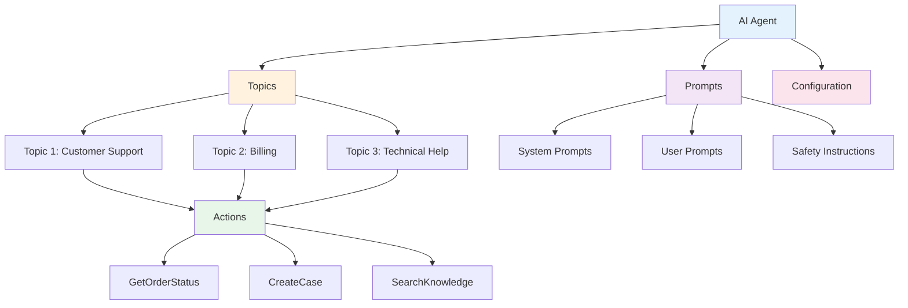

# Agent blueprint

Browse and understand all AI Agents, Topics, Actions, and Prompts configured in your Salesforce org with comprehensive entity relationship diagrams.

## The Problem

**Understanding how all the pieces of your Agentforce implementation fit together can be challenging, especially as complexity grows.**

As your AI implementation scales, you need to:

- 🗺️ **Visualize Relationships**: See how agents, topics, actions, and prompts connect
- 📊 **Track Dependencies**: Understand what will be impacted when you make changes
- 🔍 **Quick Discovery**: Find specific components without navigating through multiple setup pages
- 📋 **Version Management**: Keep track of which agent versions are active vs. draft
- 🎯 **Configuration Audit**: Review your entire setup to ensure best practices

**In short**: You need a unified view to understand and manage your growing Agentforce implementation.
- ❌ **No Visualization**: Can't see the big picture of your AI architecture
- ❌ **Version Confusion**: Multiple agent versions with no clear comparison
- ❌ **Documentation Gap**: No built-in way to document your AI setup

**Result:** Teams waste hours navigating Salesforce Setup, and critical relationships between AI components remain invisible.

## How GenAI Explorer Solves This

GenAI Explorer provides a **unified configuration view** with:

✅ **Complete Agent Browser**: See all agents, topics, actions, and prompts in one place

✅ **Visual ERD Diagrams**: Interactive diagrams showing how everything connects

✅ **Relationship Mapping**: Instantly see which topics use which actions, which prompts belong where

✅ **Version Comparison**: Side-by-side comparison of agent versions

✅ **Deep Inspection**: Click any component to see full configuration details

✅ **Documentation Ready**: Export diagrams and configurations for team documentation

**Impact:** Understand your entire AI setup in minutes instead of hours, make informed configuration decisions, and onboard new team members 10x faster.

## Overview

The Configuration Explorer provides a comprehensive view of your Agentforce setup, allowing you to understand how all the pieces fit together - from agents to topics to actions to prompts.

