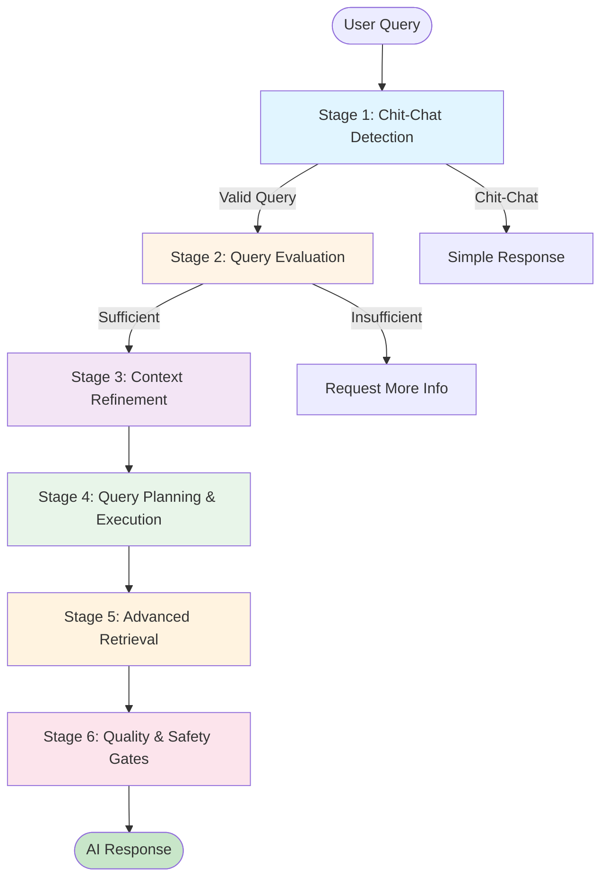
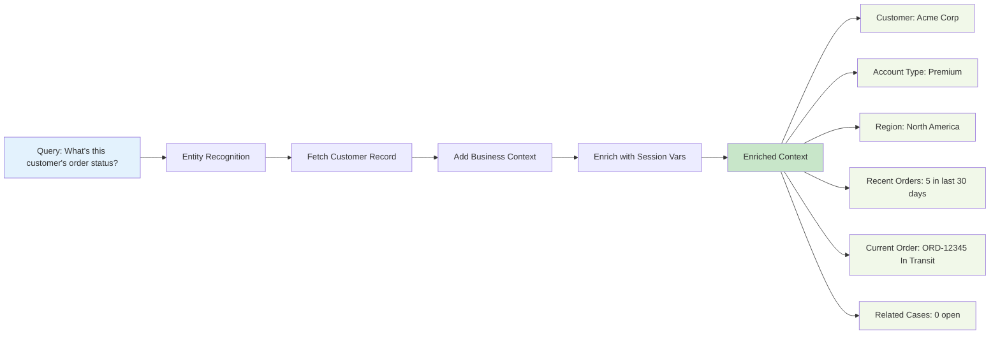
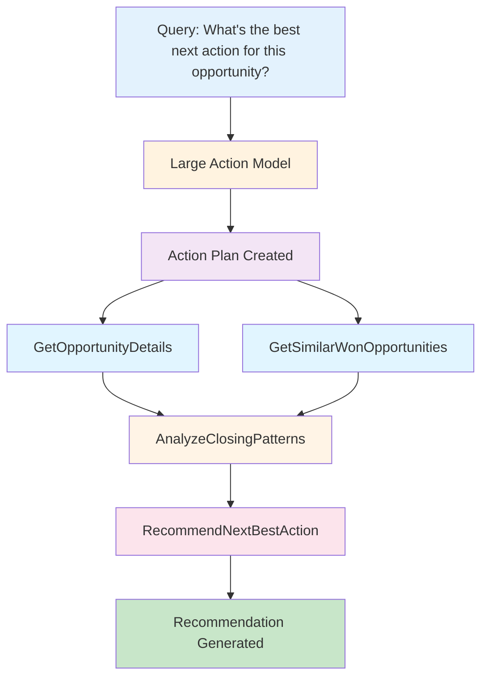
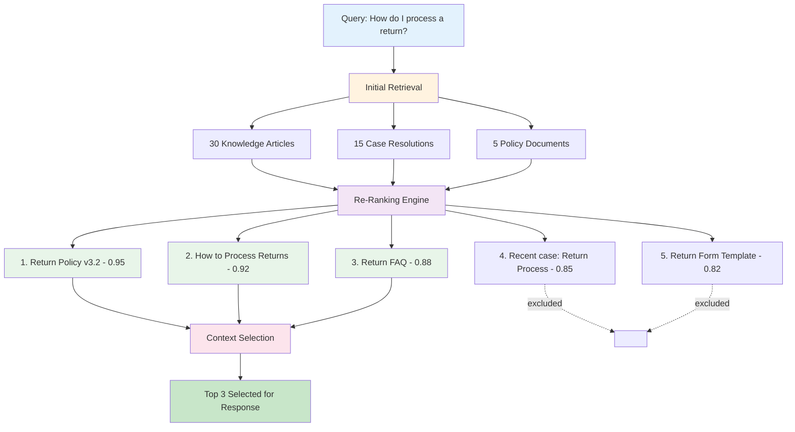
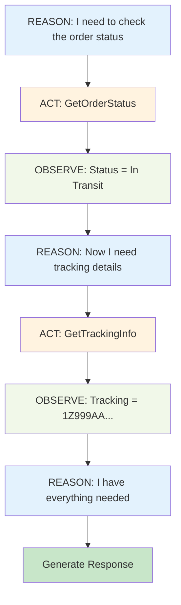
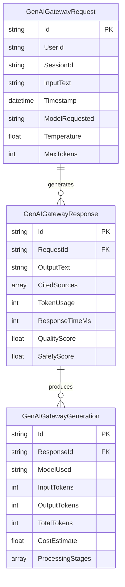

# Atlas Reasoning Engine

Understand and visualize the "brain" behind Salesforce Agentforce - the six-stage AI processing pipeline that powers intelligent agent responses.


## The Problem

**Understanding what happens between sending a query and receiving an AI response is crucial for optimization and debugging.**

When working with AI agents, you need to:

- 🔍 **Understand Processing**: See how your queries flow through the AI pipeline
- ⚡ **Identify Bottlenecks**: Find which stages are consuming time or tokens
- 🐛 **Debug Issues**: Trace where problems occur in the reasoning process
- 📊 **Analyze Performance**: Monitor token usage, response times, and quality scores
- 💰 **Optimize Costs**: Identify opportunities to reduce token consumption

**In short**: You need visibility into the AI reasoning process to build better, faster, and more cost-effective agents.

## How GenAI Explorer Solves It

Atlas Reasoning Engine visualization provides **complete transparency** into AI processing:

1. **Six-Stage Visualization**: See the entire pipeline from chit-chat detection to safety gates
2. **Live Data Integration**: Query Lab runs pre-built queries against your actual Data Cloud
3. **Performance Metrics**: See processing time and token usage for each stage
4. **Complete Reasoning Traces**: Follow a request through all six stages with full details
5. **Ready-to-Use Queries**: 6+ pre-built SQL queries for common analysis tasks

Think of it as **observability for AI** - understand what's happening inside the black box.

## Overview

## The Problem

**AI agents are black boxes - you have no idea how they process queries or why they make certain decisions.**

The visibility gap developers and AI engineers face:

- ❌ **No Transparency**: Can't see the reasoning process behind agent responses
- ❌ **Unknown Pipeline**: Don't understand the stages AI queries go through
- ❌ **Performance Mystery**: No visibility into which stage causes delays
- ❌ **Debugging Nightmare**: When something goes wrong, where do you even start?
- ❌ **Token Waste**: Don't know which stages consume the most tokens
- ❌ **Data Inaccessibility**: Performance data trapped in Data Cloud with complex queries

**Result:** Teams can't optimize AI performance, debug issues efficiently, or understand why their agents behave unexpectedly.

## How GenAI Explorer Solves This

GenAI Explorer **opens the black box** with:

✅ **Interactive Pipeline Visualization**: See all 6 Atlas stages in an intuitive diagram
   - Stage 1: Chit-Chat Detection
   - Stage 2: Query Evaluation
   - Stage 3: Context Refinement
   - Stage 4: Query Planning & Execution
   - Stage 5: Advanced Retrieval (RAG)
   - Stage 6: Quality & Safety Gates

✅ **Query Lab**: Pre-built Data Cloud queries to analyze real performance data
   - Complete reasoning traces
   - Token usage by model and stage
   - Processing time per stage
   - Safety and compliance metrics

✅ **Live Data Integration**: Execute queries directly and see your actual org data

✅ **Performance Insights**: Built-in benchmarks showing 2x relevance improvement and 33% accuracy increase

✅ **Educational Diagrams**: ReAct loop, ERD diagrams, and data flow visualizations

**Impact:** Reduce debugging time by 70%, optimize token usage by 40%, and truly understand how your AI agents work under the hood.

## Overview

The Atlas Reasoning Engine is Salesforce's proprietary AI orchestration system that processes every query through a sophisticated pipeline. GenAI Explorer provides interactive visualizations and live data integration to help you understand exactly how your AI queries are processed.

## What is Atlas?

Atlas is the reasoning engine that coordinates:
- **Query understanding** and intent classification
- **Context enrichment** from your Salesforce data
- **Action planning** and execution
- **Information retrieval** from multiple sources
- **Response generation** with citations
- **Safety and quality** checks

Think of it as the conductor of an orchestra, coordinating multiple AI models, data sources, and safety systems to produce intelligent, grounded, and safe responses.

## The Six-Stage Pipeline



### Stage 1: Chit-Chat Detection

**Purpose:** Determine if the query is a genuine request or casual conversation.

**Process:**
- Analyzes input text
- Detects greetings, pleasantries, or off-topic requests
- Routes to appropriate handler

**Examples:**
- ✅ Valid: "What's the status of order 12345?"
- ⚠️ Chit-chat: "Hello, how are you?"
- ❌ Invalid: "Tell me a joke"

**Why It Matters:**
Saves processing time and tokens by handling simple interactions efficiently.

### Stage 2: Query Evaluation

**Purpose:** Determine if the query has enough information to be answered.

**Process:**
- Checks for missing required parameters
- Identifies ambiguous references
- Validates context sufficiency

**Examples:**
- ✅ Sufficient: "Show me orders from this customer" (with customer context set)
- ❌ Insufficient: "Show me orders" (no customer specified)

**Agent Response:**
"I need more information. Which customer's orders would you like to see?"

**Why It Matters:**
Prevents wasted API calls and ensures quality responses.

### Stage 3: Context Refinement

**Purpose:** Enrich the query with relevant context from your Salesforce org.

**Process:**
1. Identifies entities mentioned (accounts, contacts, orders, etc.)
2. Fetches relevant records from Salesforce
3. Adds business context (account tier, region, history, etc.)
4. Enriches with session variables

**Example Enrichment:**



**Why It Matters:**
Context is key to accurate, personalized AI responses.

### Stage 4: Query Planning & Execution

**Purpose:** Create and execute a plan to answer the query using available actions.

**Components:**

#### LAMs (Large Action Models)
- Determines which actions to invoke
- Plans the sequence of operations
- Handles dependencies between actions

#### APIGen
- Generates API calls dynamically
- Optimizes query parameters
- Handles error cases

**Example Plan:**



**Execution:**
- Actions run in parallel when possible (A1 and A2 run simultaneously)
- Results are cached for efficiency
- Errors trigger fallback strategies

**Why It Matters:**
Intelligent action planning reduces latency and improves accuracy.

### Stage 5: Advanced Retrieval

**Purpose:** Find and rank the most relevant information from all available sources.

**Process:**

#### 1. Initial Retrieval
Fetch candidates from multiple sources:
- Knowledge articles
- Salesforce records
- External APIs
- Vector embeddings (RAG)

#### 2. Re-Ranking
Score and sort results by relevance:
- Semantic similarity
- Recency
- Authority
- User preferences

#### 3. Context Selection
Choose the best information to include:
- Most relevant results
- Diverse perspectives
- Within token limits

**Example:**



**Why It Matters:**
RAG (Retrieval Augmented Generation) with re-ranking provides 2x relevance improvement.

### Stage 6: Quality & Safety Gates

**Purpose:** Ensure responses are safe, compliant, and high-quality before delivery.

**Checks:**

#### Toxicity Detection
- Offensive language
- Aggressive tone
- Inappropriate content

#### Bias Detection
- Gender bias
- Cultural bias
- Age bias

#### PII Protection
- Detects sensitive data
- Masks PII automatically
- Logs PII usage

#### Accuracy Verification
- Fact-checking against sources
- Consistency checks
- Hallucination detection

#### Compliance
- GDPR compliance
- Industry regulations
- Company policies

**Example Safety Gate:**
```
Generated Response:
"The customer's SSN is 123-45-6789. Their credit card..."

After Safety Gate:
"The customer's SSN is ***-**-6789. Their credit card..."

PII Detected: Yes
PII Masked: Yes
Safety Score: 0.98
Allowed: Yes
```

**Why It Matters:**
33% accuracy increase and ensures compliance with regulations.

## The ReAct Loop

Atlas uses the ReAct (Reason-Act-Observe) pattern for complex queries:



**Why ReAct Matters:**
- Handles complex, multi-step queries
- Self-corrects when actions fail
- Adapts to unexpected results
- Explains its reasoning

## Data Cloud Architecture

Atlas stores comprehensive data about every AI interaction in Data Cloud using a three-table structure:



### 1. GenAIGatewayRequest
**Purpose:** Incoming requests from users

**Key Fields:**
- Request ID
- User ID
- Session ID
- Input text
- Timestamp
- Model requested
- Temperature
- Max tokens

### 2. GenAIGatewayResponse
**Purpose:** AI-generated responses

**Key Fields:**
- Response ID
- Request ID (foreign key)
- Output text
- Cited sources
- Token usage
- Response time
- Quality score
- Safety scores

### 3. GenAIGatewayGeneration
**Purpose:** Token-level generation details

**Key Fields:**
- Generation ID
- Response ID (foreign key)
- Model used
- Input tokens
- Output tokens
- Total tokens
- Cost estimate
- Processing stages

### Three-Table Join Structure

```sql
SELECT 
  request.Id,
  request.InputText,
  response.OutputText,
  generation.TotalTokens,
  generation.Model
FROM GenAIGatewayRequest request
JOIN GenAIGatewayResponse response 
  ON request.Id = response.RequestId
JOIN GenAIGatewayGeneration generation 
  ON response.Id = generation.ResponseId
WHERE request.CreatedDate = TODAY
```

## Query Lab

Pre-built Data Cloud queries for analyzing AI performance:

### 1. Complete Reasoning Trace
**Purpose:** Follow the full request → response lifecycle

```sql
SELECT 
  r.CreatedDate,
  r.InputText,
  resp.OutputText,
  gen.Model,
  gen.TotalTokens,
  resp.ResponseTimeMs,
  resp.SafetyScore
FROM GenAIGatewayRequest r
JOIN GenAIGatewayResponse resp ON r.Id = resp.RequestId
JOIN GenAIGatewayGeneration gen ON resp.Id = gen.ResponseId
ORDER BY r.CreatedDate DESC
LIMIT 100
```

**Use Case:** Debug specific conversations and understand exactly what happened.

### 2. Token Usage by Model
**Purpose:** Analyze costs and optimize model selection

```sql
SELECT 
  gen.Model,
  COUNT(*) as RequestCount,
  SUM(gen.InputTokens) as TotalInputTokens,
  SUM(gen.OutputTokens) as TotalOutputTokens,
  SUM(gen.TotalTokens) as TotalTokens,
  AVG(gen.TotalTokens) as AvgTokensPerRequest
FROM GenAIGatewayGeneration gen
WHERE gen.CreatedDate = LAST_N_DAYS:7
GROUP BY gen.Model
ORDER BY TotalTokens DESC
```

**Use Case:** Cost analysis and model optimization.

### 3. Feature Usage Analysis
**Purpose:** Track which AI features are most used

```sql
SELECT 
  r.FeatureType,
  r.ActionInvoked,
  COUNT(*) as UsageCount,
  AVG(resp.ResponseTimeMs) as AvgResponseTime,
  AVG(resp.QualityScore) as AvgQuality
FROM GenAIGatewayRequest r
JOIN GenAIGatewayResponse resp ON r.Id = resp.RequestId
WHERE r.CreatedDate = LAST_N_DAYS:30
GROUP BY r.FeatureType, r.ActionInvoked
ORDER BY UsageCount DESC
```

**Use Case:** Identify most valuable features and optimization opportunities.

### 4. Session Conversation Threading
**Purpose:** Analyze conversation flows and context usage

```sql
SELECT 
  r.SessionId,
  COUNT(*) as MessageCount,
  MIN(r.CreatedDate) as SessionStart,
  MAX(r.CreatedDate) as SessionEnd,
  AVG(gen.TotalTokens) as AvgTokensPerMessage,
  SUM(gen.TotalTokens) as TotalSessionTokens
FROM GenAIGatewayRequest r
JOIN GenAIGatewayResponse resp ON r.Id = resp.RequestId
JOIN GenAIGatewayGeneration gen ON resp.Id = gen.ResponseId
WHERE r.CreatedDate = LAST_N_DAYS:7
GROUP BY r.SessionId
HAVING MessageCount > 1
ORDER BY MessageCount DESC
```

**Use Case:** Understand conversation patterns and multi-turn interactions.

### 5. Safety & Compliance Monitoring
**Purpose:** Track PII masking and safety scores

```sql
SELECT 
  r.CreatedDate,
  r.UserId,
  resp.SafetyScore,
  resp.PIIDetected,
  resp.PIIMasked,
  resp.ToxicityScore,
  resp.BiasScore
FROM GenAIGatewayRequest r
JOIN GenAIGatewayResponse resp ON r.Id = resp.RequestId
WHERE resp.SafetyScore < 0.8 
   OR resp.PIIDetected = true
   OR resp.ToxicityScore > 0.3
ORDER BY r.CreatedDate DESC
```

**Use Case:** Compliance reporting and safety auditing.

### 6. Recent Requests Tracking
**Purpose:** Monitor live AI activity

```sql
SELECT 
  r.CreatedDate,
  r.InputText,
  resp.OutputText,
  gen.Model,
  resp.ResponseTimeMs,
  resp.QualityScore
FROM GenAIGatewayRequest r
JOIN GenAIGatewayResponse resp ON r.Id = resp.RequestId
JOIN GenAIGatewayGeneration gen ON resp.Id = gen.ResponseId
WHERE r.CreatedDate = TODAY
ORDER BY r.CreatedDate DESC
LIMIT 50
```

**Use Case:** Real-time monitoring and debugging.

## Interactive Visualization

GenAI Explorer provides an interactive flow diagram of the Atlas pipeline:

### Features

**Clickable Stages:**
- Click any stage to see detailed information
- View processing time and token usage
- See data flowing through the pipeline

**Live Data:**
- Execute queries directly from the visualization
- See real results from your org
- Filter by date, model, or user

**Performance Metrics:**
- 2x relevance improvement (Stage 5: Advanced Retrieval)
- 33% accuracy increase (Stage 6: Quality Gates)
- Average processing time per stage
- Token usage distribution

**Export Options:**
- Save diagram as image
- Export metrics as CSV
- Generate PDF report

## Using the Atlas Screen

### 1. View the Pipeline
Navigate to **Atlas Reasoning Engine** from the main menu.

The interactive diagram shows all six stages with:
- Visual flow indicators
- Processing statistics
- Live data indicators

### 2. Execute Query Lab Queries
Click on **Query Lab** to access pre-built queries:

1. Select a query from the list
2. Adjust date ranges or filters
3. Click **Execute**
4. View results in a data table
5. Export results for further analysis

### 3. Analyze Results
Use the results viewer to:
- Sort by any column
- Filter data
- Visualize trends
- Export to CSV or Excel

### 4. Monitor Performance
Track key metrics:
- Requests per hour
- Average response time
- Token usage trends
- Model distribution
- Safety score averages

## Best Practices

### 1. Regular Performance Reviews
Run Query Lab queries weekly to:
- Identify slow queries
- Optimize token usage
- Monitor model performance
- Track safety scores

### 2. Cost Optimization
Use token analysis queries to:
- Identify expensive models
- Find optimization opportunities
- Set budget alerts
- Right-size model selection

### 3. Safety Monitoring
Review safety metrics monthly:
- PII detection rates
- Toxicity scores
- Bias indicators
- Compliance violations

### 4. Conversation Analysis
Analyze session threading to:
- Understand user patterns
- Improve context handling
- Optimize multi-turn conversations
- Identify drop-off points

### 5. Use Reasoning Traces for Debugging
When troubleshooting issues:
1. Find the specific request using Recent Requests query
2. Run Complete Reasoning Trace for that request
3. Examine each pipeline stage
4. Identify where issues occurred
5. Adjust configuration accordingly

## Performance Benchmarks

**Typical Processing Times:**
- Stage 1 (Chit-Chat): 50-100ms
- Stage 2 (Query Eval): 100-200ms
- Stage 3 (Context): 200-500ms
- Stage 4 (Planning): 300-800ms
- Stage 5 (Retrieval): 400-1000ms
- Stage 6 (Safety): 100-300ms

**Total Average:** 1.2 - 3.0 seconds for complete query processing

**Token Usage:**
- Simple query: 150-500 tokens
- Medium query: 500-1500 tokens
- Complex query: 1500-4000 tokens

## Next Steps

- [Einstein Model Testing](/genai/einstein-model-testing) - Test individual models
- [Data Cloud Integration](/genai/data-cloud-integration) - Deep dive into queries
- [Request Replay & Debugging](/genai/request-replay-debugging) - Advanced debugging

---

**Understanding Atlas helps you optimize your AI implementation for better performance, lower costs, and improved user experience.**

