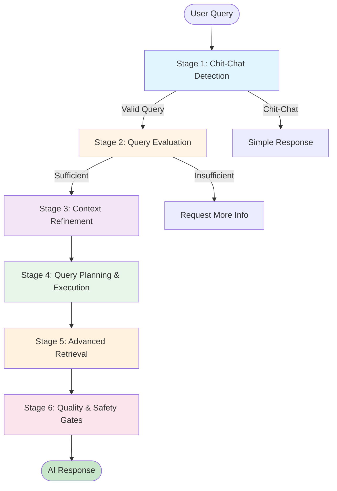

# Atlas Reasoning Engine

Understand and visualize the "brain" behind Salesforce Agentforce - the six-stage AI processing pipeline that powers intelligent agent responses.

---

## The Problem

**Understanding what happens between sending a query and receiving an AI response is crucial for optimization and debugging.**

When working with AI agents, you need to:

- 🔍 **Understand Processing**: See how your queries flow through the AI pipeline
- ⚡ **Identify Bottlenecks**: Find which stages are consuming time or tokens
- 🐛 **Debug Issues**: Trace where problems occur in the reasoning process
- 📊 **Analyze Performance**: Monitor token usage, response times, and quality scores
- 💰 **Optimize Costs**: Identify opportunities to reduce token consumption

**In short**: You need visibility into the AI reasoning process to build better, faster, and more cost-effective agents.

## How GenAI Explorer Solves It

Atlas Reasoning Engine visualization provides **complete transparency** into AI processing:

1. **Six-Stage Visualization**: See the entire pipeline from chit-chat detection to safety gates
2. **Live Data Integration**: Query Lab runs pre-built queries against your actual Data Cloud
3. **Performance Metrics**: See processing time and token usage for each stage
4. **Complete Reasoning Traces**: Follow a request through all six stages with full details
5. **Ready-to-Use Queries**: 6+ pre-built SQL queries for common analysis tasks
6. **Interactive Gantt Charts**: Visual timelines showing processing stages and timing

Think of it as **observability for AI** - understand what's happening inside the black box.

## Overview

The Atlas Reasoning Engine is Salesforce's proprietary AI orchestration system that processes every query through a sophisticated pipeline. GenAI Explorer provides interactive visualizations and live data integration to help you understand exactly how your AI queries are processed.

## What is Atlas?

Atlas is the reasoning engine that coordinates:
- **Query understanding** and intent classification
- **Context enrichment** from your Salesforce data
- **Action planning** and execution
- **Information retrieval** from multiple sources
- **Response generation** with citations
- **Safety and quality** checks

Think of it as the conductor of an orchestra, coordinating multiple AI models, data sources, and safety systems to produce intelligent, grounded, and safe responses.

## The Six-Stage Pipeline

### Processing Timeline (Gantt Chart)

The following Gantt chart shows the typical timeline and sequence of the Atlas Reasoning Engine's six-stage processing pipeline:

```mermaid
gantt
    title Atlas Reasoning Engine - Query Processing Timeline
    dateFormat SSS
    axisFormat %L ms
    
    section Initial Processing
    Chit-Chat Detection           :done, chitchat, 000, 500ms
    Query Evaluation              :done, eval, after chitchat, 1000ms
    
    section Context & Planning
    Context Refinement            :active, context, after eval, 1500ms
    Query Planning & Execution    :crit, planning, after context, 2500ms
    
    section Retrieval & Safety
    Advanced Retrieval (RAG)      :crit, retrieval, after planning, 3000ms
    Quality & Safety Gates        :done, safety, after retrieval, 1000ms
    
    section Delivery
    Response Generation           :milestone, response, after safety, 0ms
```

**Typical Processing Times:**
- **Stage 1** (Chit-Chat Detection): 50-100ms
- **Stage 2** (Query Evaluation): 100-200ms
- **Stage 3** (Context Refinement): 200-500ms
- **Stage 4** (Query Planning & Execution): 300-800ms *(Critical)*
- **Stage 5** (Advanced Retrieval): 400-1000ms *(Critical)*
- **Stage 6** (Quality & Safety Gates): 100-300ms

**Total Average Processing Time:** 1.2 - 3.0 seconds

:::tip Detailed Timeline Documentation
For more detailed Gantt charts showing the ReAct loop, parallel execution, and complete lifecycle, see the Stage 4 and Stage 6 documentation.
:::

### Pipeline Flow Diagram

For the complete documentation including all stages, ReAct loops, Data Cloud architecture, Query Lab examples, and more, see the individual stage documentation pages in the sidebar.

## Related Documentation

- **[Stage 1: Chit-Chat Detection](/genai/atlas-reasoning-engine/stage-1-chitchat-detection)** - Query filtering
- **[Stage 2: Query Evaluation](/genai/atlas-reasoning-engine/stage-2-query-evaluation)** - Intent analysis  
- **[Stage 3: Context Refinement](/genai/atlas-reasoning-engine/stage-3-context-refinement)** - Data enrichment
- **[Stage 4: Query Planning](/genai/atlas-reasoning-engine/stage-4-query-planning)** - Action orchestration
- **[Stage 5: Advanced Retrieval](/genai/atlas-reasoning-engine/stage-5-advanced-retrieval)** - RAG and search
- **[Stage 6: Quality & Safety](/genai/atlas-reasoning-engine/stage-6-quality-safety)** - Response validation
- **[Einstein Model Testing](/genai/einstein-model-testing)** - Test individual models
- **[Data Cloud Integration](/genai/data-cloud-integration)** - Deep dive into queries
- **[Request Replay & Debugging](/genai/request-replay-debugging)** - Advanced debugging

---

**Understanding Atlas helps you optimize your AI implementation for better performance, lower costs, and improved user experience.**

