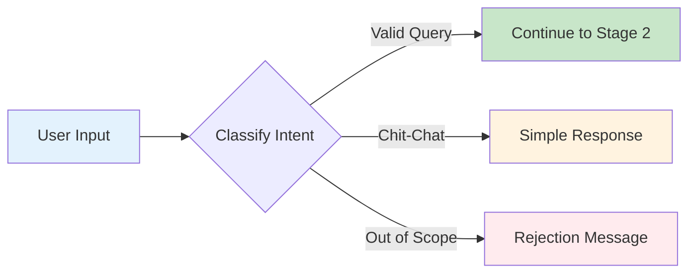
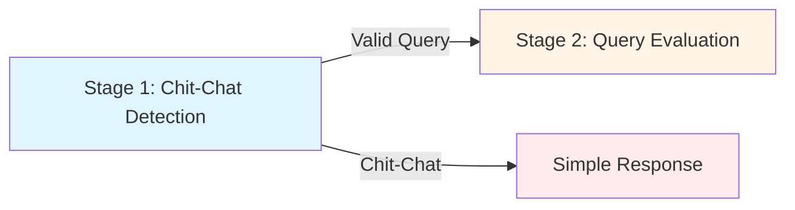

# Stage 1: Chit-Chat Detection

## Overview

The first stage of the Atlas Reasoning Engine determines whether the input is a **valid query within scope** or **casual conversation** (chit-chat).

**Processing Time:** 50-100ms  
**Type:** Fast validation  
**Purpose:** Filter out off-topic requests and casual greetings

---

## What Happens in This Stage

### Input Analysis

Atlas analyzes the incoming text to classify the intent:



### Classification Categories

| Category | Description | Atlas Response |
|----------|-------------|----------------|
| ✅ **Valid Query** | Business-related question or request | Continue to Stage 2 |
| ⚠️ **Chit-Chat** | Greeting, pleasantry, or social interaction | Simple conversational response |
| ❌ **Out of Scope** | Request outside agent's capabilities | Polite rejection with guidance |

---

## Examples

### ✅ Valid Queries (Pass Through)

These queries proceed to Stage 2:

```
"What's the status of order 12345?"
"Show me all open cases for Acme Corp"
"Create a new opportunity for John Smith"
"What are my tasks for today?"
"Find contacts in the San Francisco region"
```

### ⚠️ Chit-Chat (Simple Response)

These get handled with simple responses:

```
"Hello" → "Hi! How can I help you today?"
"How are you?" → "I'm here to help! What can I do for you?"
"Good morning" → "Good morning! What would you like to know?"
"Thank you" → "You're welcome! Is there anything else?"
```

### ❌ Out of Scope (Rejected)

These get politely rejected:

```
"Tell me a joke" → "I'm here to help with Salesforce tasks. How can I assist you?"
"What's the weather?" → "I focus on Salesforce data. How can I help with your business?"
"Sing a song" → "I'm a business assistant. What would you like to know about your data?"
```

---

## How It Works

### 1. Text Preprocessing

```
Original Input: "Hey there! What's the status of my order?"
↓
Normalized: "what status order"
↓
Intent Tokens: ["status", "order"]
```

### 2. Intent Classification

Atlas uses a classifier to determine the primary intent:

| Signal | Weight | Indicates |
|--------|--------|-----------|
| Business terms | High | Valid query |
| Question words | Medium | Information request |
| Greetings only | High | Chit-chat |
| Action verbs | High | Valid command |
| Social phrases | Medium | Chit-chat |

### 3. Confidence Scoring

```python
# Pseudocode
intent_score = calculate_intent_confidence(tokens)

if intent_score > 0.8:
    return VALID_QUERY
elif intent_score > 0.3:
    return CHIT_CHAT
else:
    return OUT_OF_SCOPE
```

---

## Benefits

### ⚡ Performance Optimization

- **Fast Rejection**: Out-of-scope queries don't consume processing resources
- **Token Savings**: Avoids expensive LLM calls for simple greetings
- **Quick Response**: Users get immediate feedback for casual interactions

### 💰 Cost Reduction

| Without Chit-Chat Detection | With Chit-Chat Detection |
|----------------------------|--------------------------|
| All queries → full pipeline | Only valid queries → full pipeline |
| "Hello" costs 1000+ tokens | "Hello" costs < 50 tokens |
| Wasted processing time | Optimized resource usage |

---

## Configuration

### Adjusting Sensitivity

Admins can tune the chit-chat detector:

```javascript
// Example configuration
{
  "chitchat_detection": {
    "enabled": true,
    "confidence_threshold": 0.8,
    "allow_greetings": true,
    "handle_pleasantries": true,
    "out_of_scope_message": "I'm here to help with Salesforce. What would you like to know?"
  }
}
```

### Custom Responses

Customize responses for chit-chat:

```json
{
  "responses": {
    "greeting": "Hello! How can I assist you today?",
    "farewell": "Goodbye! Feel free to reach out anytime.",
    "thanks": "You're welcome! Anything else I can help with?",
    "out_of_scope": "I focus on Salesforce. How can I help with your business?"
  }
}
```

---

## Monitoring

### Performance Considerations

**Typical Chit-Chat Detection Performance:**
- **Processing Time:** 50-100ms per request
- **Chit-Chat Detection Rate:** 10-20% of incoming queries
- **Out-of-Scope Detection Rate:** 3-8% of queries
- **False Positive Rate:** Less than 5% with well-tuned prompts

:::note
Monitor your agent's performance through **Setup → Einstein → Einstein for Service**. Salesforce provides built-in analytics for query classification and detection accuracy.
:::

---

## Troubleshooting

### Issue: Valid Queries Marked as Chit-Chat

**Symptoms:**
- Business queries get simple responses
- Users report "agent doesn't understand"

**Solutions:**
1. Lower confidence threshold (0.8 → 0.7)
2. Add business terms to allowlist
3. Review false positive logs
4. Retrain classifier with examples

### Issue: Too Many Queries Pass Through

**Symptoms:**
- High processing costs
- Many irrelevant queries in pipeline

**Solutions:**
1. Raise confidence threshold (0.8 → 0.9)
2. Expand out-of-scope patterns
3. Add domain-specific filters
4. Review query patterns

---

## Best Practices

### ✅ Do's

- ✅ Allow greetings at conversation start
- ✅ Combine greeting + query in single input
- ✅ Monitor false positive/negative rates
- ✅ Customize responses for your brand
- ✅ Track chit-chat patterns over time

### ❌ Don'ts

- ❌ Set threshold too high (blocks valid queries)
- ❌ Set threshold too low (wastes resources)
- ❌ Ignore user feedback on misclassification
- ❌ Use generic responses (poor UX)
- ❌ Disable monitoring

---

## Integration with Stage 2

Queries that pass Stage 1 move to [Stage 2: Query Evaluation](./stage-2-query-evaluation):



---

## Related Documentation

- **[Stage 2: Query Evaluation](./stage-2-query-evaluation)** - Next stage
- **[Complete Pipeline](../)** - All stages overview

---

**Stage 1 ensures that only valid business queries consume expensive processing resources, optimizing both performance and cost.**

