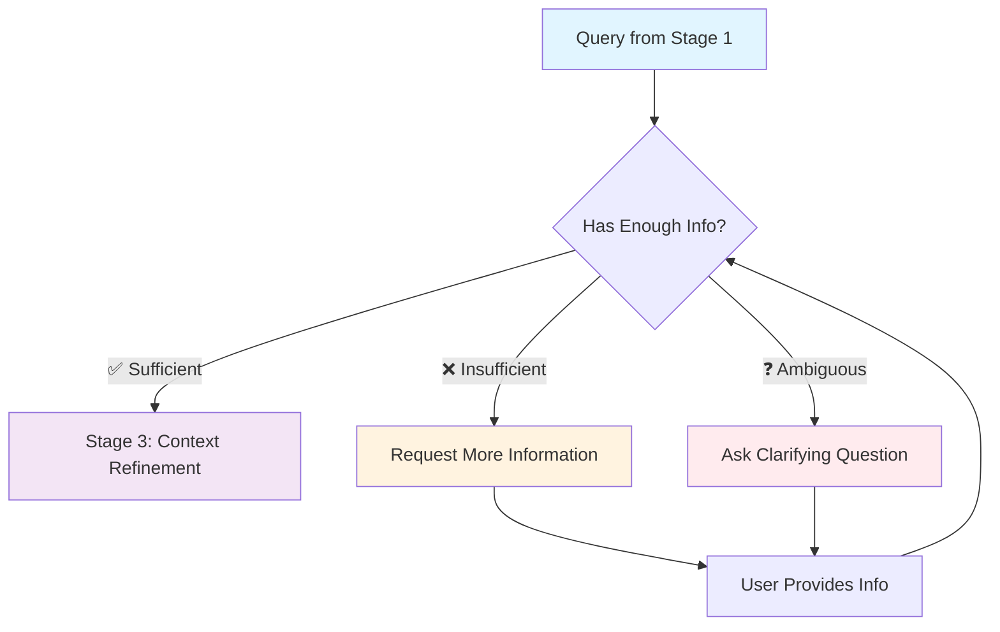
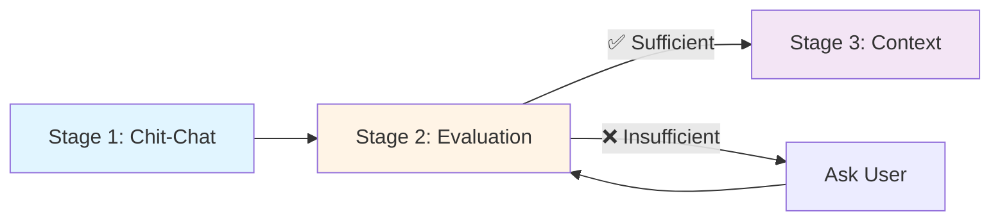

# Stage 2: Query Evaluation

## Overview

After passing chit-chat detection, Stage 2 determines if the query has **enough information** to be answered or if **more details are needed** from the user.

**Processing Time:** 100-200ms  
**Type:** Context validation  
**Purpose:** Prevent wasted API calls and ensure quality responses

---

## What Happens in This Stage

### Information Sufficiency Check

Atlas evaluates whether the query contains all necessary information:



---

## Evaluation Criteria

### What Atlas Checks

| Check | Description | Example |
|-------|-------------|---------|
| **Entity References** | Are all mentioned entities identifiable? | "this customer" needs context |
| **Required Parameters** | Are all required fields present? | "Create opportunity" needs account |
| **Temporal Context** | Is the timeframe clear? | "recent orders" needs definition |
| **Scope Definition** | Is the query scope appropriate? | "all records" may be too broad |
| **Action Clarity** | Is the intended action clear? | "check" vs "update" vs "delete" |

---

## Examples

### ✅ Sufficient Information

These queries have everything needed and proceed to Stage 3:

```
❌ INSUFFICIENT:
"Show me orders"
→ Missing: Which customer? What timeframe?

✅ SUFFICIENT:
"Show me orders for Acme Corp from last month"
→ Has: Entity (Acme Corp) + Timeframe (last month)
```

```
❌ INSUFFICIENT:
"Create a case"
→ Missing: For which account? What subject?

✅ SUFFICIENT:
"Create a case for Tesla Motors regarding billing issue"
→ Has: Account (Tesla) + Subject (billing)
```

```
❌ INSUFFICIENT:
"What's the status?"
→ Missing: Status of what? Which record?

✅ SUFFICIENT:
"What's the status of opportunity OPP-12345?"
→ Has: Record type (opportunity) + ID (OPP-12345)
```

### ❌ Insufficient Information

Atlas asks for clarification:

```
User: "Show me orders"
Atlas: "I need more information. Which customer's orders would you like to see?"

User: "Update the contact"
Atlas: "Which contact would you like to update? Please provide a name or ID."

User: "Recent cases"
Atlas: "How recent? Would you like cases from the last week, month, or a specific timeframe?"
```

### ❓ Ambiguous Queries

Atlas disambiguates:

```
User: "Show me John's information"
Atlas: "I found 3 contacts named John:
  1. John Smith - Acme Corp
  2. John Doe - Beta Industries  
  3. John Williams - Gamma LLC
Which one would you like to see?"

User: "Check the order"
Atlas: "I can help with that. Would you like to:
  1. Check order status
  2. Check order details
  3. Check order history"
```

---

## How It Works

### 1. Entity Extraction

```javascript
Query: "Show me orders for Acme Corp from last month"

Extracted Entities:
{
  action: "retrieve",
  object: "orders",
  account: "Acme Corp",
  timeframe: "last month"
}
```

### 2. Completeness Check

```javascript
Required Fields for "retrieve orders":
- ✅ account: Present ("Acme Corp")
- ✅ timeframe: Present ("last month")  
- ✅ action: Present ("show")

Result: SUFFICIENT → Proceed to Stage 3
```

### 3. Context Resolution

```javascript
Query: "Show me more orders"

Context Check:
- Previous Query: "Show orders for Acme Corp"
- Implicit Entity: "Acme Corp" (from context)
- Implicit Action: "retrieve" (continuation)

Result: SUFFICIENT with context → Proceed to Stage 3
```

---

## Clarification Strategies

### Progressive Disclosure

Atlas asks for one piece of information at a time:

```
User: "Create an opportunity"

Atlas (Step 1): "Which account is this opportunity for?"
User: "Acme Corp"

Atlas (Step 2): "What's the opportunity name?"
User: "Q1 2025 Enterprise License"

Atlas (Step 3): "What's the expected close date?"
User: "March 31, 2025"

Atlas: "Creating opportunity 'Q1 2025 Enterprise License' for Acme Corp..."
```

### Multiple Choice Questions

Atlas offers options when ambiguous:

```
User: "Recent opportunities"

Atlas: "Which opportunities would you like to see?
  A. My opportunities
  B. Team opportunities
  C. All opportunities in my region
  D. Specific account's opportunities

Type A, B, C, or D, or describe what you need."
```

### Smart Defaults

Atlas suggests common defaults:

```
User: "Show me cases"

Atlas: "I'll show you open cases assigned to you from the last 30 days.
If you'd like different criteria, please let me know."

[Shows results with suggested filters]
```

---

## Session Context

### Maintaining Conversation History

Atlas remembers previous interactions:

```
Turn 1:
User: "Show me Acme Corp's account details"
Atlas: [Shows account details]

Turn 2:
User: "What are their open opportunities?"
Atlas: [Understands "their" = Acme Corp from Turn 1]

Turn 3:
User: "And recent cases?"
Atlas: [Still remembers Acme Corp context]
```

### Context Window

```javascript
Session Context:
{
  currentAccount: "Acme Corp",
  currentOpportunity: "OPP-12345",
  lastQuery: "show opportunities",
  timeframe: "last 30 days",
  conversationStage: "exploration"
}
```

---

## Configuration

### Query Evaluation Settings

```json
{
  "query_evaluation": {
    "enabled": true,
    "require_entity_resolution": true,
    "allow_ambiguous_queries": false,
    "max_clarification_turns": 3,
    "use_session_context": true,
    "context_window_size": 5,
    "smart_defaults_enabled": true
  }
}
```

### Required Fields by Object

```json
{
  "required_fields": {
    "create_opportunity": ["account", "name", "close_date"],
    "create_case": ["account", "subject"],
    "update_contact": ["contact_id"],
    "retrieve_orders": ["account", "timeframe"]
  }
}
```

---

## Monitoring

### Performance Considerations

**Typical Query Evaluation Performance:**
- **Processing Time:** 100-200ms per request
- **Clarification Request Rate:** 20-30% of queries
- **Average Clarification Turns:** 1-2 exchanges
- **Context Resolution Success:** 75-85% after clarification

:::note
Monitor your agent's performance through **Setup → Einstein → Einstein for Service**. Salesforce provides built-in analytics for query understanding and clarification effectiveness.
:::

---

## Best Practices

### ✅ Do's

- ✅ Use session context to reduce clarifications
- ✅ Offer smart defaults when appropriate
- ✅ Ask specific, actionable questions
- ✅ Limit clarification turns (max 3)
- ✅ Provide examples of valid formats

### ❌ Don'ts

- ❌ Ask for all information at once
- ❌ Use technical jargon in clarifications
- ❌ Ignore conversation context
- ❌ Allow infinite clarification loops
- ❌ Proceed with insufficient information

---

## Troubleshooting

### Issue: Too Many Clarifications

**Symptoms:**
- Users frustrated by constant questions
- High clarification rate (>40%)

**Solutions:**
1. Enable smart defaults
2. Improve entity extraction
3. Expand context window
4. Add common patterns to allowlist

### Issue: Wrong Assumptions

**Symptoms:**
- Atlas proceeds with wrong entity
- Users report incorrect results

**Solutions:**
1. Increase confidence threshold
2. Always confirm ambiguous entities
3. Show assumptions to user
4. Add explicit confirmation step

---

## Integration with Stage 3

Queries that pass Stage 2 move to [Stage 3: Context Refinement](./stage-3-context-refinement):



---

## Related Documentation

- **[Stage 1: Chit-Chat Detection](./stage-1-chitchat-detection)** - Previous stage
- **[Stage 3: Context Refinement](./stage-3-context-refinement)** - Next stage
- **[Complete Pipeline](../)** - All stages overview

---

**Stage 2 ensures that only queries with sufficient information proceed to expensive processing stages, improving both user experience and system efficiency.**


