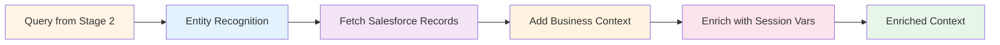
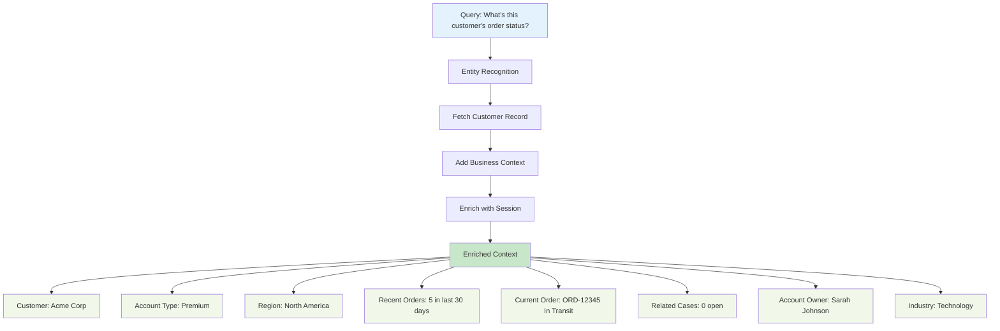
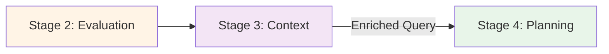

# Stage 3: Context Refinement

## Overview

Stage 3 enriches the validated query with **relevant context** from your Salesforce org, transforming a simple question into a context-rich request that can be accurately processed.

**Processing Time:** 200-500ms  
**Type:** Data enrichment  
**Purpose:** Add business context for accurate, personalized responses

---

## What Happens in This Stage

### Context Enrichment Flow



---

## Context Enrichment Example

### Before Context Refinement

```
Query: "What's this customer's order status?"

Raw Information:
- Action: "retrieve"
- Object: "order"
- Customer: "this customer" (ambiguous)
```

### After Context Refinement



---

## Types of Context Added

### 1. Entity Context

**Account Information:**
```json
{
  "accountId": "001xx000003DGb2AAG",
  "accountName": "Acme Corp",
  "accountType": "Premium",
  "industry": "Technology",
  "annualRevenue": 50000000,
  "numberOfEmployees": 5000,
  "region": "North America",
  "accountOwner": {
    "name": "Sarah Johnson",
    "email": "sarah.johnson@company.com"
  }
}
```

### 2. Relationship Context

**Related Records:**
```json
{
  "relatedContacts": [
    {
      "name": "John Smith",
      "title": "VP of Operations",
      "email": "john.smith@acme.com"
    }
  ],
  "activeOpportunities": 3,
  "openCases": 0,
  "recentOrders": [
    {
      "orderId": "ORD-12345",
      "status": "In Transit",
      "amount": 125000,
      "expectedDelivery": "2025-01-15"
    }
  ]
}
```

### 3. Temporal Context

**Time-Based Information:**
```json
{
  "currentDate": "2025-12-10",
  "fiscalYear": "FY2025",
  "fiscalQuarter": "Q4",
  "lastInteraction": "2025-12-05",
  "accountAge": "3 years",
  "lifetimeValue": 2500000
}
```

### 4. Behavioral Context

**Activity Patterns:**
```json
{
  "purchaseFrequency": "monthly",
  "averageOrderValue": 100000,
  "preferredChannel": "email",
  "supportTier": "premium",
  "engagementScore": 85,
  "churnRisk": "low"
}
```

### 5. User Context

**Current User Information:**
```json
{
  "userId": "005xx000001SwJ7AAK",
  "userName": "Mike Davis",
  "userRole": "Sales Representative",
  "userRegion": "West",
  "userPermissions": ["ReadAccount", "EditOpportunity"],
  "userPreferences": {
    "timezone": "America/Los_Angeles",
    "language": "en_US"
  }
}
```

### 6. Session Context

**Conversation History:**
```json
{
  "sessionId": "sess-abc123",
  "conversationTurns": 5,
  "previousQueries": [
    "Show me accounts in California",
    "Focus on technology companies"
  ],
  "activeFilters": {
    "region": "California",
    "industry": "Technology"
  },
  "contextEntities": ["Acme Corp", "Beta Industries"]
}
```

---

## Context Sources

### Salesforce Objects

Atlas queries Data Cloud using standard SOQL to build context:

```sql
-- Example: Building context for an Account query using SOQL
SELECT 
  Id, Name, Type, Industry,
  AnnualRevenue, NumberOfEmployees,
  (SELECT Name, Title, Email FROM Contacts WHERE IsActive = true),
  (SELECT Id, StageName, Amount FROM Opportunities WHERE IsClosed = false),
  (SELECT Id, Status FROM Cases WHERE IsClosed = false)
FROM Account
WHERE Name = 'Acme Corp'
LIMIT 1
```

:::info
This is a conceptual example showing how context is built. Actual queries are handled automatically by Agentforce based on your configured data sources and topics.
:::

**Data Sources Available:**
- Standard Salesforce objects (Account, Contact, Opportunity, Case, etc.)
- Custom objects configured in your org
- External data sources connected to Data Cloud

### External Data Sources

- **Data Cloud**: Real-time customer data platform
- **Einstein Analytics**: Predictive scores and insights
- **Marketing Cloud**: Engagement history
- **Service Cloud**: Support interactions
- **Commerce Cloud**: Purchase history

### Session Variables

```javascript
sessionVariables = {
  activeAccount: "Acme Corp",
  activeOpportunity: "OPP-12345",
  userFilters: {
    dateRange: "last 30 days",
    region: "North America"
  },
  previousResults: [...],
  conversationContext: [...]
}
```

---

## Context Refinement Strategies

### 1. Entity Resolution

**Ambiguous → Specific:**
```
Before: "this customer"
After:  "Acme Corp (Account ID: 001xx000003DGb2AAG)"

Before: "my opportunities"
After:  "Opportunities owned by Mike Davis in West region"

Before: "recent orders"
After:  "Orders from last 30 days for Acme Corp"
```

### 2. Implicit Information

**Add Unstated Details:**
```
Query: "Create a case"

Added Context:
- Account: [From current session]
- Contact: [Primary contact for account]
- Priority: [Based on account tier]
- Owner: [Current user]
- Origin: [Agent conversation]
```

### 3. Business Rules

**Apply Org-Specific Logic:**
```javascript
if (account.type === "Premium") {
  context.priority = "High";
  context.sla = "4 hours";
  context.assignTo = "Premium Support Team";
}

if (account.region === "EMEA") {
  context.timezone = "Europe/London";
  context.businessHours = "9am-5pm GMT";
}
```

### 4. Permission Filtering

**Respect User Permissions:**
```javascript
// Filter context based on user access
if (!user.hasPermission("ViewAllAccounts")) {
  context.accounts = filterByOwnership(accounts, user);
}

if (!user.hasPermission("ViewConfidentialFields")) {
  context = removeFields(context, ["SSN", "CreditCard"]);
}
```

---

## Performance Optimization

### Caching Strategy

```javascript
// Cache frequently accessed context
contextCache.set(`account:${accountId}`, accountContext, ttl=5min);
contextCache.set(`user:${userId}`, userContext, ttl=30min);

// Reuse cached context within session
if (contextCache.has(`account:${accountId}`)) {
  return contextCache.get(`account:${accountId}`);
}
```

### Parallel Data Fetching

```javascript
// Fetch multiple data sources in parallel
const [
  accountData,
  relatedContacts,
  openOpportunities,
  recentCases,
  orderHistory
] = await Promise.all([
  fetchAccount(accountId),
  fetchContacts(accountId),
  fetchOpportunities(accountId),
  fetchCases(accountId),
  fetchOrders(accountId)
]);
```

---

## Monitoring

### Performance Considerations

**Typical Context Refinement Performance:**
- **Processing Time:** 200-500ms per request
- **Context Sources Used:** 3-6 sources per query
- **Cache Hit Rate:** 50-70% for frequently accessed data
- **Context Quality Score:** Typically 0.80+ for well-configured agents

:::note
Monitor your agent's performance through **Setup → Einstein → Einstein for Service**. Salesforce provides built-in analytics for context quality and retrieval performance.
:::

---

## Best Practices

### ✅ Do's

- ✅ Cache frequently accessed context
- ✅ Fetch data in parallel when possible
- ✅ Respect user permissions and field-level security
- ✅ Include only relevant context (avoid overloading)
- ✅ Update context as conversation progresses

### ❌ Don'ts

- ❌ Fetch all related records (use limits)
- ❌ Ignore permission boundaries
- ❌ Cache sensitive data too long
- ❌ Add irrelevant context (increases token usage)
- ❌ Make synchronous calls to multiple sources

---

## Integration with Stage 4

Enriched queries move to [Stage 4: Query Planning & Execution](./stage-4-query-planning):



---

## Related Documentation

- **[Stage 2: Query Evaluation](./stage-2-query-evaluation)** - Previous stage
- **[Stage 4: Query Planning](./stage-4-query-planning)** - Next stage
- **[Complete Pipeline](../)** - All stages overview

---

**Stage 3 transforms simple queries into context-rich requests, enabling accurate and personalized AI responses.**


