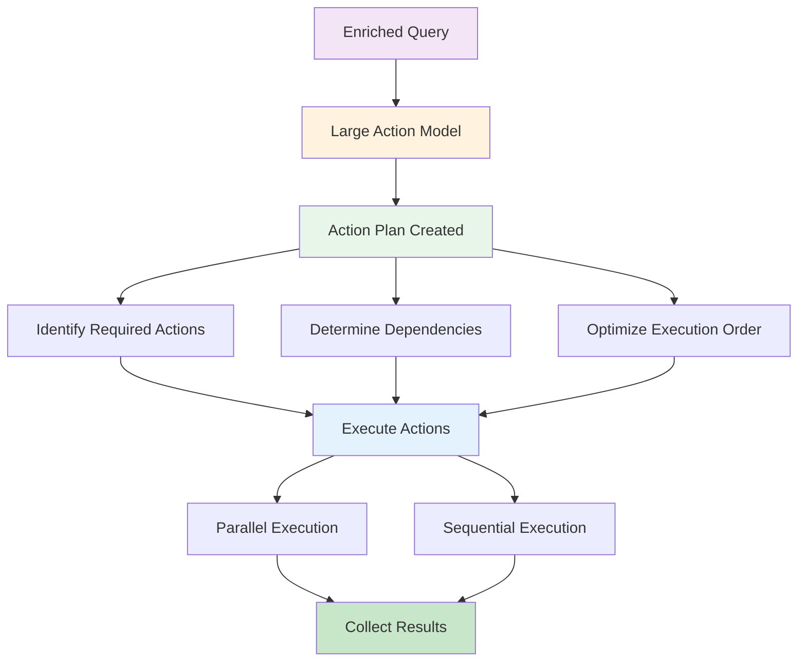
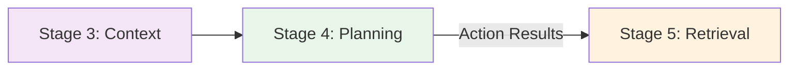

# Stage 4: Query Planning & Execution

## Overview

Stage 4 is where Atlas creates an **action plan** to answer the enriched query and **executes** the necessary operations using Large Action Models (LAMs) and APIGen.

**Processing Time:** 300-800ms  
**Type:** Critical path - Action orchestration  
**Purpose:** Determine and execute the optimal sequence of actions

---

## What Happens in This Stage

### Action Planning Flow



---

## Components

### 1. Large Action Models (LAMs)

**What LAMs Do:**
- Analyze the enriched query and context
- Determine which actions are needed
- Plan the sequence of operations
- Handle dependencies between actions
- Optimize for parallel execution

**Example LAM Decision:**
```javascript
Query: "What's the best next action for this opportunity?"

LAM Analysis:
{
  requiredActions: [
    "GetOpportunityDetails",
    "GetSimilarWonOpportunities",
    "AnalyzeClosingPatterns",
    "RecommendNextBestAction"
  ],
  dependencies: {
    "AnalyzeClosingPatterns": ["GetOpportunityDetails", "GetSimilarWonOpportunities"],
    "RecommendNextBestAction": ["AnalyzeClosingPatterns"]
  },
  parallelizable: ["GetOpportunityDetails", "GetSimilarWonOpportunities"]
}
```

### 2. APIGen (API Generation)

**What APIGen Does:**
- Generates API calls dynamically
- Optimizes query parameters
- Handles error cases and retries
- Transforms data formats
- Manages rate limits

**Example APIGen Output:**
```javascript
{
  actions: [
    {
      type: "SOQL_QUERY",
      query: "SELECT Id, Name, StageName, Amount FROM Opportunity WHERE Id = 'OPP-12345'",
      timeout: 5000
    },
    {
      type: "REST_API",
      endpoint: "/services/data/v59.0/sobjects/Opportunity/OPP-12345",
      method: "GET",
      headers: {"Authorization": "Bearer ..."}
    }
  ]
}
```

---

## Execution Strategies

### Parallel Execution

When actions are independent, they run simultaneously:

```mermaid
gantt
    title Parallel Execution Example
    dateFormat SSS
    axisFormat %L ms
    
    section Planning
    Query Analysis                  :done, analysis, 000, 500ms
    Action Plan Creation            :active, plan, after analysis, 1000ms
    
    section Parallel Actions
    GetOpportunityDetails           :crit, a1, after plan, 2000ms
    GetSimilarWonOpportunities      :crit, a2, after plan, 2000ms
    
    section Sequential Actions
    AnalyzeClosingPatterns          :active, a3, after a1, 1500ms
    RecommendNextBestAction         :done, a4, after a3, 1000ms
    
    section Result
    Return Recommendation           :milestone, done, after a4, 0ms
```



**Time Saved:** 2000ms (parallel) vs 4000ms (sequential) = **50% faster**

### Sequential Execution

When actions depend on each other, they run in order:

```
Action 1: Get Account Details
   ↓
Action 2: Get Related Contacts (needs Account ID)
   ↓
Action 3: Get Contact Activities (needs Contact IDs)
   ↓
Result: Complete Activity Report
```

### Conditional Execution

```javascript
plan = {
  action1: "CheckAccountType",
  conditionalActions: {
    if_premium: ["AssignPremiumSupport", "SetHighPriority"],
    if_standard: ["AssignStandardSupport", "SetNormalPriority"]
  }
}
```

---

## Real-World Examples

### Example 1: Simple Retrieve

```
Query: "Show me account details for Acme Corp"

Action Plan:
1. GetAccountByName("Acme Corp")

Execution:
- Single SOQL query
- No dependencies
- Fast execution (200ms)
```

### Example 2: Complex Analysis

```
Query: "What's the health score for my top 10 accounts?"

Action Plan:
1. [Parallel] GetMyAccounts (top 10 by revenue)
2. [Parallel for each account]:
   - GetOpenOpportunities
   - GetOpenCases
   - GetRecentOrders
   - GetEngagementScore
3. [Sequential] CalculateHealthScore (aggregate results)
4. [Sequential] RankAccounts
5. [Sequential] FormatResults

Execution:
- 1 account query
- 40 parallel queries (10 accounts × 4 metrics)
- 3 sequential calculations
- Total time: 800ms (vs 2000ms sequential)
```

### Example 3: Multi-Step Operation

```
Query: "Create a case for Tesla and assign to the right team"

Action Plan:
1. GetAccountByName("Tesla")
2. DetermineAccountTier (from account data)
3. [Conditional based on tier]:
   If Premium → AssignToPremiumTeam
   If Standard → AssignToStandardTeam
4. CreateCase (with determined owner)
5. SendNotification (to assigned team)

Execution:
- Sequential (each step depends on previous)
- Total time: 600ms
```

---

## Error Handling

### Retry Logic

```javascript
executionConfig = {
  maxRetries: 3,
  retryDelay: [100ms, 500ms, 1000ms], // exponential backoff
  retryableErrors: ["TIMEOUT", "RATE_LIMIT", "TEMPORARY_ERROR"]
}
```

### Fallback Strategies

```javascript
if (action "GetSimilarOpportunities" fails) {
  fallback: "GetRecentOpportunities"
}

if (external_api_call fails) {
  fallback: "UseCachedData"
}
```

### Partial Results

```javascript
// If some parallel actions fail, return partial results
results = {
  successful: [action1Result, action2Result],
  failed: [action3Error],
  partial: true,
  confidence: 0.7
}
```

---

## Optimization Techniques

### 1. Query Optimization

**Before Optimization:**
```sql
-- 3 separate queries
SELECT Id, Name FROM Account WHERE Id = '001...'
SELECT COUNT() FROM Opportunity WHERE AccountId = '001...'
SELECT COUNT() FROM Case WHERE AccountId = '001...'
```

**After Optimization:**
```sql
-- 1 query with subqueries
SELECT 
  Id, Name,
  (SELECT COUNT() FROM Opportunities) as OpptyCount,
  (SELECT COUNT() FROM Cases) as CaseCount
FROM Account 
WHERE Id = '001...'
```

### 2. Caching

```javascript
// Cache expensive computations
if (cache.has(`account_health:${accountId}`)) {
  return cache.get(`account_health:${accountId}`);
}

const healthScore = await calculateHealthScore(accountId);
cache.set(`account_health:${accountId}`, healthScore, ttl=5min);
```

### 3. Batch Operations

```javascript
// Instead of 100 individual API calls
for (account of accounts) {
  await updateAccount(account);
}

// Batch into single call
await batchUpdateAccounts(accounts); // 100x faster
```

---

## Monitoring

### Performance Considerations

**Typical Query Planning Performance:**
- **Processing Time:** 400-800ms per request
- **Actions Per Query:** 2-5 actions on average
- **Parallel Execution Rate:** 50-70% of eligible actions
- **Action Success Rate:** 90-95% with proper error handling

:::note
Monitor your agent's performance through **Setup → Einstein → Einstein for Service**. Salesforce provides built-in analytics for action execution and query optimization.
:::

---

## Best Practices

### ✅ Do's

- ✅ Identify independent actions for parallel execution
- ✅ Use batch operations when possible
- ✅ Implement retry logic for transient failures
- ✅ Cache expensive computations
- ✅ Optimize SOQL queries

### ❌ Don'ts

- ❌ Execute all actions sequentially
- ❌ Make individual API calls in loops
- ❌ Ignore rate limits
- ❌ Skip error handling
- ❌ Over-complicate action plans

---

## Integration with Stage 5

Action results move to [Stage 5: Advanced Retrieval](./stage-5-advanced-retrieval):



---

## Related Documentation

- **[Stage 3: Context Refinement](./stage-3-context-refinement)** - Previous stage
- **[Stage 5: Advanced Retrieval](./stage-5-advanced-retrieval)** - Next stage
- **[Complete Pipeline](../)** - All stages overview

---

**Stage 4 is the critical path where Atlas orchestrates intelligent action execution, optimizing for both speed and accuracy through parallel processing and smart planning.**


