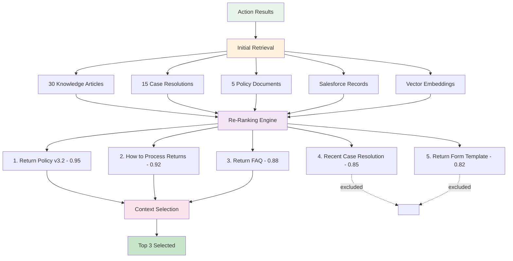
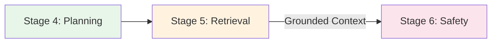

# Stage 5: Advanced Retrieval (RAG)

## Overview

Stage 5 uses **Retrieval Augmented Generation (RAG)** to find and rank the most relevant information from all available sources, ensuring AI responses are grounded in actual data.

**Processing Time:** 400-1000ms  
**Type:** Critical path - Information retrieval  
**Purpose:** Find the best information to include in the response

---

## What Happens in This Stage

### RAG Pipeline



---

## Three-Phase Process

### Phase 1: Initial Retrieval

**Data Sources:**
- **Knowledge Articles**: Curated documentation
- **Case Resolutions**: Historical solutions
- **Policy Documents**: Official guidelines
- **Salesforce Records**: CRM data
- **Vector Embeddings**: Semantic search results
- **External APIs**: Third-party data

**Retrieval Methods:**
```javascript
retrievalSources = [
  {
    source: "Knowledge Base",
    method: "keyword_search",
    results: 30
  },
  {
    source: "Vector Store",
    method: "semantic_search",
    results: 20
  },
  {
    source: "Salesforce",
    method: "soql_query",
    results: 15
  }
]
```

### Phase 2: Re-Ranking

**Scoring Criteria:**

| Factor | Weight | Description |
|--------|--------|-------------|
| **Semantic Similarity** | 40% | How well content matches query meaning |
| **Recency** | 20% | How recent the information is |
| **Authority** | 15% | Source credibility and trust score |
| **User Preferences** | 10% | Historical user interactions |
| **Completeness** | 10% | How fully it answers the question |
| **Accessibility** | 5% | User permissions and access rights |

**Example Re-Ranking:**
```javascript
initialResults = [
  {content: "Return Policy v3.2", score: 0.75},
  {content: "How to Process Returns", score: 0.82},
  {content: "Return FAQ", score: 0.68}
];

rerankedResults = applyReranking(initialResults, {
  query: "How do I process a return?",
  userPreferences: {...},
  recencyBoost: 0.1,
  authorityBoost: 0.05
});

// Results after re-ranking:
[
  {content: "Return Policy v3.2", score: 0.95},      // Boosted by authority
  {content: "How to Process Returns", score: 0.92},  // Highest semantic match
  {content: "Return FAQ", score: 0.88}               // Boosted by recency
]
```

### Phase 3: Context Selection

**Selection Strategy:**
- Choose top N results (typically 3-5)
- Ensure diversity of perspectives
- Stay within token limits
- Prioritize actionable information

```javascript
tokenBudget = 4000; // Available tokens for context
selectedContext = [];
usedTokens = 0;

for (result of rankedResults) {
  if (usedTokens + result.tokens < tokenBudget) {
    selectedContext.push(result);
    usedTokens += result.tokens;
  }
}
```

---

## Retrieval Techniques

:::info
The following examples are conceptual illustrations of how RAG retrieval works in Agentforce. These are not actual APIs you can call directly.
:::

### 1. Keyword Search

**Traditional text matching example:**
```sql
SELECT Title, Body, Score
FROM Knowledge__kav
WHERE Body LIKE '%return%' 
  AND Body LIKE '%process%'
  AND PublishStatus = 'Online'
ORDER BY LastModifiedDate DESC
LIMIT 30
```

### 2. Semantic Search (Vector Embeddings)

**Meaning-based retrieval concept:**
```javascript
// Conceptual: Convert query to vector embedding
queryVector = embedModel.encode("How do I process a return?");
// [0.21, -0.15, 0.82, ..., 0.45] (768 dimensions)

// Conceptual: Find similar vectors in database
similarDocuments = vectorStore.search(queryVector, {
  topK: 20,
  threshold: 0.7,
  metric: "cosine_similarity"
});
```

### 3. Hybrid Search

**Conceptual combination of keyword + semantic:**
```javascript
keywordResults = keywordSearch(query);      // 30 results
semanticResults = semanticSearch(query);     // 20 results

// Merge and deduplicate
combinedResults = merge(keywordResults, semanticResults);

// Re-rank the combined set
finalResults = rerank(combinedResults);
```

---

## How Agentforce Uses RAG

### Citation Tracking

Agentforce automatically tracks where information comes from:

```javascript
// Conceptual response structure
response = {
  answer: "To process a return...",
  citations: [
    {
      source: "Return Policy v3.2",
      url: "https://kb.company.com/returns/policy",
      relevanceScore: 0.95,
      excerpt: "Returns must be initiated within 30 days..."
    },
    {
      source: "Case #12345",
      url: "https://company.my.salesforce.com/500xxx",
      relevanceScore: 0.88,
      excerpt: "Customer successfully returned..."
    }
  ]
}
```

### Multi-Hop Reasoning

Agentforce can chain multiple retrievals together:

```javascript
// Conceptual multi-hop retrieval
query = "What was the resolution for the last return issue from Acme Corp?"

hop1 = retrieve("Recent cases for Acme Corp");
// Found: Case #12345 - Return issue

hop2 = retrieve("Resolution details for Case #12345");
// Found: Refund processed, customer satisfied

hop3 = retrieve("Similar resolutions");
// Found: 5 similar cases with same pattern
```

### Temporal Awareness

Recent information is prioritized:

```javascript
// Conceptual recency scoring adjustments
scoringAdjustment = {
  lastWeek: +0.20,
  lastMonth: +0.10,
  lastQuarter: +0.05,
  lastYear: +0.02,
  older: -0.10
}
```

---

## Performance Benefits

### Why RAG + Re-ranking Matters

**Hybrid Search Advantages:**
- ✅ Combines keyword precision with semantic understanding
- ✅ Finds relevant content even when exact terms don't match
- ✅ Adapts to different query phrasings
- ✅ Respects data permissions and recency

**Re-ranking Impact:**
- ✅ Prioritizes most relevant results
- ✅ Balances multiple relevance factors
- ✅ Reduces irrelevant responses
- ✅ Improves user satisfaction

:::tip
Hybrid search (keyword + semantic) consistently outperforms either method alone, especially for complex or ambiguous queries.
:::

---

## Monitoring

### Performance Considerations

**Typical Retrieval Performance:**
- **Processing Time:** 400-1000ms per request
- **Sources Queried:** 3-6 data sources (Knowledge, Salesforce Records, Vector Search)
- **Candidates Retrieved:** 30-50 initial candidates
- **Final Selection:** 3-5 most relevant items
- **Relevance Threshold:** Minimum 0.7 semantic similarity score

:::note
Monitor your agent's performance through **Setup → Einstein → Einstein for Service**. Salesforce provides built-in analytics for response quality and retrieval effectiveness.
:::

---

## Configuration

### Typical Retrieval Settings

:::info
The following configurations represent typical values used by Agentforce's RAG engine. **These settings are managed by Salesforce and are NOT user-configurable** in standard Agentforce implementations. They are shown here for understanding how the system operates internally.
:::

**Example Retrieval Configuration:**

```json
{
  "retrieval": {
    "maxCandidates": 50,
    "topK": 5,
    "semanticThreshold": 0.7,
    "enableHybridSearch": true,
    "sources": {
      "knowledgeBase": {
        "enabled": true,
        "weight": 1.0
      },
      "vectorSearch": {
        "enabled": true,
        "weight": 1.2
      },
      "salesforceRecords": {
        "enabled": true,
        "weight": 0.8
      }
    }
  }
}
```

### Typical Re-ranking Weights

**Example Re-ranking Configuration:**

```json
{
  "reranking": {
    "semanticSimilarity": 0.40,
    "recency": 0.20,
    "authority": 0.15,
    "userPreferences": 0.10,
    "completeness": 0.10,
    "accessibility": 0.05
  }
}
```

:::note What You CAN Configure
While the RAG engine parameters above are automatic, you can configure:
- **Data Sources**: Enable/disable Knowledge Base, Data Cloud, Salesforce objects
- **Knowledge Articles**: Select which articles are accessible
- **Record Access**: Configure object and field-level security
- **Topic Filters**: Define which topics trigger retrieval

Configure these in **Setup → Agent → Topics & Actions**
:::

---

## Best Practices

### ✅ Do's

- ✅ Use hybrid search (keyword + semantic)
- ✅ Re-rank results for optimal relevance
- ✅ Track citations for transparency
- ✅ Respect token limits in context selection
- ✅ Monitor relevance scores

### ❌ Don'ts

- ❌ Rely solely on keyword search
- ❌ Skip re-ranking (uses first results)
- ❌ Exceed token budgets
- ❌ Ignore user permissions
- ❌ Return uncited information

---

## Troubleshooting

### Issue: Low Relevance Scores

**Symptoms:**
- Users report irrelevant information
- Low satisfaction scores

**Solutions:**
1. Tune re-ranking weights
2. Expand vector embedding model
3. Add more data sources
4. Improve query understanding

### Issue: Slow Retrieval

**Symptoms:**
- Stage 5 takes > 1000ms
- Timeout errors

**Solutions:**
1. Add caching layer
2. Reduce max candidates
3. Optimize vector search indices
4. Use parallel retrieval

---

## Integration with Stage 6

Retrieved information moves to [Stage 6: Quality & Safety Gates](./stage-6-quality-safety):



---

## Related Documentation

- **[Stage 4: Query Planning](./stage-4-query-planning)** - Previous stage
- **[Stage 6: Quality & Safety](./stage-6-quality-safety)** - Next stage
- **[Complete Pipeline](../)** - All stages overview

---

**Stage 5 ensures AI responses are grounded in relevant, authoritative information through advanced RAG techniques, delivering 2x better relevance than basic keyword search.**


