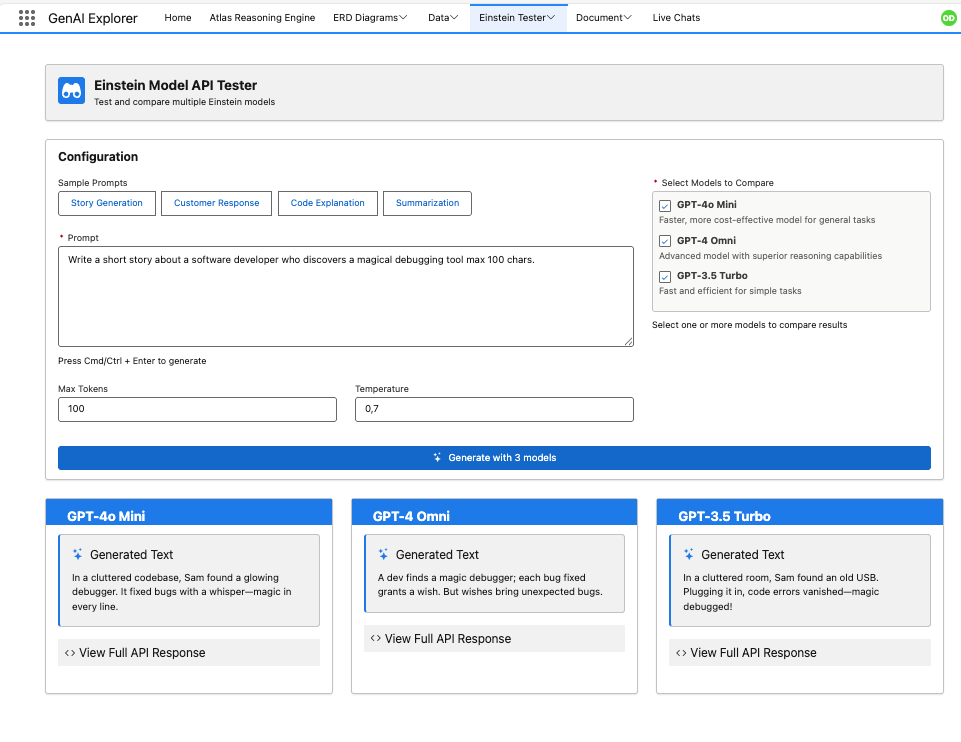

# Einstein Model Testing

Test and compare Einstein AI models directly from your browser with custom prompts, parameter control, and real-time results.



## The Problem

**Choosing the right AI model for your use case requires understanding the tradeoffs between cost, speed, and quality.**

When building AI solutions, teams need to:

- 🎯 **Model Selection**: Determine which model provides the best balance for specific use cases
- 💰 **Cost Optimization**: Understand token consumption and pricing implications
- ⚡ **Performance Testing**: Compare response times across different models
- 🎨 **Quality Assessment**: Evaluate output quality for your specific prompts
- 🔧 **Parameter Tuning**: Experiment with temperature, max tokens, and other settings
- 📊 **Side-by-Side Comparison**: Test multiple models with identical inputs

**In short**: You need a sandbox to experiment with different models and parameters before committing to production.

## How GenAI Explorer Solves This

GenAI Explorer provides **comprehensive model testing** with:

✅ **Side-by-Side Comparison**: Test multiple models with identical prompts simultaneously

✅ **Parameter Control**: Adjust and understand key settings
   - Temperature (creativity vs consistency)
   - Max tokens (response length limits)
   - Top-p, frequency penalty, presence penalty

✅ **Cost Transparency**: See token usage and estimated costs in real-time

✅ **Performance Metrics**: Compare response time, quality, and token efficiency

✅ **Sample Prompts Library**: Pre-built prompts for common scenarios
   - Customer service responses
   - Data analysis
   - Code generation
   - Creative writing

✅ **A/B Testing**: Save and compare results across multiple test runs

**Impact:** Choose the right model for each use case, reduce costs by 50-70% with smarter model selection, and validate quality before deployment.

## Overview

The Einstein Model Testing interface allows you to experiment with different AI models, adjust generation parameters, and compare results side-by-side. This is essential for selecting the right model for your use case and optimizing your AI implementation.

## Supported Models

### GPT-4 Omni
**Best for:** Complex reasoning, detailed analysis, multi-step tasks

**Specifications:**
- Context window: 128K tokens
- Max output: 4096 tokens
- Cost: Higher
- Speed: Slower
- Quality: Highest

**Use Cases:**
- Complex problem-solving
- Detailed explanations
- Code generation and review
- Multi-step reasoning
- Creative content

### GPT-4o Mini
**Best for:** Fast, cost-effective general tasks

**Specifications:**
- Context window: 128K tokens
- Max output: 4096 tokens
- Cost: Medium
- Speed: Fast
- Quality: High

**Use Cases:**
- Quick responses
- Simple queries
- High-volume applications
- Real-time chat
- Summarization

### GPT-3.5 Turbo
**Best for:** Simple, efficient tasks with fast response times

**Specifications:**
- Context window: 16K tokens
- Max output: 4096 tokens
- Cost: Lower
- Speed: Fastest
- Quality: Good

**Use Cases:**
- Simple questions
- Data extraction
- Classification
- Translation
- Basic chat

## Getting Started

### 1. Access Model Testing

Navigate to **Einstein Model Testing** from the main menu.

### 2. Select a Model

Choose one or more models to test:
- ☐ GPT-4 Omni
- ☐ GPT-4o Mini
- ☐ GPT-3.5 Turbo

**Pro Tip:** Select multiple models to compare results side-by-side.

### 3. Configure Parameters

Adjust generation parameters to control behavior:

#### Temperature (0.0 - 2.0)
**Controls randomness and creativity**

- **0.0 - 0.3**: Deterministic, factual, consistent
  - Use for: Data extraction, classification, coding
- **0.4 - 0.7**: Balanced creativity and coherence
  - Use for: General chat, explanations, Q&A
- **0.8 - 1.2**: Creative, varied responses
  - Use for: Brainstorming, content creation, stories
- **1.3 - 2.0**: Highly creative, unpredictable
  - Use for: Creative writing, experimental outputs

**Default: 0.7**

#### Max Tokens (1 - 4096)
**Controls response length**

- **50-100**: Brief, concise answers
- **200-500**: Paragraph-length responses
- **500-1000**: Detailed explanations
- **1000-2000**: Comprehensive answers
- **2000-4096**: Very long, detailed content

**Default: 500**

#### Top P (0.0 - 1.0)
**Nucleus sampling - alternative to temperature**

- **0.1**: Very focused, deterministic
- **0.5**: Balanced
- **0.9**: More diverse
- **1.0**: Full diversity

**Default: 1.0**

**Note:** Use either temperature OR top_p, not both.

#### Frequency Penalty (0.0 - 2.0)
**Reduces repetition of tokens based on frequency**

- **0.0**: No penalty, allows repetition
- **0.5**: Moderate penalty
- **1.0**: Strong penalty
- **2.0**: Maximum penalty

**Default: 0.0**

#### Presence Penalty (0.0 - 2.0)
**Reduces repetition of topics already mentioned**

- **0.0**: No penalty
- **0.5**: Moderate penalty
- **1.0**: Strong penalty
- **2.0**: Maximum penalty

**Default: 0.0**

### 4. Enter Your Prompt

Type or paste your prompt in the text area.

**Pro Tip:** Use the sample prompts to get started quickly.

### 5. Generate Response

Click **Generate** to send the prompt to the selected model(s).

Results appear in real-time below the prompt area.

## Sample Prompts

### Story Generation
```
Write a short story about a robot learning to appreciate art. 
Include a plot twist and make it emotional.
```

**Recommended Settings:**
- Model: GPT-4 Omni
- Temperature: 0.9
- Max Tokens: 1000

### Customer Service Response
```
Generate a professional customer service response to this complaint:
"I ordered my package 2 weeks ago and it still hasn't arrived. 
This is unacceptable. I want a refund."

Tone: Empathetic and professional
Include: Apology, explanation, solution, timeline
```

**Recommended Settings:**
- Model: GPT-4o Mini
- Temperature: 0.6
- Max Tokens: 300

### Code Explanation
```
Explain this TypeScript function in simple terms:

const debounce = <T extends (...args: any[]) => any>(
  func: T,
  delay: number
): ((...args: Parameters<T>) => void) => {
  let timeoutId: NodeJS.Timeout;
  return (...args: Parameters<T>) => {
    clearTimeout(timeoutId);
    timeoutId = setTimeout(() => func(...args), delay);
  };
};
```

**Recommended Settings:**
- Model: GPT-4 Omni
- Temperature: 0.3
- Max Tokens: 500

### Summarization
```
Summarize this article in 3 bullet points:

[Paste article text here]

Focus on: key findings, practical implications, and recommendations.
```

**Recommended Settings:**
- Model: GPT-3.5 Turbo
- Temperature: 0.4
- Max Tokens: 200

### Data Extraction
```
Extract the following information from this email and return as JSON:
- Sender name
- Company name
- Requested meeting date
- Meeting purpose
- Urgency level (low/medium/high)

Email:
"Hi, I'm Sarah from Acme Corporation. I'd like to schedule a meeting 
next Tuesday to discuss our Q4 partnership opportunities. This is quite 
urgent as we need to finalize contracts by end of month."
```

**Recommended Settings:**
- Model: GPT-3.5 Turbo
- Temperature: 0.0
- Max Tokens: 150

### Creative Brainstorming
```
Brainstorm 10 creative names for a new app that helps remote teams 
collaborate on design projects. The names should be:
- Memorable
- Easy to spell
- Available as .com domains
- Modern and tech-forward
```

**Recommended Settings:**
- Model: GPT-4o Mini
- Temperature: 1.0
- Max Tokens: 400

## Multi-Model Comparison

### Side-by-Side Testing

When you select multiple models, results display side-by-side:

```
┌─────────────────────┬─────────────────────┬─────────────────────┐
│    GPT-4 Omni       │    GPT-4o Mini      │   GPT-3.5 Turbo     │
├─────────────────────┼─────────────────────┼─────────────────────┤
│ Response Time: 3.2s │ Response Time: 1.8s │ Response Time: 0.9s │
│ Tokens: 342         │ Tokens: 285         │ Tokens: 198         │
│                     │                     │                     │
│ [Response content]  │ [Response content]  │ [Response content]  │
│                     │                     │                     │
└─────────────────────┴─────────────────────┴─────────────────────┘
```

### Comparison Metrics

**Automatically displayed:**
- Response time
- Token usage
- Cost estimate
- Character count
- Word count
- Response quality (experimental)

### Use Cases for Comparison

**1. Model Selection**
Test the same prompt across all models to find the best fit:
- Quality vs. speed tradeoff
- Cost optimization
- Response consistency

**2. Parameter Tuning**
Run the same prompt with different parameters:
- Compare temperature settings
- Test max token limits
- Evaluate penalty effects

**3. Prompt Engineering**
Test prompt variations to find what works best:
- Different wording
- More/less context
- Various formats

## Advanced Features

### Custom System Prompts

Override the default system prompt:

**Default System Prompt:**
```
You are a helpful AI assistant.
```

**Custom System Prompt Example:**
```
You are a Salesforce expert with deep knowledge of CRM best practices. 
Always cite Salesforce documentation when making recommendations.
Keep responses concise and actionable.
```

**To Set Custom System Prompt:**
1. Click **Advanced Settings**
2. Toggle **Custom System Prompt**
3. Enter your system prompt
4. Generate responses

### Response History

View and manage previous test results:

**Features:**
- Browse all past tests
- Re-run previous prompts
- Compare historical results
- Export test data

**To Access History:**
1. Click **History** tab
2. Select a previous test
3. View original prompt and results
4. Optionally re-run or modify

### Batch Testing

Test multiple prompts sequentially:

**Steps:**
1. Click **Batch Mode**
2. Enter prompts (one per line)
3. Select model(s)
4. Click **Run Batch**
5. View all results in a table

**Use Case:** Test consistency across similar prompts

### Export Results

Export test results for analysis:

**Export Formats:**
- **JSON**: Full test data including parameters
- **CSV**: Tabular results for spreadsheet analysis
- **Markdown**: Human-readable documentation
- **PDF**: Formatted report

## Performance Analysis

### Response Time Analysis

Compare average response times:

| Model | Avg Response Time | Min | Max |
|-------|------------------|-----|-----|
| GPT-4 Omni | 2.8s | 1.5s | 5.2s |
| GPT-4o Mini | 1.5s | 0.8s | 2.9s |
| GPT-3.5 Turbo | 0.7s | 0.4s | 1.3s |

### Token Usage Analysis

Track token consumption:

| Model | Avg Tokens | Cost per 1K Tokens |
|-------|------------|-------------------|
| GPT-4 Omni | 450 | $0.03 |
| GPT-4o Mini | 380 | $0.015 |
| GPT-3.5 Turbo | 320 | $0.002 |

### Quality Metrics

Experimental quality scoring:

- **Relevance**: How well it answers the question
- **Coherence**: Logical flow and consistency
- **Completeness**: Addresses all aspects
- **Accuracy**: Factual correctness (when verifiable)

## Best Practices

### 1. Start Simple
Begin with basic prompts and gradually increase complexity.

### 2. Use Appropriate Models
- GPT-4 Omni: Complex tasks requiring deep reasoning
- GPT-4o Mini: General purpose, balanced quality/speed
- GPT-3.5 Turbo: Simple, high-volume tasks

### 3. Optimize Temperature
- Factual tasks: 0.0 - 0.3
- Balanced: 0.4 - 0.7
- Creative: 0.8 - 1.2

### 4. Control Token Usage
Set max_tokens based on expected response length to avoid unnecessary costs.

### 5. Test Consistency
Run the same prompt multiple times (especially with temperature > 0) to ensure consistent quality.

### 6. Compare Before Deploying
Always test with multiple models before choosing one for production use.

### 7. Use Custom System Prompts
Tailor the system prompt to your specific domain or use case for better results.

### 8. Monitor Costs
Track token usage and costs, especially when testing with GPT-4 models.

## Troubleshooting

### Slow Response Times
- Try a faster model (GPT-4o Mini or GPT-3.5 Turbo)
- Reduce max_tokens
- Simplify the prompt
- Check Salesforce API limits

### Low Quality Responses
- Switch to GPT-4 Omni for complex tasks
- Increase max_tokens for longer responses
- Add more context to the prompt
- Use a custom system prompt
- Adjust temperature for more/less creativity

### Inconsistent Results
- Lower temperature for more consistency
- Test multiple times to verify
- Add more specific instructions
- Use examples in the prompt

### Token Limit Errors
- Reduce max_tokens setting
- Shorten the input prompt
- Remove unnecessary context
- Split into multiple requests

## Cost Optimization

### Strategies

**1. Use the Right Model**
- Don't use GPT-4 Omni for simple tasks
- GPT-3.5 Turbo is 15x cheaper for basic queries

**2. Limit Token Usage**
- Set appropriate max_tokens
- Keep prompts concise
- Remove unnecessary context

**3. Cache Responses**
- Store and reuse common responses
- Avoid regenerating static content

**4. Batch Requests**
- Process multiple items together when possible
- Reduces overhead

**5. Monitor Usage**
- Track costs regularly
- Set budget alerts
- Identify optimization opportunities

## Next Steps

- [Chat with Agents](./4-chat-with-agents.md) - Test models in agent context
- [Request Replay & Debugging](./11-request-replay-debugging.md) - Debug and optimize

---

**Effective model testing leads to better AI implementations and significant cost savings.**

