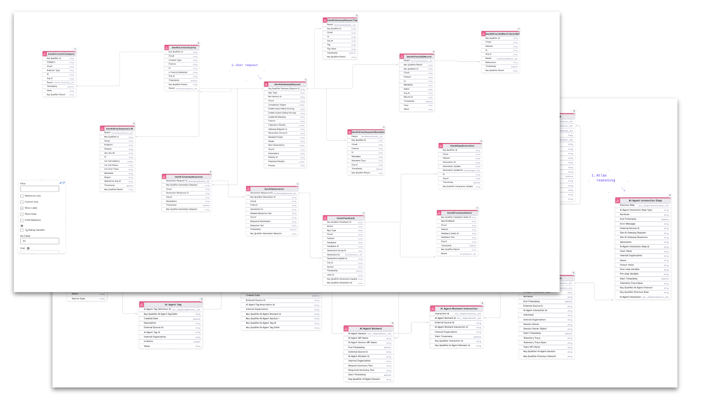

# Data Cloud Integration

Execute queries and monitor AI data directly from GenAI Explorer with comprehensive Data Cloud integration for analytics and insights.



## The Problem

**Analyzing AI performance requires querying Data Cloud to understand conversations, token usage, errors, and agent behavior.**

Teams need to:

- 📊 **Monitor Performance**: Track agent success rates, response times, and user satisfaction
- 💰 **Analyze Costs**: Understand token consumption patterns and optimize spending
- 🐛 **Debug Issues**: Investigate errors and failed conversations
- 📈 **Identify Trends**: Spot patterns in user queries and agent responses
- 🔍 **Audit Behavior**: Review what agents are doing and why
- ⚡ **Real-Time Insights**: Get immediate visibility into AI operations

**In short**: You need quick access to AI data for analysis and optimization without writing complex SQL queries.

## How GenAI Explorer Solves This

GenAI Explorer provides **instant data access** with:

✅ **Pre-Built Query Library**: 8+ ready-to-use analytics queries
   - Complete reasoning traces
   - Token usage by model
   - Conversation threading
   - Feature usage statistics
   - Safety and compliance metrics
   - Error analysis
   - Performance trends

✅ **Interactive Query Builder**: Build custom queries with auto-complete
   - Object and field suggestions
   - Syntax validation
   - Query optimization tips

✅ **Live Data Execution**: Run queries directly against your org
   - Real-time results
   - No external tools needed
   - Secure OAuth authentication

✅ **Multiple Export Formats**: Get data where you need it
   - CSV for Excel
   - JSON for APIs
   - Text for reports
   - Copy to clipboard

✅ **Query Lab in Atlas**: Specialized queries for reasoning engine analysis
   - Stage-by-stage performance
   - ReAct loop iterations
   - RAG retrieval effectiveness

**Impact:** Analyze AI performance in minutes instead of days, export data instantly, and make data-driven optimization decisions without SQL expertise.

## Overview

GenAI Explorer provides deep integration with Salesforce Data Cloud, allowing you to query, analyze, and monitor all aspects of your AI implementation. Access real-time data about requests, responses, token usage, conversations, and performance metrics.

## AI Data Objects

### GenAI Gateway Request

**Purpose:** Incoming AI requests from users and agents.

**Key Fields:**
- `Id` - Unique request identifier
- `InputText__c` - User's input/query
- `SessionId__c` - Conversation session ID
- `UserId__c` - User who made the request
- `AgentId__c` - AI Agent being queried
- `FeatureType__c` - Type of AI feature used
- `ActionInvoked__c` - Actions requested
- `CreatedDate` - Timestamp of request
- `ModelRequested__c` - AI model requested
- `Temperature__c` - Model temperature parameter
- `MaxTokens__c` - Maximum tokens allowed

**Common Queries:**
```sql
-- Recent requests
SELECT Id, InputText__c, CreatedDate, UserId__c
FROM GenAIGatewayRequest__c
WHERE CreatedDate = TODAY
ORDER BY CreatedDate DESC

-- Requests by user
SELECT UserId__c, COUNT(Id) as RequestCount
FROM GenAIGatewayRequest__c
WHERE CreatedDate = LAST_N_DAYS:7
GROUP BY UserId__c

-- Requests by agent
SELECT AgentId__c, COUNT(Id) as RequestCount
FROM GenAIGatewayRequest__c
WHERE CreatedDate = LAST_N_DAYS:30
GROUP BY AgentId__c
```

### GenAI Gateway Response

**Purpose:** AI-generated responses to requests.

**Key Fields:**
- `Id` - Unique response identifier
- `RequestId__c` - Foreign key to Request
- `OutputText__c` - AI-generated response
- `CitedSources__c` - References used
- `ResponseTimeMs__c` - Time to generate
- `QualityScore__c` - Quality assessment
- `SafetyScore__c` - Safety assessment
- `PIIDetected__c` - PII detection flag
- `PIIMasked__c` - PII masking applied
- `ToxicityScore__c` - Toxicity level
- `BiasScore__c` - Bias detection score
- `ErrorMessage__c` - Error details if failed
- `CreatedDate` - Response timestamp

**Common Queries:**
```sql
-- Responses with citations
SELECT r.InputText__c, resp.OutputText__c, resp.CitedSources__c
FROM GenAIGatewayRequest__c r
JOIN GenAIGatewayResponse__c resp ON r.Id = resp.RequestId__c
WHERE resp.CitedSources__c != null
ORDER BY r.CreatedDate DESC

-- Quality analysis
SELECT 
  AVG(QualityScore__c) as AvgQuality,
  AVG(ResponseTimeMs__c) as AvgResponseTime,
  COUNT(Id) as TotalResponses
FROM GenAIGatewayResponse__c
WHERE CreatedDate = LAST_N_DAYS:7

-- Safety monitoring
SELECT Id, RequestId__c, SafetyScore__c, ToxicityScore__c
FROM GenAIGatewayResponse__c
WHERE SafetyScore__c < 0.8
   OR ToxicityScore__c > 0.3
ORDER BY CreatedDate DESC
```

### GenAI Gateway Generation

**Purpose:** Token-level details about AI generation.

**Key Fields:**
- `Id` - Unique generation identifier
- `ResponseId__c` - Foreign key to Response
- `Model__c` - Actual model used
- `InputTokens__c` - Input token count
- `OutputTokens__c` - Output token count
- `TotalTokens__c` - Total tokens used
- `CostEstimate__c` - Estimated cost
- `ProcessingTimeMs__c` - Processing time per stage
- `ModelParameters__c` - Model settings used
- `CreatedDate` - Generation timestamp

**Common Queries:**
```sql
-- Token usage by model
SELECT 
  Model__c,
  SUM(InputTokens__c) as TotalInput,
  SUM(OutputTokens__c) as TotalOutput,
  SUM(TotalTokens__c) as TotalTokens,
  AVG(TotalTokens__c) as AvgPerRequest,
  SUM(CostEstimate__c) as TotalCost
FROM GenAIGatewayGeneration__c
WHERE CreatedDate = LAST_N_DAYS:30
GROUP BY Model__c

-- Expensive requests
SELECT 
  g.ResponseId__c,
  g.TotalTokens__c,
  g.CostEstimate__c,
  r.InputText__c
FROM GenAIGatewayGeneration__c g
JOIN GenAIGatewayResponse__c resp ON g.ResponseId__c = resp.Id
JOIN GenAIGatewayRequest__c r ON resp.RequestId__c = r.Id
WHERE g.TotalTokens__c > 2000
ORDER BY g.TotalTokens__c DESC
```

## Pre-Built Queries

GenAI Explorer includes pre-built queries for common analysis tasks:

### 1. Complete Request-Response Trace

**Purpose:** Follow the full lifecycle of an AI interaction.

**Query:**
```sql
SELECT 
  r.Id as RequestId,
  r.CreatedDate,
  r.InputText__c,
  r.SessionId__c,
  r.UserId__c,
  resp.OutputText__c,
  resp.ResponseTimeMs__c,
  resp.QualityScore__c,
  resp.CitedSources__c,
  gen.Model__c,
  gen.TotalTokens__c,
  gen.CostEstimate__c
FROM GenAIGatewayRequest__c r
JOIN GenAIGatewayResponse__c resp ON r.Id = resp.RequestId__c
JOIN GenAIGatewayGeneration__c gen ON resp.Id = gen.ResponseId__c
WHERE r.CreatedDate = TODAY
ORDER BY r.CreatedDate DESC
LIMIT 100
```

**Use Case:** Debug specific interactions, understand what happened end-to-end.

### 2. Token Usage Analysis

**Purpose:** Analyze costs and optimize model selection.

**Query:**
```sql
SELECT 
  gen.Model__c,
  COUNT(DISTINCT r.SessionId__c) as SessionCount,
  COUNT(gen.Id) as RequestCount,
  SUM(gen.InputTokens__c) as TotalInputTokens,
  SUM(gen.OutputTokens__c) as TotalOutputTokens,
  SUM(gen.TotalTokens__c) as TotalTokens,
  AVG(gen.TotalTokens__c) as AvgTokensPerRequest,
  SUM(gen.CostEstimate__c) as TotalCost,
  AVG(gen.CostEstimate__c) as AvgCostPerRequest
FROM GenAIGatewayGeneration__c gen
JOIN GenAIGatewayResponse__c resp ON gen.ResponseId__c = resp.Id
JOIN GenAIGatewayRequest__c r ON resp.RequestId__c = r.Id
WHERE gen.CreatedDate = LAST_N_DAYS:30
GROUP BY gen.Model__c
ORDER BY TotalCost DESC
```

**Use Case:** Identify cost optimization opportunities.

### 3. Conversation Threading

**Purpose:** Analyze multi-turn conversations.

**Query:**
```sql
SELECT 
  r.SessionId__c,
  COUNT(r.Id) as MessageCount,
  MIN(r.CreatedDate) as SessionStart,
  MAX(r.CreatedDate) as SessionEnd,
  TIMEDIFF(MAX(r.CreatedDate), MIN(r.CreatedDate)) as SessionDuration,
  AVG(gen.TotalTokens__c) as AvgTokensPerMessage,
  SUM(gen.TotalTokens__c) as TotalSessionTokens,
  AVG(resp.ResponseTimeMs__c) as AvgResponseTime
FROM GenAIGatewayRequest__c r
JOIN GenAIGatewayResponse__c resp ON r.Id = resp.RequestId__c
JOIN GenAIGatewayGeneration__c gen ON resp.Id = gen.ResponseId__c
WHERE r.CreatedDate = LAST_N_DAYS:7
  AND r.SessionId__c != null
GROUP BY r.SessionId__c
HAVING MessageCount > 1
ORDER BY MessageCount DESC, SessionStart DESC
```

**Use Case:** Understand conversation patterns and session behavior.

### 4. Performance Monitoring

**Purpose:** Track response times and identify bottlenecks.

**Query:**
```sql
SELECT 
  r.AgentId__c,
  COUNT(resp.Id) as TotalResponses,
  AVG(resp.ResponseTimeMs__c) as AvgResponseTime,
  MIN(resp.ResponseTimeMs__c) as MinResponseTime,
  MAX(resp.ResponseTimeMs__c) as MaxResponseTime,
  PERCENTILE(resp.ResponseTimeMs__c, 0.5) as MedianResponseTime,
  PERCENTILE(resp.ResponseTimeMs__c, 0.95) as P95ResponseTime,
  AVG(resp.QualityScore__c) as AvgQualityScore
FROM GenAIGatewayRequest__c r
JOIN GenAIGatewayResponse__c resp ON r.Id = resp.RequestId__c
WHERE r.CreatedDate = LAST_N_DAYS:7
GROUP BY r.AgentId__c
ORDER BY AvgResponseTime DESC
```

**Use Case:** Identify slow agents and optimize performance.

### 5. Feature Usage Analysis

**Purpose:** Track which AI features are most used.

**Query:**
```sql
SELECT 
  r.FeatureType__c,
  r.ActionInvoked__c,
  COUNT(r.Id) as UsageCount,
  COUNT(DISTINCT r.UserId__c) as UniqueUsers,
  AVG(resp.ResponseTimeMs__c) as AvgResponseTime,
  AVG(resp.QualityScore__c) as AvgQuality,
  COUNT(CASE WHEN resp.ErrorMessage__c != null THEN 1 END) as ErrorCount,
  (COUNT(CASE WHEN resp.ErrorMessage__c != null THEN 1 END) * 100.0 / COUNT(r.Id)) as ErrorRate
FROM GenAIGatewayRequest__c r
JOIN GenAIGatewayResponse__c resp ON r.Id = resp.RequestId__c
WHERE r.CreatedDate = LAST_N_DAYS:30
GROUP BY r.FeatureType__c, r.ActionInvoked__c
ORDER BY UsageCount DESC
```

**Use Case:** Understand feature adoption and prioritize improvements.

### 6. Safety & Compliance Monitoring

**Purpose:** Track PII detection, masking, and safety scores.

**Query:**
```sql
SELECT 
  r.CreatedDate,
  r.UserId__c,
  r.AgentId__c,
  resp.SafetyScore__c,
  resp.PIIDetected__c,
  resp.PIIMasked__c,
  resp.ToxicityScore__c,
  resp.BiasScore__c,
  CASE 
    WHEN resp.SafetyScore__c < 0.7 THEN 'High Risk'
    WHEN resp.SafetyScore__c < 0.85 THEN 'Medium Risk'
    ELSE 'Low Risk'
  END as RiskLevel
FROM GenAIGatewayRequest__c r
JOIN GenAIGatewayResponse__c resp ON r.Id = resp.RequestId__c
WHERE r.CreatedDate = LAST_N_DAYS:30
  AND (resp.SafetyScore__c < 0.8 
       OR resp.PIIDetected__c = true
       OR resp.ToxicityScore__c > 0.3
       OR resp.BiasScore__c > 0.3)
ORDER BY resp.SafetyScore__c ASC, r.CreatedDate DESC
```

**Use Case:** Compliance auditing and safety monitoring.

### 7. User Engagement Analysis

**Purpose:** Track user adoption and engagement.

**Query:**
```sql
SELECT 
  r.UserId__c,
  COUNT(DISTINCT DATE(r.CreatedDate)) as ActiveDays,
  COUNT(r.Id) as TotalRequests,
  COUNT(DISTINCT r.SessionId__c) as TotalSessions,
  AVG(resp.QualityScore__c) as AvgQualityScore,
  SUM(gen.TotalTokens__c) as TotalTokensUsed,
  MIN(r.CreatedDate) as FirstRequest,
  MAX(r.CreatedDate) as LastRequest
FROM GenAIGatewayRequest__c r
JOIN GenAIGatewayResponse__c resp ON r.Id = resp.RequestId__c
JOIN GenAIGatewayGeneration__c gen ON resp.Id = gen.ResponseId__c
WHERE r.CreatedDate = LAST_N_DAYS:30
GROUP BY r.UserId__c
ORDER BY TotalRequests DESC
```

**Use Case:** Understand user adoption and identify power users.

### 8. Error Analysis

**Purpose:** Identify and track errors.

**Query:**
```sql
SELECT 
  DATE(r.CreatedDate) as ErrorDate,
  r.AgentId__c,
  resp.ErrorMessage__c,
  COUNT(resp.Id) as ErrorCount,
  COUNT(DISTINCT r.UserId__c) as AffectedUsers
FROM GenAIGatewayRequest__c r
JOIN GenAIGatewayResponse__c resp ON r.Id = resp.RequestId__c
WHERE r.CreatedDate = LAST_N_DAYS:7
  AND resp.ErrorMessage__c != null
GROUP BY DATE(r.CreatedDate), r.AgentId__c, resp.ErrorMessage__c
ORDER BY ErrorDate DESC, ErrorCount DESC
```

**Use Case:** Track and prioritize bug fixes.

## SOQL Query Builder

### Features

**Interactive Query Editor:**
- Syntax highlighting
- Auto-completion
- Field suggestions
- Error detection

**Result Display:**
- Sortable columns
- Filterable data
- Pagination
- Export to CSV/Excel

**Query History:**
- Save favorite queries
- Browse recent queries
- Share queries with team

### Using the Query Builder

1. **Select Object**
   - Choose from AI data objects
   - View object schema
   - See field descriptions

2. **Build Query**
   - Select fields to retrieve
   - Add WHERE conditions
   - Set ORDER BY
   - Configure LIMIT

3. **Execute**
   - Click **Run Query**
   - View results
   - Analyze data

4. **Export**
   - Download as CSV
   - Copy to clipboard
   - Save to board

## Visualizations

### Create Charts from Query Results

**Supported Chart Types:**
- Line charts (time series)
- Bar charts (comparisons)
- Pie charts (distributions)
- Scatter plots (correlations)
- Heatmaps (patterns)

**Example: Token Usage Over Time**
```sql
SELECT 
  DATE(CreatedDate) as Date,
  SUM(TotalTokens__c) as TotalTokens
FROM GenAIGatewayGeneration__c
WHERE CreatedDate = LAST_N_DAYS:30
GROUP BY DATE(CreatedDate)
ORDER BY Date
```

**Visualization:** Line chart showing daily token usage trends.

### Dashboard Creation

Combine multiple queries into a dashboard:

**Components:**
- Metric cards (KPIs)
- Charts and graphs
- Data tables
- Live updates

**Example Dashboard:**
- Total requests today
- Average response time
- Token usage by model
- Top 10 users
- Recent errors


