# AI Retriever & RAG Monitoring

Monitor every knowledge retrieval your AI agents make with complete visibility into what content was found, how relevant it was, and where it came from.

## The Problem

**Understanding why AI agents give certain answers requires seeing what knowledge they retrieved and how they chose it.**

Teams need to:

- 🔍 **Debug Wrong Answers**: See exactly what content the AI retrieved when it gave incorrect information
- 📊 **Measure Quality**: Know if the right content is being found with good relevance scores
- ⚡ **Optimize Performance**: Identify slow retrievals and optimize response times
- 📚 **Find Content Gaps**: Discover what knowledge is missing from your knowledge base
- 🎯 **Validate Sources**: Trace retrieved content back to source Salesforce records
- 🔬 **A/B Test Retrievers**: Compare different retriever configurations objectively

**In short**: You need complete transparency into your RAG (Retrieval-Augmented Generation) system to build reliable AI agents.

## How GenAI Explorer Solves This

GenAI Explorer provides **complete RAG visibility** with:

✅ **Request Timeline**: See every query your agents make
   - Query text and context
   - When requests were made
   - Number of results returned
   - Average response times

✅ **Response Ranking**: Results sorted by relevance
   - Best match highlighted automatically
   - Relevance scores as percentages
   - Quick visual scanning

✅ **Execution Time Tracking**: Monitor performance
   - Individual response times
   - Average time per request
   - Identify slow queries

✅ **Source Tracing**: Know where content comes from
   - Clickable links to source records
   - Data source identification
   - Object type information

✅ **Content Preview**: See what AI actually saw
   - First 2 lines of retrieved text
   - Clean truncation
   - Quick verification

✅ **Quality Metrics**: Measure retrieval effectiveness
   - Score distribution analysis
   - Performance trends
   - Content gap identification

**Impact:** Debug agent issues in minutes, optimize retrieval quality with data, and build confidence in AI responses with source tracing.

## How It Works


## Features

### Request Timeline

Every retrieval request is captured with:

```
┌─────────────────────────────────────────────────────────────┐
│  📋 Request: "How do I reset my password?"                  │
│  🕐 Dec 9, 2025, 10:30:45 AM (5 minutes ago)               │
│  📊 3 results | ⏱️ Avg: 1.23s                              │
└─────────────────────────────────────────────────────────────┘
```

### Best Match Highlighting

The top-ranked result gets special visual treatment:

```mermaid
graph LR
    A[All Results] --> B{Sort by Score}
    B --> C[#1: 95.3%]
    B --> D[#2: 87.1%]
    B --> E[#3: 82.5%]
    
    C --> F[🎨 Green Border]
    C --> G[🏆 Best Match Badge]
    C --> H[✨ Shadow Effect]
    
    style C fill:#d4edda,stroke:#28a745,stroke-width:3px
    style D fill:#fff,stroke:#ccc,stroke-width:1px
    style E fill:#fff,stroke:#ccc,stroke-width:1px
```



### Score Interpretation

```mermaid
graph TD
    A[Response Scores] --> B[>90% - Excellent Match]
    A --> C[80-90% - Good Match]
    A --> D[70-80% - Fair Match]
    A --> E["<70% - Weak Match"]
    
    B --> F[✅ High Confidence]
    C --> G[⚠️ Review Content]
    D --> H[⚠️ May Need Better Data]
    E --> I[❌ Missing Knowledge]
    
    style B fill:#d4edda,color:#000
    style C fill:#fff3cd,color:#000
    style D fill:#ffe5cc,color:#000
    style E fill:#f8d7da,color:#000
```



### Performance Tracking


## Use Cases

### Use Case 1: Debugging Wrong Answers


**Steps:**
1. Open GenAI Explorer and navigate to your Retriever
2. Find the specific query that led to the wrong answer
3. Check what content was actually retrieved
4. Verify the relevance score
5. Click through to source records
6. Identify the issue and fix it

### Use Case 2: Measuring Quality

Track quality metrics over time:

**Before GenAI Explorer:**
```
❓ Is our RAG working well?
❓ How good is the knowledge base?
❓ Should we add more data?
```

**After GenAI Explorer:**
```
✅ 85% of queries get >90% score
⚠️ 10% of queries get &lt;70% score
📝 Action: Add content for low-scoring topics
```

### Use Case 3: Performance Optimization

```mermaid
graph TD
    A[Monitor Execution Times] --> B{Avg Time?}
    B -->|"<1s"| C[✅ Excellent]
    B -->|1-2s| D[⚠️ Acceptable]
    B -->|>2s| E[❌ Needs Optimization]
    
    E --> F[Check for Patterns]
    F --> G[Large Knowledge Base?]
    F --> H[Complex Queries?]
    F --> I[Data Cloud Issues?]
    
    G --> J[Optimize Vector Index]
    H --> K[Simplify Queries]
    I --> L[Check Data Cloud Performance]
    
    style C fill:#d4edda
    style D fill:#fff3cd
    style E fill:#f8d7da
```



### Use Case 4: Content Gap Analysis

Identify missing knowledge by analyzing low-scoring queries:


**Action Plan:**
1. Export low-scoring queries
2. Group by topic
3. Create missing content
4. Measure improvement

### Use Case 5: A/B Testing

Compare two retriever configurations:

| Metric | Retriever A | Retriever B | Winner |
|--------|-------------|-------------|--------|
| Avg Score | 87.3% | 92.1% | 🏆 B |
| Avg Time | 1.8s | 1.2s | 🏆 B |
| Avg Results | 3.2 | 4.5 | 🏆 B |

**Decision:** Deploy Retriever B based on objective metrics

## Workflow

```mermaid
flowchart TD
    A[Start: Agent Interaction] --> B[Agent Makes Retrieval]
    B --> C[Data Logged to Data Cloud]
    C --> D[Open GenAI Explorer]
    D --> E[Navigate to Retriever]
    E --> F[View Timeline]
    F --> G{Issue Found?}
    
    G -->|Low Scores| H[Fix: Add Better Content]
    G -->|Wrong Source| I[Fix: Update Source Record]
    G -->|Slow Performance| J[Fix: Optimize Configuration]
    G -->|No Issues| K[✅ Monitor Regularly]
    
    H --> L[Test with New Query]
    I --> L
    J --> L
    L --> M{Improved?}
    M -->|Yes| N[✅ Deploy]
    M -->|No| O[Try Different Fix]
    O --> H
    
    style K fill:#d4edda
    style N fill:#d4edda
```



## Best Practices

### Do's and Don'ts


✅ **Do:**
- Monitor quality weekly
- Track score trends
- Verify source records
- Test changes before deploying
- Set performance baselines

❌ **Don't:**
- Ignore low scores (&lt;70%)
- Assume high score = correct answer
- Forget to check source records
- Let execution time grow unchecked
- Make changes without testing

### Success Metrics

```mermaid
graph LR
    A[🎯 Target Metrics] --> B[Score: >80%]
    A --> C["Time: <2s"]
    A --> D[Results: 3+]
    
    B --> E[85% of queries]
    C --> F[95% of responses]
    D --> G[90% of requests]
    
    style E fill:#d4edda
    style F fill:#d4edda
    style G fill:#d4edda
```



**Recommended Targets:**
- **Quality**: >80% relevance score on 85% of queries
- **Performance**: &lt;2s execution time on 95% of responses
- **Coverage**: 3+ relevant results on 90% of requests

### Weekly Dashboard Example

```
┌─────────────────────────────────────┐
│  📊 This Week's Performance         │
├─────────────────────────────────────┤
│  Queries: 1,247                     │
│  Avg Score: 87.3% ✅                │
│  Avg Time: 1.45s ✅                 │
│  Low Scores: 78 (6.2%) ⚠️           │
└─────────────────────────────────────┘
```

## Getting Started

### Navigation

```
GenAI Explorer → Data → Search "Retriever" → Select Your Retriever
```

### Key Visual Indicators

| Visual | Meaning |
|--------|---------|
| 🏆 Green border | Best match result |
| >90% score | Excellent retrieval |
| 80-90% score | Good retrieval |
| &lt;70% score | Review needed |
| &lt;1s time | Fast performance |
| >2s time | Slow, needs optimization |

### Quick Actions


## Data Cloud Objects

### AIRetrieverRequest__dll

Stores each retrieval request:
- `id__c` - Unique request ID
- `queryText__c` - The search query
- `requestTimestamp__c` - When requested
- `retrieverApiName__c` - Which retriever was used

### AIRetrieverResponse__dll

Stores each retrieved result:
- `id__c` - Unique response ID
- `resultText__c` - Retrieved content (JSON)
- `scoreNumber__c` - Relevance score (0-1)
- `responseTimestamp__c` - When returned
- `aiRetrieverRequestId__c` - Links to request

## FAQs

**Q: How long is retrieval data stored?**  
A: Data Cloud retention policies apply (typically 30-90 days).

**Q: Can I export retrieval data?**  
A: Yes, use the Data Cloud Integration feature to query and export.

**Q: What's a good relevance score?**  
A: >80% is good, >90% is excellent. Below 70% needs investigation.

**Q: How do I improve low scores?**  
A: Add more relevant content to your knowledge base or update existing content.

**Q: Can I compare retrievers?**  
A: Yes, run the same queries through different retrievers and compare metrics.

---

**Related Features:**
- [Data Cloud Integration](./data-cloud-integration)
- [Chat with Agents](./chat-with-agents)
- [Conversation History](./conversation-history)

