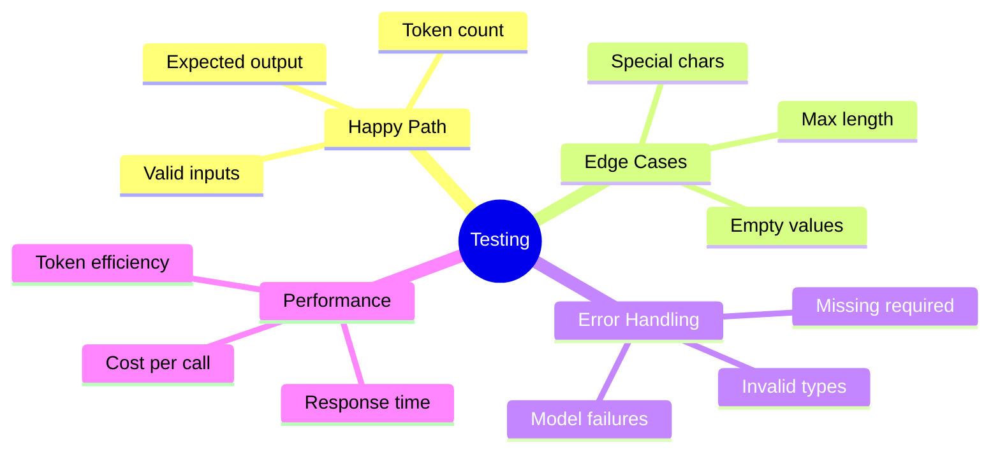
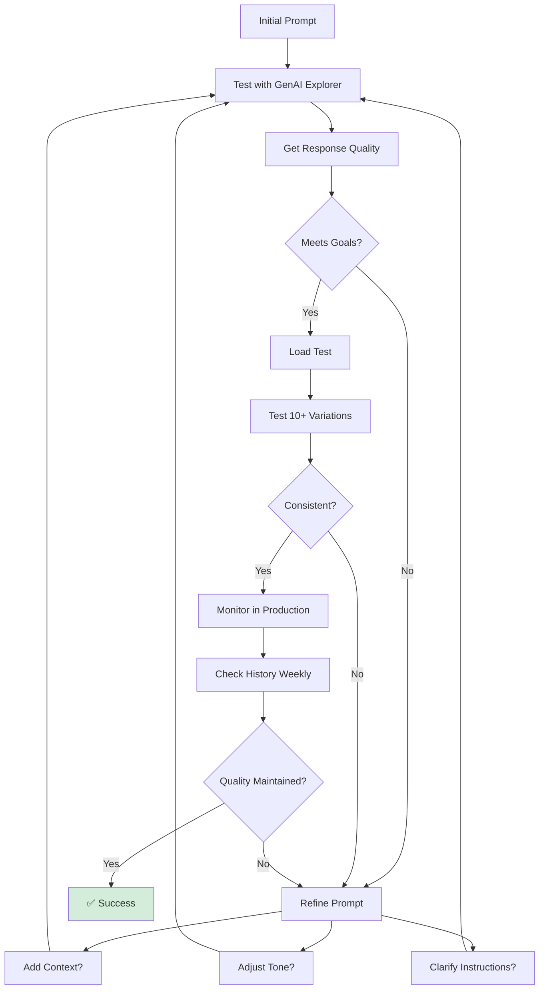

# Best Practices

Comprehensive guidelines for effective prompt template management.

---

## Testing Best Practices

### Pre-Deployment Testing

✅ **Always Test:**
1. **Happy Path**: Typical user inputs
2. **Edge Cases**: Empty, null, very long
3. **Special Characters**: `<>`, `&`, `"`, `'`
4. **Unicode**: Non-English characters
5. **Consistency**: Multiple runs with same input
6. **Performance**: Response time and token count



### Testing Checklist

Before activating:

- [ ] ✅ Tested with realistic production data
- [ ] ✅ Tested with edge cases (empty, null, long)
- [ ] ✅ All variables substitute correctly
- [ ] ✅ Token count is reasonable (&lt;800)
- [ ] ✅ Tested with different AI models (if applicable)
- [ ] ✅ Output format matches expectations
- [ ] ✅ Required fields validated
- [ ] ✅ Optional fields handle null gracefully
- [ ] ✅ Special characters handled correctly
- [ ] ✅ Tested multiple times for consistency
- [ ] ✅ Performance is acceptable (&lt;3s)
- [ ] ✅ Cost per execution within budget

---

---

## Token Optimization Best Practices

### Keep Templates Concise

**❌ Verbose:**
```
You are a helpful customer service agent.
Please help the customer with their question.
Be helpful and professional in your response.
Please make sure to address all of their concerns.
```
**Tokens:** ~30

**✅ Concise:**
```
Help customer professionally.
Address all concerns.
```
**Tokens:** ~7

**Savings:** 77%

### Token Targets

| Template Type | Target | Max |
|--------------|--------|-----|
| Simple | &lt;300 | 500 |
| Standard | &lt;600 | 900 |
| Complex | &lt;900 | 1500 |

**See:** **[Token Optimization](./token-optimization)** for strategies

---

## Monitoring Best Practices

### Regular Review Schedule

**Daily:**
- ✅ Check for execution errors
- ✅ Monitor unusual token spikes
- ✅ Verify template is working

**Weekly:**
- ✅ Review token usage trends
- ✅ Compare performance across versions
- ✅ Identify optimization opportunities
- ✅ Check response quality

**Monthly:**
- ✅ Analyze cost vs. performance
- ✅ Update templates based on learnings
- ✅ Archive unused templates
- ✅ Plan optimization initiatives

**See:** **[Execution History](./execution-history)** for monitoring guide

---

## Version Management Best Practices

### Version Comparison

Before switching versions:

```
┌─────────────────────────────────────────────────────────────┐
│  Compare Versions: v2 vs v3                                 │
├─────────────────────────────────────────────────────────────┤
│                                                              │
│  ┌─ v2 (Previous) ──────────────┬─ v3 (Current) ─────────┐ │
│  │                               │                         │ │
│  │ Avg Tokens: 800               │ Avg Tokens: 600        │ │
│  │ Avg Time: 2.1s                │ Avg Time: 1.8s         │ │
│  │ Executions: 1,247             │ Executions: 342        │ │
│  │                               │                         │ │
│  │ Template Length: 450 chars    │ Length: 320 chars      │ │
│  │ Variables: 5                  │ Variables: 4           │ │
│  │                               │                         │ │
│  └───────────────────────────────┴─────────────────────────┘ │
│                                                              │
│  📊 v3 is 25% faster and 25% cheaper                        │
└─────────────────────────────────────────────────────────────┘
```

**Evaluate:**
1. Token count difference
2. Response time change
3. Output quality
4. Cost impact
5. User feedback

---

## Prompt Engineering Best Practices

### Workflow



### Prompt Structure

**Effective Template Structure:**
```
1. Role/Context (1 line)
2. Task (1-2 lines)
3. Constraints (optional, 1-2 lines)
4. Output Format (optional, 1 line)
```

**Example:**
```
You are a customer service expert.
Help {!Customer_Name} with {!Issue_Type}.
Be professional and concise.
Provide actionable steps.
```

---

---

## Security Best Practices

### ✅ Do's

- ✅ Validate all input data
- ✅ Sanitize special characters
- ✅ Use type-safe variables
- ✅ Test with malicious inputs
- ✅ Limit template permissions

### ❌ Don'ts

- ❌ Trust user input blindly
- ❌ Allow template injection
- ❌ Expose sensitive data in prompts
- ❌ Store credentials in templates
- ❌ Allow unrestricted variable access

---

## Performance Best Practices

### Response Time

**Targets:**
- Simple templates: less than 1s
- Standard templates: less than 2s
- Complex templates: less than 3s

**If Slow:**
1. Reduce template length
2. Use smaller AI model
3. Remove unnecessary context
4. Optimize variable lookups

### Token Efficiency

**Track:**
- Average tokens per execution
- Token cost trend over time
- High-token outliers

**Optimize:**
- Remove redundant text
- Use concise language
- Limit examples to 2-3

---

## Documentation Best Practices

### Template Description

**✅ Good Description:**
```
Helps customers with billing inquiries.
Uses customer name and account details.
Returns step-by-step resolution.
```

**❌ Bad Description:**
```
Customer template
```

### Variable Documentation

**For Each Variable:**
- Purpose: What is it for?
- Format: Expected format
- Examples: Sample values
- Default: Default value if any

---

## Deployment Best Practices

### Pre-Deployment Checklist

- [ ] All tests pass
- [ ] Token count optimized
- [ ] Documentation complete
- [ ] Peer review done
- [ ] Security validated
- [ ] Performance acceptable

### Rollout Strategy

1. **Test in Sandbox** first
2. **Pilot with Small Group** (10% of users)
3. **Monitor Closely** (daily checks)
4. **Gradual Rollout** (25% → 50% → 100%)
5. **Keep Previous Version** ready for rollback

### Rollback Plan

If issues arise:
1. Identify the problem quickly
2. Revert to previous version
3. Fix issue in new version
4. Re-test thoroughly
5. Re-deploy when stable

---

## Common Pitfalls to Avoid

### ❌ Don't

1. **Skip Edge Case Testing**
   - Always test empty, null, long values

2. **Ignore Token Costs**
   - Monitor and optimize regularly

3. **Deploy Without Testing**
   - Test in sandbox first

4. **Make All Fields Required**
   - Only require truly necessary fields

5. **Use Vague Variable Names**
   - Use clear, descriptive names

6. **Forget to Monitor**
   - Check execution history regularly

7. **Over-Engineer Templates**
   - Keep prompts simple and focused

8. **Neglect Version Comparison**
   - Always compare before switching

---

## Success Metrics

### Track These KPIs

| Metric | Target | Action If Off |
|--------|--------|---------------|
| **Token Count** | &lt;800 | Optimize template |
| **Response Time** | &lt;2s | Simplify or use smaller model |
| **Error Rate** | &lt;1% | Fix validation issues |
| **Cost/1K Calls** | Varies | Optimize tokens |
| **User Satisfaction** | >90% | Improve output quality |

---

## Related Documentation

- **[Testing Templates](./testing-templates)** - Comprehensive testing guide
- **[Execution History](./execution-history)** - Monitoring guide
- **[Token Optimization](./token-optimization)** - Cost reduction strategies

---

**Following these best practices ensures reliable, cost-effective templates that deliver high-quality results.**


