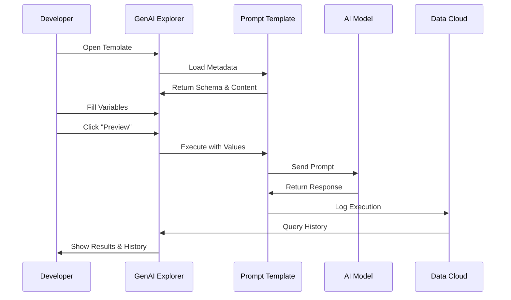

# Prompt Builder & Template Testing

Test and preview your prompt templates with live execution, see exactly what the AI receives, and track template performance over time.


## The Problem

**Building effective prompts requires rapid iteration, testing with real variables, and understanding how prompts perform in production.**

Teams need to:

- 🧪 **Test Before Deploying**: Preview prompts with sample data before agents use them
- 🔍 **Debug Variable Issues**: See how variables are populated in the final prompt
- 📊 **Track Performance**: Know which templates work best and why
- 🎯 **Validate Inputs**: Ensure required fields are properly defined
- 📈 **Monitor Usage**: See how often templates are called and their token costs
- 🔄 **Version Management**: Track changes across template versions

**In short**: You need a safe environment to test prompts, verify variable substitution, and monitor real-world performance.

---

## How GenAI Explorer Solves This

GenAI Explorer provides **complete prompt testing** with:

✅ **Live Preview**: Test templates instantly
   - Fill in variables with test data
   - Execute against real AI models
   - See the actual LLM response
   - Verify token counts

✅ **Variable Editor**: Interactive input form
   - Auto-generated from template schema
   - Type-safe input validation
   - Required field indicators
   - Default value support

✅ **Template Inspector**: See the final prompt
   - View complete prompt text
   - Verify variable substitution
   - Check formatting and structure
   - Copy for external testing

✅ **Execution History**: Track real usage
   - Last 10 executions from production
   - Token usage per call
   - Response times
   - Model and version info

✅ **Version Comparison**: Test different versions
   - See what changed between versions
   - Compare performance metrics
   - Validate before activation

**Impact:** Test prompts safely, catch variable issues before production, and optimize token usage with real data.

---

## How It Works



---

## Quick Start

### Step 1: Open a Template

```
GenAI Explorer → Object List → Search "GenAiPromptTemplate" → Select Template
```

### Step 2: Test Your Template

1. Review the template content in the editor
2. Fill in the variable form with test data
3. Click "Preview Template"
4. Review the generated output
5. Check token count

### Step 3: View History

1. Scroll to "Execution History" panel
2. Click on any execution to see details
3. Review variables used
4. Check response quality

---

## Key Features

### Execution History

Track the last 10 executions from production with token costs and performance metrics.

**See:** **[Execution History](/genai/prompt-builder/execution-history)** for monitoring guide

### Token Optimization

Analyze token usage across versions and identify cost reduction opportunities.

**See:** **[Token Optimization](/genai/prompt-builder/token-optimization)** for strategies

---

## Common Use Cases

### 1. Testing Before Deployment

Test your template with sample data, verify variable substitution, and check output quality before activating.

### 2. Debugging Variable Issues

When agents get wrong data, check execution history to see actual variable values and identify issues.

### 3. Optimizing Token Usage

Review history to find high-token executions and optimize template length for cost savings.

### 4. Version Comparison

Compare token counts and performance between template versions before switching.

### 5. Prompt Engineering

Rapidly iterate on prompts, test variations, and monitor consistency across multiple runs.

---

## UI Components

### Template Editor

- **Syntax Highlighting**: Easy to read template syntax
- **Read-Only View**: See the template structure
- **Variable Markers**: `{!Variable_Name}` clearly highlighted

### Input Form

- **Auto-Generated**: Built from template schema
- **Type Validation**: Correct input types enforced
- **Required Indicators**: * marks required fields
- **Default Values**: Pre-populated where defined

### Execution History

- **Last 10 Calls**: Most recent production usage
- **Version Badge**: Which template version was used
- **Token Count**: Cost visibility
- **User Info**: Who triggered the execution
- **Expandable Details**: Full request/response

---

## Template Structure

### Metadata Fields

| Field | Description |
|-------|-------------|
| `developerName` | API name of template |
| `masterLabel` | Display name |
| `description` | What the template does |
| `activeVersionIdentifier` | Current active version |
| `type` | Template type |
| `visibility` | Who can use it |

### Version Fields

| Field | Description |
|-------|-------------|
| `versionIdentifier` | Version number |
| `content` | Template text |
| `inputs` | Variable definitions |
| `primaryModel` | AI model to use |
| `status` | Active/Draft/Archived |

---

## Documentation

### Guides

- **[Testing Templates](/genai/prompt-builder/testing-templates)** - Complete testing workflow
- **[Execution History](/genai/prompt-builder/execution-history)** - Tracking and monitoring
- **[Token Optimization](/genai/prompt-builder/token-optimization)** - Reducing costs
- **[Best Practices](/genai/prompt-builder/best-practices)** - Testing & deployment tips

### Related Features

- **[Einstein Model Testing](/genai/einstein-model-testing)** - Test individual models
- **[Data Cloud Integration](/genai/data-cloud-integration)** - Query execution data
- **[Chat with Agents](/genai/chat-with-agents)** - Test in agent context

---

## FAQs

**Q: Can I edit templates in GenAI Explorer?**  
A: No, GenAI Explorer is read-only. Use Salesforce Setup to edit templates.

**Q: How many executions are stored in history?**  
A: The last 10 executions are shown. Full history is in Data Cloud.

**Q: Does preview count against my AI credits?**  
A: Yes, preview executions use real AI calls and count toward your limits.

**Q: Can I test with production data?**  
A: Yes, if you have access. Use caution with sensitive data.

**Q: What if a required variable is missing?**  
A: The preview will fail with a validation error.

---

**Test prompts safely, catch issues early, and optimize for production success.**

