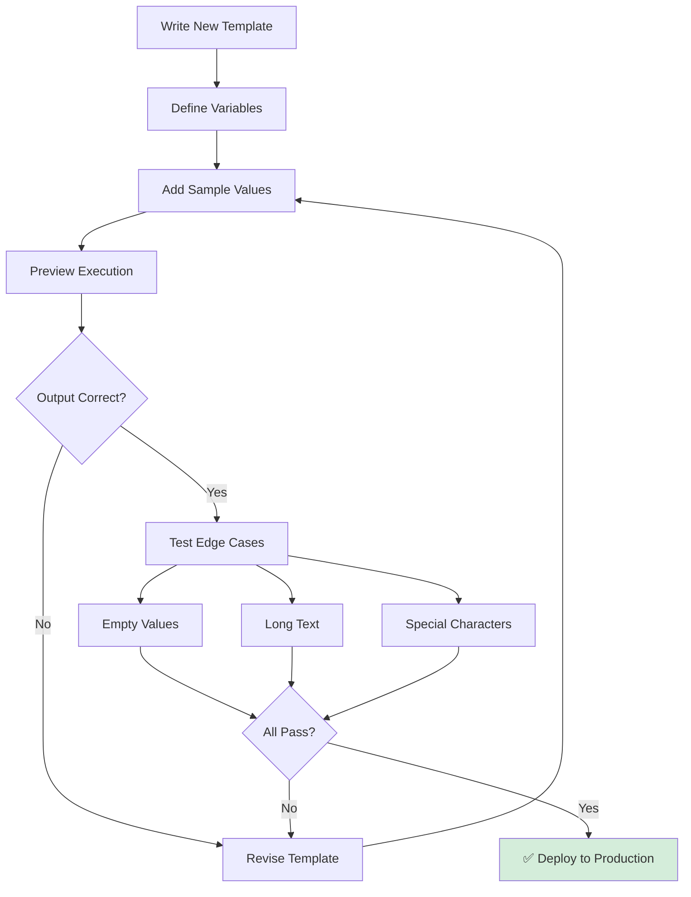
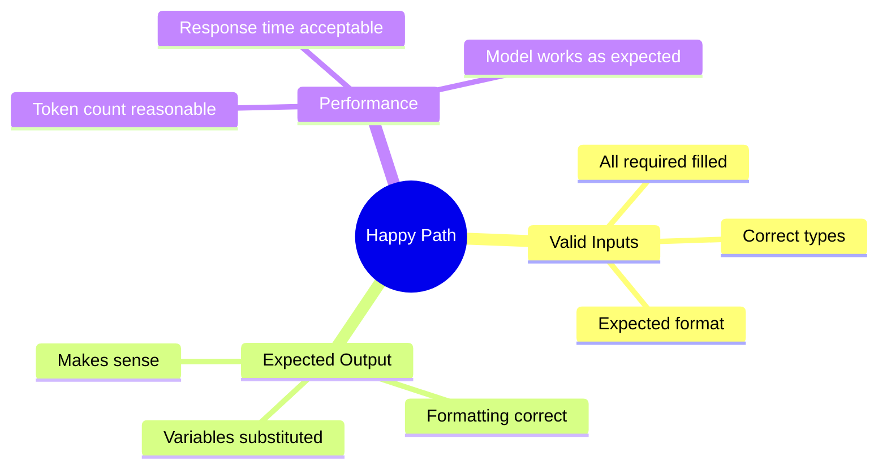
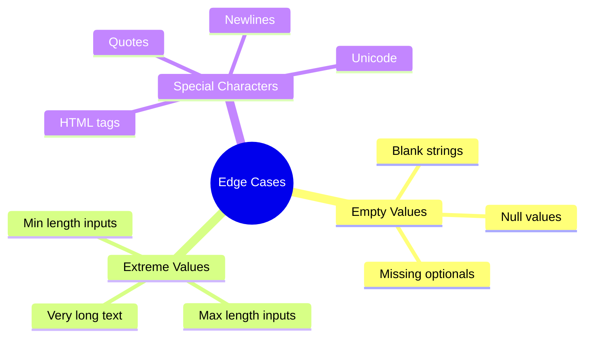

# Testing Templates

Complete guide to testing prompt templates safely before deployment.

---

## Testing Workflow



---

## Step-by-Step Testing

### Step 1: Open Template

```
1. Navigate to GenAI Explorer
2. Search for "GenAiPromptTemplate"
3. Select your template
4. Review template content
```

### Step 2: Fill Variables

```
1. Locate the "Input Variables" form
2. Fill in all required fields (marked with *)
3. Add optional field values
4. Verify data types are correct
```

### Step 3: Preview Template

```
1. Click "Preview Template" button
2. Wait for execution
3. Review generated output
4. Check token count
5. Verify response quality
```

### Step 4: Test Edge Cases

Test with problematic inputs:
- Empty strings
- Very long text (1000+ characters)
- Special characters (`<>`, `&`, `"`)
- Null values
- Numbers as strings
- Unicode characters

---

---

## Testing Checklist

### Happy Path Testing



✅ **Test with:**
- Typical user inputs
- Common scenarios
- Standard data formats
- Expected values

### Edge Case Testing



✅ **Test with:**
- Empty required fields (should error)
- Empty optional fields (should work)
- Maximum length text
- Special characters: `<>`, `&`, `"`, `'`
- Line breaks and formatting
- Non-English characters

### Error Handling

❌ **Should Fail:**
```
- Missing required variables
- Invalid data types
- Malformed input
```

✅ **Should Succeed:**
```
- Missing optional variables
- Edge case values
- Special characters (escaped)
```

---

## Test Scenarios

### Scenario 1: Customer Support Template

**Template:**
```
Help {!CustomerName} with their {!IssueType} regarding {!ProductName}.
```

**Test Cases:**
| Test | CustomerName | IssueType | ProductName | Expected |
|------|--------------|-----------|-------------|----------|
| Happy Path | "John Smith" | "billing" | "Premium" | ✅ Substitutes all |
| Empty Optional | "Jane Doe" | "" | "Basic" | ✅ Works with empty |
| Long Name | "Christopher..." | "technical" | "Enterprise" | ✅ Handles long text |
| Special Chars | "O'Brien & Co" | "access" | "Standard" | ✅ Escapes properly |

### Scenario 2: Data Analysis Template

**Template:**
```
Analyze this {!DataType} data: {!DataContent}

Provide:
1. Key trend
2. Recommendation
```

**Test Cases:**
| Test | DataType | DataContent | Expected |
|------|----------|-------------|----------|
| Normal | "sales" | "Q1: $100K..." | ✅ Analyzes data |
| Large Data | "transactions" | "10KB of data" | ✅ Handles volume |
| Empty Data | "metrics" | "" | ❌ Should error |
| Invalid Type | "unknown" | "abc123" | ⚠️ Model interprets |

---

## Validation Rules

### Required Fields

```javascript
// Required field validation
if (variable.required && !value) {
  throw new Error(`${variable.name} is required`);
}
```

**Test:**
- Leave required field empty → Should error
- Fill required field → Should succeed

### Type Validation

```javascript
// Type validation
if (variable.type === "Number" && isNaN(value)) {
  throw new Error(`${variable.name} must be a number`);
}
```

**Test:**
- Enter text in number field → Should error
- Enter number → Should succeed

### Length Validation

```javascript
// Max length check
if (value.length > maxLength) {
  throw new Error(`${variable.name} exceeds max length`);
}
```

**Test:**
- Enter 10,000 characters → Check behavior
- Enter normal length → Should succeed

---

## Testing Best Practices

### ✅ Do's

- ✅ Test with realistic production data
- ✅ Test all edge cases before deploying
- ✅ Verify token counts are reasonable
- ✅ Test with different AI models if applicable
- ✅ Check output format matches expectations
- ✅ Test multiple times for consistency

### ❌ Don'ts

- ❌ Skip edge case testing
- ❌ Assume variables will always have values
- ❌ Deploy without checking token counts
- ❌ Forget to test with special characters
- ❌ Ignore validation errors
- ❌ Test only once

---

## Debugging Issues

### Issue: Variables Not Substituting

**Symptoms:**
```
Output shows: "Help {!CustomerName}..."
Instead of: "Help John Smith..."
```

**Solutions:**
1. Check variable name matches exactly
2. Verify variable is defined in template
3. Ensure value is provided in form
4. Check for typos in variable reference

### Issue: Unexpected Output

**Symptoms:**
- Output doesn't make sense
- Wrong information included
- Formatting broken

**Solutions:**
1. Review template content carefully
2. Check variable substitution
3. Test with simpler inputs
4. Verify AI model is correct
5. Check for conflicting instructions

### Issue: High Token Count

**Symptoms:**
- Token count > 1000
- Cost too high
- Slow responses

**Solutions:**
1. Shorten template text
2. Remove redundant instructions
3. Use more concise language
4. Consider smaller AI model

**See:** **[Token Optimization](./token-optimization)** for details

---

## Pre-Deployment Checklist

Before activating a template:

- [ ] ✅ Tested with realistic data
- [ ] ✅ Tested with edge cases (empty, null, long)
- [ ] ✅ All variables substitute correctly
- [ ] ✅ Token count is reasonable (&lt;800)
- [ ] ✅ Tested with different AI models (if applicable)
- [ ] ✅ Output format matches expectations
- [ ] ✅ Required fields have validation
- [ ] ✅ Optional fields have defaults or handle null
- [ ] ✅ Special characters are handled
- [ ] ✅ Tested multiple times for consistency
- [ ] ✅ Performance is acceptable (&lt;3s)
- [ ] ✅ Cost per execution is within budget

---

## Related Documentation

- **[Execution History](./execution-history)** - Monitor after deployment
- **[Token Optimization](./token-optimization)** - Reduce costs
- **[Best Practices](./best-practices)** - Overall guidelines

---

**Thorough testing prevents production issues and ensures high-quality AI responses.**

