# Token Optimization

Reduce token usage and costs while maintaining template quality.

---

## Understanding Token Costs

### What Are Tokens?

```
1 token ≈ 4 characters
1 token ≈ 0.75 words

Example:
"Hello, how are you today?" = 7 tokens
```

### Cost Impact

```mermaid
graph TD
    A[Template Version] --> B{Token Count}
    B -->|1200 tokens| C[❌ High Cost: $2.40/1K calls]
    B -->|800 tokens| D[⚠️ Medium: $1.60/1K calls]
    B -->|400 tokens| E[✅ Low: $0.80/1K calls]
    
    style C fill:#f8d7da
    style D fill:#fff3e0
    style E fill:#d4edda
```



---

## Version Comparison

| Version | Avg Tokens | Cost/1K Calls | Change |
|---------|-----------|---------------|---------|
| v1 | 1,200 | $2.40 | - |
| v2 | 800 | $1.60 | 🟢 -33% |
| v3 | 600 | $1.20 | 🟢 -50% |

**Goal:** Reduce tokens without sacrificing quality

---

## Optimization Strategies

### 1. Remove Redundancy

**❌ Before:**
```
You are a helpful customer service agent. 
Please help the customer with their question.
Be helpful and professional in your response.
```
**Tokens:** ~20

**✅ After:**
```
Help customer professionally.
```
**Tokens:** ~4

**Savings:** 80%

### 2. Use Concise Language

**❌ Verbose:**
```
Please analyze the following data and provide 
a comprehensive summary of the key findings.
```
**Tokens:** ~15

**✅ Concise:**
```
Summarize key findings:
```
**Tokens:** ~4

**Savings:** 73%

### 3. Limit Examples

**❌ Too Many:**
```
Example 1: [50 tokens]
Example 2: [50 tokens]
Example 3: [50 tokens]
Example 4: [50 tokens]
```
**Total:** 200+ tokens

**✅ Essential Only:**
```
Example 1: [50 tokens]
Example 2: [50 tokens]
```
**Total:** 100 tokens

**Savings:** 50%

### 4. Optimize Variable Names

**❌ Long:**
```
{!Customer_Full_Name_Including_Title}
{!Product_Name_With_Version_Number}
```

**✅ Short:**
```
{!Customer_Name}
{!Product}
```

**Savings:** ~20 tokens per template

### 5. Remove Formatting

**❌ Extra Formatting:**
```
Please note the following:
- Point 1
- Point 2
- Point 3

Thank you for your attention.
```

**✅ Direct:**
```
Note:
1. Point 1
2. Point 2
3. Point 3
```

**Savings:** ~30%

---

## Token Analysis Workflow

```mermaid
graph TD
    A[Review History] --> B[Analyze Token Counts]
    B --> C{Average Tokens?}
    
    C -->|>1000| D[❌ Too Expensive]
    C -->|500-1000| E[⚠️ Consider Optimizing]
    C -->|"<500"| F[✅ Efficient]
    
    D --> G[Shorten Template]
    D --> H[Remove Redundancy]
    D --> I[Use Smaller Model]
    
    E --> J[Review Necessity]
    
    G --> K[Test New Version]
    H --> K
    I --> K
    J --> K
    
    K --> L[Compare Costs]
    L --> M{Savings?}
    M -->|Yes| N[✅ Deploy]
    M -->|No| O[Keep Current]
    
    style F fill:#d4edda
    style N fill:#d4edda
```



---

## Optimization Checklist

Before deploying:

- [ ] Removed redundant instructions
- [ ] Used concise language
- [ ] Limited examples to 2-3 max
- [ ] Shortened variable names
- [ ] Removed unnecessary formatting
- [ ] Tested output quality
- [ ] Verified token count &lt;800
- [ ] Compared with previous version

---

## Token Targets

### By Use Case

| Use Case | Target Tokens | Acceptable Range |
|----------|--------------|------------------|
| **Simple Classification** | 100-200 | Up to 300 |
| **Customer Support** | 300-500 | Up to 700 |
| **Data Analysis** | 400-600 | Up to 900 |
| **Content Generation** | 500-800 | Up to 1200 |
| **Complex Reasoning** | 800-1200 | Up to 1500 |

---

## Cost Savings Examples

### Example 1: Customer Support Template

**Before Optimization:**
```
Template length: 450 characters
Avg tokens: 800
Executions: 5,000/month
Cost: 5,000 × 800 × $0.002 / 1000 = $8.00/month
```

**After Optimization:**
```
Template length: 250 characters
Avg tokens: 450
Executions: 5,000/month
Cost: 5,000 × 450 × $0.002 / 1000 = $4.50/month
```

**Savings: $3.50/month (44%)**

### Example 2: Data Analysis Template

**Before Optimization:**
```
Avg tokens: 1,200
Executions: 10,000/month
Cost: 10,000 × 1,200 × $0.002 / 1000 = $24.00/month
```

**After Optimization:**
```
Avg tokens: 600
Executions: 10,000/month
Cost: 10,000 × 600 × $0.002 / 1000 = $12.00/month
```

**Savings: $12.00/month (50%)**

---

## Testing Optimizations

### Step 1: Baseline

```
1. Note current average token count
2. Record output quality
3. Document response time
```

### Step 2: Optimize

```
1. Apply optimization strategies
2. Test with same inputs
3. Measure new token count
```

### Step 3: Validate

```
1. Verify output quality maintained
2. Check user satisfaction
3. Calculate cost savings
```

### Step 4: Deploy

```
1. If quality maintained + cost reduced → Deploy
2. If quality degraded → Revert
3. If minimal savings → Keep current
```

---

## Related Documentation

- **[Testing Templates](./testing-templates)** - Validate optimizations
- **[Execution History](./execution-history)** - Track token usage
- **[Best Practices](./best-practices)** - Overall guidelines
- **[Einstein Model Testing](/genai/einstein-model-testing/cost-optimization)** - More strategies

---

**Smart optimization reduces costs by 30-50% while maintaining quality.**


