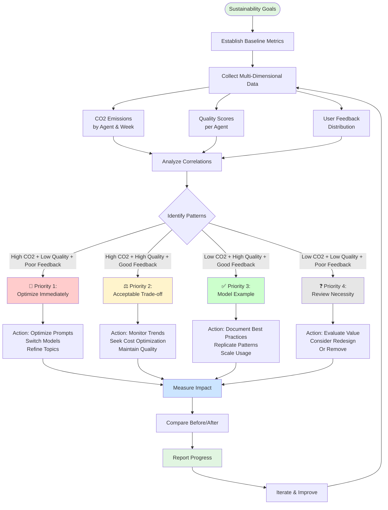

# Token Usage Report - Sustainability Guide

Sustainability teams face a unique challenge: **reducing environmental impact while maintaining business value**. The Token Usage Report provides a comprehensive framework that goes beyond simple CO2 tracking to understand the complete picture of AI agent performance.

## The Challenge: Beyond Simple Metrics

Traditional sustainability reporting focuses solely on emissions:
- ❌ **CO2 tracking alone** doesn't tell you if emissions are justified
- ❌ **Cost reduction** might sacrifice quality or user satisfaction
- ❌ **No context** about whether high emissions correlate with high value

**The Reality**: High emissions might be acceptable if they deliver exceptional quality and user satisfaction. Low emissions might be wasteful if they result in poor user experience and low adoption.

## Our Holistic Approach

The Token Usage Report enables sustainability teams to make **informed decisions** by combining three critical dimensions:

1. **Environmental Impact** (CO2 Emissions) - What's the cost to the planet?
2. **Quality Performance** (Quality Scores) - Are we delivering value?
3. **User Satisfaction** (Feedback) - Are users happy with the results?

## Methodology: From Theory to Practice

Our approach follows a systematic methodology that connects theory (sustainability goals) with practice (actionable optimization):



## Step-by-Step Process

### Phase 1: Establish Baseline (Week 1)

**Objective**: Understand current state across all dimensions

1. **Export Current Metrics**
   - CO2 emissions by agent (from "CO2 by Agents")
   - Weekly trends (from "CO2 by Agents/Week")
   - Quality scores (from "Median Quality Score")
   - Feedback distribution (from "Feedbacks")
   - Topic usage patterns (from "Covered Topics Week by Week")

2. **Document Baselines**
   - Total CO2 emissions per agent
   - Average quality scores
   - Feedback ratios (positive/negative)
   - Topic usage frequency

3. **Set Targets**
   - Define sustainability goals (e.g., "Reduce CO2 by 30% in 3 months")
   - Set quality thresholds (e.g., "Maintain quality scores above 3.5/5")
   - Define feedback targets (e.g., "Achieve 80% positive feedback")

### Phase 2: Analyze Correlations (Week 2)

**Objective**: Understand relationships between metrics

1. **Cross-Reference Data**
   - Which agents have high CO2 but low quality?
   - Which topics have high cost but poor feedback?
   - Are there agents with low CO2 and high quality? (success patterns)

2. **Identify Patterns**
   - **Waste Patterns**: High CO2 + Low Quality + Poor Feedback
   - **Value Patterns**: High CO2 + High Quality + Good Feedback
   - **Efficiency Patterns**: Low CO2 + High Quality + Good Feedback
   - **Underutilized Patterns**: Low CO2 + Low Quality + Poor Feedback

3. **Prioritize Actions**
   - Rank agents/topics by optimization potential
   - Focus on high-impact, low-effort improvements first

### Phase 3: Implement Optimizations (Weeks 3-8)

**Objective**: Reduce emissions while maintaining or improving quality

**For Priority 1 (High CO2 + Low Quality + Poor Feedback):**

1. **Model Optimization**
   - Test lower-emission models (e.g., GPT-4o Mini vs GPT-4 Omni)
   - Use Einstein Model Testing to compare emissions and quality
   - Switch to more efficient models where quality remains acceptable

2. **Prompt Optimization**
   - Refine prompts to reduce token usage
   - Remove unnecessary context
   - Use more efficient prompt structures

3. **Topic Refinement**
   - Review topic configurations
   - Eliminate redundant topics
   - Optimize topic routing

## Baseline Optimization: Reducing Prompt Size

One of the most effective ways to reduce CO2 emissions is to **optimize the baseline prompt size**. Different agent configuration elements—topic classifications, instructions, and action descriptions—are sent to the LLM at different stages of the Atlas reasoning pipeline, directly impacting token consumption and emissions.

### How Configuration is Sent to the LLM

The Atlas Reasoning Engine processes queries through six stages, and different configuration elements are included at different stages:

- **Topic Classifications**: Sent during **Query Evaluation** (Stage 2) when determining which topic matches the user's intent
- **Topic Instructions**: Sent during **Query Planning & Execution** (Stage 4) when the LLM reasons within a specific topic
- **Action Descriptions**: Sent during **Query Planning & Execution** (Stage 4) when the LLM considers which actions to invoke

**Important**: Not all configuration is sent with every request. The Atlas engine intelligently includes only relevant topics and actions based on the query context. However, verbose configurations still impact token usage significantly at their respective stages.

### The Problem: Prompt Bloat

When configuring AI agents, it's common to include:
- **Topic Classifications**: Detailed descriptions for each topic (sent during topic evaluation)
- **Instructions**: Comprehensive guidelines for the agent (sent during topic reasoning)
- **Action Descriptions**: Detailed explanations of available actions (sent when actions are considered)

**The Impact**: If you have dozens of topics, each with long descriptions, plus extensive instructions and action details, the relevant portions are sent to the LLM at the appropriate stages. Verbose configurations can easily add thousands of tokens per request, multiplying across interactions and significantly increasing CO2 emissions.

**Example Scenario:**

During **Query Evaluation (Stage 2)**: All topic classifications are evaluated
```
- 25 topics × 200 tokens each = 5,000 tokens (sent for topic matching)
```

During **Query Planning & Execution (Stage 4)**: Selected topic's instructions and actions
```
- Selected topic instructions: 1,500 tokens
- Available actions (15) × 150 tokens each = 2,250 tokens
- User message: 50 tokens
Total for Stage 4: ~3,800 tokens
```

**Total per request**: ~8,800 tokens across all stages

With 1,000 requests/day:
- Daily tokens: 8.8M tokens
- CO2 emissions: ~440g CO2/day
- Monthly: ~13.2kg CO2

**Note**: While not all topics are sent at every stage, verbose configurations still significantly impact token usage at their respective stages.

### Solution: Optimize Baseline Configuration

#### 1. Clearer Topic Classification

**Problem**: Verbose topic descriptions increase prompt size unnecessarily.

**Before (Verbose):**
```
Topic: "Customer Order Status Inquiry"
Description: "This topic handles customer inquiries about the status of their orders. 
Users may ask questions such as: Where is my order? When will my order arrive? 
What is the tracking number for my order? The agent should provide accurate and 
timely information about order status, shipping details, and estimated delivery dates. 
If the order is delayed, the agent should explain the reason and provide next steps."
Tokens: ~120 tokens
```

**After (Optimized):**
```
Topic: "Order Status"
Description: "Customer inquiries about order tracking, shipping, and delivery dates."
Tokens: ~15 tokens
```

**Impact**: 88% reduction in tokens (120 → 15 tokens per topic)

**Best Practices:**
- Use concise, action-oriented descriptions
- Remove examples that the LLM can infer
- Focus on distinguishing characteristics only
- Use keywords instead of full sentences where possible

#### 2. Clearer Instructions

**Problem**: Redundant or overly detailed instructions bloat the prompt.

**Before (Verbose):**
```
Instructions: "You are a helpful customer service agent. Always be polite and 
professional. When customers ask questions, provide accurate information. If you 
don't know the answer, ask clarifying questions. Always confirm understanding before 
proceeding. Use clear and concise language. Avoid technical jargon unless necessary. 
Be empathetic to customer concerns. Follow up to ensure satisfaction."
Tokens: ~80 tokens
```

**After (Optimized):**
```
Instructions: "Polite, accurate, empathetic. Ask clarifying questions when needed."
Tokens: ~12 tokens
```

**Impact**: 85% reduction in tokens (80 → 12 tokens)

**Best Practices:**
- Remove redundant statements (LLMs understand "helpful" implies politeness)
- Use bullet points or keywords instead of full sentences
- Focus on unique requirements, not general AI behavior
- Move common instructions to system-level configuration

#### 3. Clearer Action Descriptions

**Problem**: Overly detailed action descriptions increase prompt size for every action.

**Before (Verbose):**
```
Action: "GetOrderStatus"
Description: "This action retrieves the current status of a customer order from 
the order management system. It requires an order ID as input parameter. The action 
will return the order status (pending, processing, shipped, delivered), tracking 
number if available, estimated delivery date, and any relevant notes about delays 
or issues. Use this action when customers ask about their order status."
Tokens: ~70 tokens
```

**After (Optimized):**
```
Action: "GetOrderStatus"
Description: "Retrieves order status, tracking, delivery date. Requires: orderId"
Tokens: ~12 tokens
```

**Impact**: 83% reduction in tokens (70 → 12 tokens per action)

**Best Practices:**
- Focus on what the action does, not how it works internally
- List required parameters concisely
- Remove examples and use-case explanations
- Use consistent formatting for all actions

### Real-World Example: Optimization Impact

**Before Optimization:**
```
Agent Configuration:
- 25 topics × 120 tokens = 3,000 tokens
- Instructions: 80 tokens
- 15 actions × 70 tokens = 1,050 tokens
- User message: 50 tokens
Total per request: ~4,180 tokens

Monthly (10,000 requests):
- Total tokens: 41.8M tokens
- CO2 emissions: ~2.09kg CO2
```

**After Optimization:**
```
Agent Configuration:
- 25 topics × 15 tokens = 375 tokens
- Instructions: 12 tokens
- 15 actions × 12 tokens = 180 tokens
- User message: 50 tokens
Total per request: ~617 tokens

Monthly (10,000 requests):
- Total tokens: 6.17M tokens
- CO2 emissions: ~0.31kg CO2
```

**Results:**
- ✅ **85% reduction in prompt size** (4,180 → 617 tokens)
- ✅ **85% reduction in CO2 emissions** (2.09kg → 0.31kg CO2/month)
- ✅ **Quality maintained**: Clearer, more focused prompts often improve quality
- ✅ **Cost savings**: Reduced token usage = lower costs

### Implementation Strategy

1. **Audit Current Configuration**

Use the following SOQL queries to audit your agent configurations and identify optimization opportunities:

#### Query 1: Topic Descriptions Analysis

**Purpose**: Identify topics with verbose descriptions that are sent during Query Evaluation (Stage 2).

```sql
SELECT 
    DeveloperName,
    MasterLabel,
    Description,
    Scope,
    Planner.DeveloperName
FROM GenAiPluginDefinition
WHERE PluginType = 'Topic'
```

**What to look for:**
- Topics with `EstimatedTokens` > 50 (200+ characters) are candidates for optimization
- Focus on topics with highest token counts first
- Compare `Description` vs `Scope` - if they're similar, consider consolidating

#### Query 2: Action Descriptions Analysis

**Purpose**: Identify actions with verbose descriptions that are sent during Query Planning (Stage 4).

```sql
 Select DeveloperName, MasterLabel, Description, InvocationTargetType, LastModifiedDate, Plugin.MasterLabel from GenAiFunctionDefinition order by LastModifiedDate desc
```

**What to look for:**
- Actions with `EstimatedTokens` > 15 (60+ characters) are candidates for optimization
- Group by `TopicName` to see which topics have the most verbose actions
- Consider actions used frequently (cross-reference with usage data)

#### Query 3: Instructions Analysis

**Purpose**: Identify topics with verbose instructions that are sent during Query Planning (Stage 4).

```sql
SELECT GenAiPluginDefinition.PLanner.DeveloperName,GenAiPluginDefinition.DeveloperName, DeveloperName,Language, Description,
      MasterLabel,NamespacePrefix,LastModifiedDate,SortOrder 
      FROM GenAiPluginInstructionDef
```

**What to look for:**
- Instructions with `EstimatedTokens` > 20 (80+ characters) are candidates for optimization
- Group by `TopicName` to see which topics have the most verbose instructions
- Consider instructions used frequently (cross-reference with usage data)


#### Query 4: Configuration Summary by Agent

**Purpose**: Get a summary view of configuration size per agent.

```sql
SELECT 
    Planner.DeveloperName as AgentName,
    Planner.MasterLabel as AgentLabel,
    COUNT(Id) as TopicCount,
    AVG(LENGTH(Description)) as AvgTopicDescriptionLength,
    SUM(LENGTH(Description)) as TotalTopicDescriptionLength
FROM GenAiPluginDefinition
WHERE PluginType = 'Topic'
GROUP BY Planner.DeveloperName, Planner.MasterLabel
ORDER BY TotalTopicDescriptionLength DESC
```

**What to look for:**
- Agents with high `TotalTopicDescriptionLength` have the most verbose configurations
- High `AvgTopicDescriptionLength` indicates consistently verbose topics
- Focus optimization on agents with highest totals

#### Query 5: Action Summary by Topic

**Purpose**: Identify topics with many verbose actions.

```sql
SELECT 
    Plugin.MasterLabel as TopicName,
    Plugin.DeveloperName as TopicDeveloperName,
    COUNT(Id) as ActionCount,
    AVG(LENGTH(Description)) as AvgActionDescriptionLength,
    SUM(LENGTH(Description)) as TotalActionDescriptionLength,
    SUM(LENGTH(Description)) / 4 as EstimatedTokensPerTopic
FROM GenAiFunctionDefinition
WHERE Description != null
GROUP BY Plugin.MasterLabel, Plugin.DeveloperName
ORDER BY EstimatedTokensPerTopic DESC
```

**What to look for:**
- Topics with high `EstimatedTokensPerTopic` add significant tokens during Stage 4
- Topics with many actions (`ActionCount`) multiplied by average length show optimization potential
- Prioritize topics with both high action count and high average description length

#### Query 6: Complete Configuration Audit

**Purpose**: Comprehensive view combining topics and actions for a specific agent.

```sql
-- First, get the agent's PlannerId, then run:

-- Topics for the agent
SELECT 
    'Topic' as ComponentType,
    DeveloperName,
    MasterLabel,
    Description,
    Scope,
    LENGTH(Description) + LENGTH(COALESCE(Scope, '')) as TotalLength,
    (LENGTH(Description) + LENGTH(COALESCE(Scope, ''))) / 4 as EstimatedTokens
FROM GenAiPluginDefinition
WHERE PlannerId = 'YOUR_PLANNER_ID' AND PluginType = 'Topic'

UNION ALL

-- Actions for the agent
SELECT 
    'Action' as ComponentType,
    DeveloperName,
    MasterLabel,
    Description,
    null as Scope,
    LENGTH(Description) as TotalLength,
    LENGTH(Description) / 4 as EstimatedTokens
FROM GenAiFunctionDefinition
WHERE PlannerId = 'YOUR_PLANNER_ID' AND Description != null

ORDER BY EstimatedTokens DESC
```

**Usage:**
1. Replace `'YOUR_PLANNER_ID'` with your agent's PlannerId
2. Review results sorted by `EstimatedTokens` to identify largest contributors
3. Focus optimization on components with highest token counts

#### Calculating Token Estimates

**Token Estimation Formula:**
- Approximate: 1 token ≈ 4 characters (varies by language and content)
- More accurate: Use OpenAI's tokenizer or similar tools for exact counts
- For quick estimates: `CHARACTER_COUNT / 4`

**Example Calculation:**
```
Description: "This topic handles customer inquiries about order status..."
Length: 120 characters
Estimated Tokens: 120 / 4 = 30 tokens
```

#### Identifying Largest Contributors

After running the queries:

1. **Export Results**: Export query results to CSV for analysis
2. **Sort by Tokens**: Identify components with highest `EstimatedTokens`
3. **Calculate Impact**: Multiply token count by usage frequency
   - High-frequency topics/actions have more impact
   - Cross-reference with Token Usage Report usage data
4. **Prioritize**: Focus on:
   - Components with highest token counts
   - Components used most frequently
   - Components with both high tokens AND high usage

2. **Prioritize Optimization**
   - Start with topics/actions used most frequently
   - Focus on verbose descriptions first
   - Remove redundancy and examples

3. **Test Incrementally**
   - Optimize one component at a time
   - Test quality scores after each change
   - Monitor feedback to ensure quality maintained

4. **Measure Impact**
   - Compare token usage before/after in Token Usage Report
   - Track CO2 emissions reduction
   - Verify quality scores remain stable or improve

5. **Document Best Practices**
   - Create templates for concise descriptions
   - Share optimized examples with team
   - Establish guidelines for future configurations

### Key Takeaways

- **Every token counts**: Reducing baseline prompt size has multiplicative impact
- **Quality can improve**: Clearer, more focused prompts often perform better
- **Easy wins**: Many optimizations require no code changes, just configuration edits
- **Measure everything**: Use Token Usage Report to track impact of optimizations

**For Priority 2 (High CO2 + High Quality + Good Feedback):**

1. **Incremental Optimization**
   - Test if quality can be maintained with lower-cost models
   - Monitor for gradual improvements
   - Document acceptable trade-offs

**For Priority 3 (Low CO2 + High Quality + Good Feedback):**

1. **Best Practice Documentation**
   - Document what makes these agents successful
   - Replicate patterns in other agents
   - Scale usage where appropriate

### Phase 4: Measure Impact (Ongoing)

**Objective**: Track progress and validate improvements

1. **Weekly Monitoring**
   - Review "CO2 by Agents/Week" for trends
   - Check quality scores haven't degraded
   - Monitor feedback ratios

2. **Before/After Comparison**
   - Compare current metrics to baseline
   - Calculate percentage improvements
   - Document successes and challenges

3. **Iterative Improvement**
   - Adjust strategies based on results
   - Refine optimization approaches
   - Share learnings across teams

### Phase 5: Report & Communicate (Monthly)

**Objective**: Demonstrate progress and value

1. **Create Sustainability Reports**
   - Total CO2 reduction achieved
   - Quality maintained or improved
   - User satisfaction maintained
   - Cost savings (if applicable)

2. **Tell the Story**
   - Show before/after comparisons
   - Highlight successful optimizations
   - Demonstrate business value maintained

3. **Set New Targets**
   - Based on progress, set new goals
   - Continue iterative improvement
   - Scale successful patterns

## Practical Example: Sustainability Initiative

**Scenario**: A sustainability team needs to reduce AI CO2 emissions by 40% while maintaining quality standards.

**Week 1: Baseline**
```
Agent A: 200g CO2/week, Quality: 3.3/5, Feedback: 60% negative
Agent B: 150g CO2/week, Quality: 4.1/5, Feedback: 85% positive
Agent C: 100g CO2/week, Quality: 3.9/5, Feedback: 75% positive
Total: 450g CO2/week
```

**Week 2: Analysis**
- **Agent A**: High CO2 + Low Quality + Poor Feedback → Priority 1 (Optimize Immediately)
- **Agent B**: High CO2 + High Quality + Good Feedback → Priority 2 (Acceptable Trade-off)
- **Agent C**: Low CO2 + High Quality + Good Feedback → Priority 3 (Model Example)

**Weeks 3-6: Optimization**
- **Agent A**: Switched to GPT-4o Mini, optimized prompts, refined topics
  - Result: 80g CO2/week (60% reduction), Quality: 3.5/5, Feedback: 70% positive
- **Agent B**: Tested GPT-4o Mini, maintained quality
  - Result: 90g CO2/week (40% reduction), Quality: 4.0/5, Feedback: 82% positive
- **Agent C**: Documented best practices, no changes needed

**Week 8: Results**
```
Agent A: 80g CO2/week, Quality: 3.5/5, Feedback: 70% positive
Agent B: 90g CO2/week, Quality: 4.0/5, Feedback: 82% positive
Agent C: 100g CO2/week, Quality: 3.9/5, Feedback: 75% positive
Total: 270g CO2/week (40% reduction achieved!)
```

**Outcome**: 
- ✅ 40% CO2 reduction achieved
- ✅ Quality maintained or improved
- ✅ User satisfaction improved
- ✅ Business value preserved

## Key Benefits

1. **Data-Driven Decisions**: Make optimization decisions based on complete data, not just emissions
2. **Value Preservation**: Ensure sustainability efforts don't sacrifice quality or user satisfaction
3. **Progress Tracking**: Measure and report on sustainability progress with concrete metrics
4. **Stakeholder Communication**: Demonstrate that sustainability goals are achieved while maintaining business value
5. **Continuous Improvement**: Iterative methodology enables ongoing optimization
6. **Risk Mitigation**: Identify and address issues before they become problems

## Reporting Templates

**Monthly Sustainability Report Structure:**

1. **Executive Summary**
   - Total CO2 reduction achieved
   - Quality metrics maintained
   - User satisfaction levels

2. **Agent-Level Analysis**
   - CO2 emissions by agent (before/after)
   - Quality score changes
   - Feedback ratio changes
   - Optimization actions taken

3. **Trend Analysis**
   - Weekly CO2 trends
   - Quality score trends
   - Feedback trends

4. **Success Stories**
   - Highlight successful optimizations
   - Document best practices
   - Share learnings

5. **Next Steps**
   - Future optimization targets
   - Planned improvements
   - Resource requirements

## Related Resources

- [Token Usage Report](/genai/token-usage-report) - Main documentation
- [Einstein Model Testing](/genai/einstein-model-testing) - Test and compare models for efficiency
- [Data Cloud Integration](/genai/data-cloud-integration) - Query and analyze AI data

---

**Back to**: [Token Usage Report](/genai/token-usage-report)
