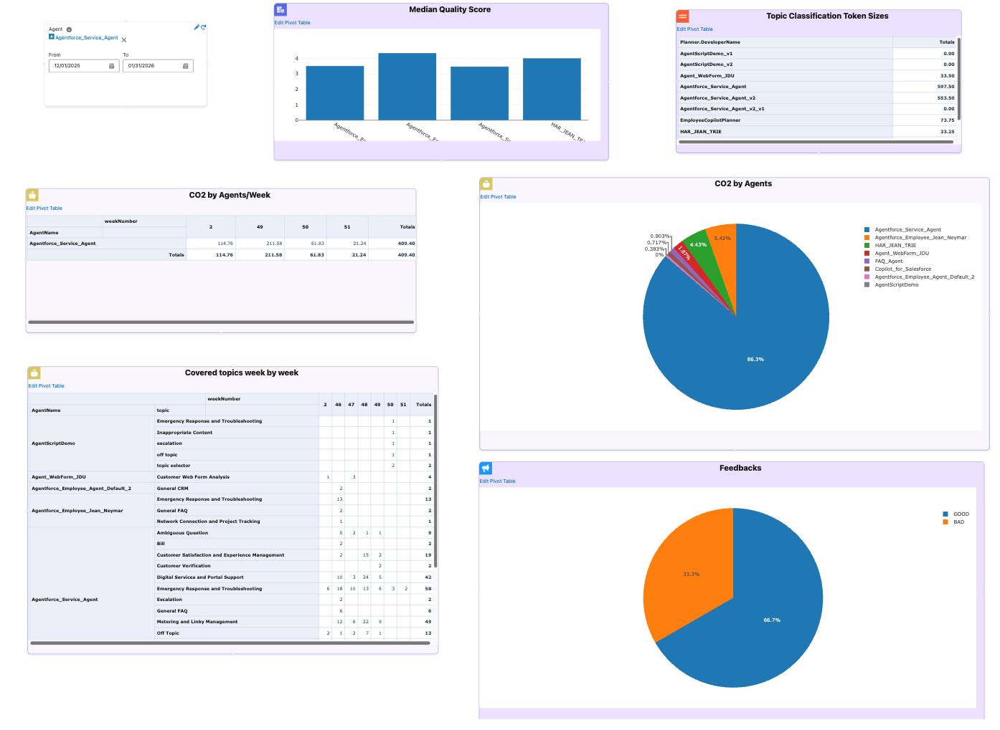

# Token Usage Report

A comprehensive analytics dashboard that combines **quality metrics**, **user feedback**, and **cost analysis** to provide a holistic view of your AI agent performance. Unlike traditional cost reports that only show spending, the Token Usage Report helps you understand the **value** you're getting for your investment.

## Overview

The Token Usage Report provides a **unified analytics dashboard** that combines multiple dimensions of AI performance:

- ✅ **Cost Analysis**: Track CO2 emissions and financial costs by agent, topic, and time period
- ✅ **Quality Metrics**: View median quality scores (1-5 scale) to understand AI response quality
- ✅ **User Feedback**: See positive/negative feedback distribution to gauge user satisfaction
- ✅ **Temporal Analysis**: Analyze trends week-by-week to identify patterns and changes
- ✅ **Topic-Level Insights**: Understand which topics drive costs and which deliver value
- ✅ **Topic Classification Token Sizes**: Analyze token requirements for topic classification prompts

**Key Benefit**: Make data-driven decisions that optimize for both cost efficiency and user satisfaction, reducing waste while improving quality.

## Report Content

The Token Usage Report consists of **six key visualizations**, each providing unique insights into your AI agent performance.

### CO2 by Agents

**What it shows:** Pie chart displaying total CO2 emissions aggregated by agent.

**Why it matters:** 
- Identify which agents have the highest environmental impact
- Prioritize sustainability initiatives
- Compare environmental impact across agents

**How to use it:**
- Look for agents with large pie slices - these are your biggest contributors to CO2 emissions
- Cross-reference with quality scores and feedback to ensure optimization doesn't sacrifice quality
- Track progress over time to measure improvement after optimization efforts

### CO2 by Agents/Week

**What it shows:** Table showing CO2 emissions broken down by agent and week.

**Why it matters:**
- Track whether emissions are increasing, decreasing, or stable over time
- Identify weeks with unusual spikes that may indicate issues
- Measure the impact of optimization efforts week-over-week

**How to use it:**
- Monitor trends for agents with consistently increasing emissions
- Investigate weeks with sudden increases - may indicate new features, bugs, or usage changes
- Compare weeks before and after optimization to quantify impact

### Covered Topics Week by Week

**What it shows:** Pivot table showing which topics are being used by which agents, organized by week.

**Why it matters:**
- Understand which topics are most popular and how usage changes over time
- Identify topics that are underutilized or experiencing declining usage
- Plan resource allocation based on actual usage patterns

**How to use it:**
- Focus optimization efforts on frequently used topics for maximum impact
- Monitor how new topics gain traction week-over-week
- Topics with high usage and high cost are prime optimization candidates

### Feedbacks

**What it shows:** Pie chart displaying the distribution of user feedback (positive vs. negative).

**Why it matters:**
- Direct measure of how users perceive your AI agents' performance
- Validates whether quality scores align with actual user experience
- Identifies areas where users are dissatisfied and need attention

**How to use it:**
- Quick view of overall user satisfaction - aim for high positive feedback percentage
- High negative feedback indicates topics or agents needing immediate attention
- Compare feedback with cost data - high cost with low feedback is a red flag

### Median Quality Score

**What it shows:** Bar chart displaying the average quality score per agent (on a scale of 1 to 5, where 5 is highest).

**Why it matters:**
- Provides an automated, consistent quality assessment across all agents
- Compare quality across agents to identify best and worst performers
- Helps balance cost optimization with quality requirements

**How to use it:**
- Establish minimum acceptable quality scores for each agent
- Agents with high scores can serve as templates for others
- When optimizing costs, ensure quality scores don't drop below thresholds

### Topic Classification Token Sizes

**What it shows:** Table displaying estimated token sizes for topic classification prompts, grouped by planner.

**Why it matters:**

Topic classification is **critical for cost optimization** because it's executed **for every single interaction** in the Atlas Reasoning Engine. Topic resolution happens as the first step of every conversation, making it one of the most frequently executed operations.

**Real-World Impact:**

Consider this example:
- **10 conversations** with an average of **10 interactions** each
- This results in **100 topic classification executions**
- If each classification uses 500 tokens, that's **50,000 tokens** just for topic resolution
- At scale, this multiplies quickly: 100 conversations × 10 interactions = **1,000 executions**

**Cost Implications:**

Because topic classification runs so frequently, even small optimizations can lead to significant cost savings:
- **Reducing scope field size by 50%** can cut topic classification costs in half
- **Optimizing 10 topics** that are used frequently can save thousands of tokens per day
- **Choosing efficient topic definitions** compounds savings across all conversations

**Key Benefits:**
- **Cost Estimation**: Understand token costs for topic classification before deployment
- **Optimization**: Identify topics with large scope fields that consume excessive tokens
- **Capacity Planning**: Plan token budgets per planner based on topic definitions
- **Performance Analysis**: Compare token requirements across different planners
- **Scalability**: Make informed decisions about topic definitions that will scale efficiently

**How to use it:**
- **Identify Optimization Opportunities**: Look for planners with high total token sizes - these may benefit from scope field optimization
- **Cost Planning**: Use token size estimates to project costs for new topics or planners
- **Compare Efficiency**: Compare token sizes across planners to identify efficient vs. inefficient configurations
- **Monitor Changes**: Track token size changes when updating topic scope definitions

**Technical Details:**
- Token size is calculated as `Scope.length / 4` (character-to-token approximation)
- Results are grouped by `Planner.DeveloperName` and summed per planner
- Uses Tooling API to query `GenAiPluginDefinition` where `PluginType = 'Topic'`
- The Scope field contains the topic classification instructions sent to the LLM

**Use Cases:**
- **Before Deployment**: Estimate token costs for new topic definitions
- **Optimization**: Find topics with unnecessarily verbose scope fields
- **Budget Planning**: Allocate token budgets per planner based on current topic sizes
- **Best Practices**: Identify planners with efficient token usage as templates

## How to Use

### Accessing the Report

1. Navigate to **Token Usage Report** in GenAI Explorer
2. The report opens as an interactive board with multiple visualizations
3. All queries execute against your Data Cloud instance

### Filtering and Customization

**Date Range Filter**
- Use the date input to filter by time period
- Default: Last 2 months
- Adjust to analyze specific periods

**Exporting Data**
- **CSV Export**: For spreadsheet analysis
- **JSON Export**: For programmatic processing
- **Image Export**: For presentations and reports

## Decision-Making Framework

Use the combined metrics to make informed decisions:

1. **High Cost + Low Quality + Poor Feedback** → **Optimize Immediately**
   - Review prompts and model selection
   - Consider topic restructuring
   - High priority for improvement

2. **High Cost + High Quality + Good Feedback** → **Acceptable Trade-off**
   - Monitor for cost optimization opportunities
   - Consider if quality can be maintained with lower-cost models
   - Low priority, but worth monitoring

3. **Low Cost + High Quality + Good Feedback** → **Model Example**
   - Document best practices
   - Use as template for other agents
   - Scale usage if appropriate

4. **Low Cost + Low Quality + Poor Feedback** → **Review Necessity**
   - Determine if topic is needed
   - Consider if investment is justified
   - May need redesign or removal

5. **High Token Size + Low Usage** → **Optimize Scope**
   - Review Topic Classification Token Sizes widget
   - Identify topics with large scope fields but low actual usage
   - Optimize scope definitions to reduce token consumption

## Best Practices

### Regular Monitoring
Review the report weekly or monthly to track trends, identify issues early, and monitor optimization progress.

### Set Baselines
Establish baseline metrics by documenting initial cost, quality, and feedback levels. Use baselines to measure improvement and set targets.

### Focus on High-Impact Areas
Prioritize optimization efforts:
- Start with high-cost, low-quality topics
- Address poor feedback areas first
- Maintain high-performing topics
- Optimize topics with high token sizes and low usage

### Correlate Metrics
Look for relationships:
- Does high cost correlate with high quality?
- Are expensive topics delivering value?
- Is user feedback aligned with quality scores?
- Do topic token sizes correlate with actual usage?

### Track Improvements
Measure the impact of changes by comparing before/after metrics, documenting optimization results, and sharing successes with the team.

## Use Cases

### Cost Optimization

**Goal**: Reduce AI costs by 30% without sacrificing quality

**Approach**:
1. Review Token Usage Report
2. Identify high-cost topics
3. Check Topic Classification Token Sizes for optimization opportunities
4. Use Einstein Model Testing to find cheaper models
5. Test improvements in Chat interface
6. Monitor results in Token Usage Report

**Outcome**: Reduced costs while maintaining quality standards

### Quality Improvement

**Goal**: Improve quality scores for underperforming agents

**Approach**:
1. Review Median Quality Score chart
2. Identify agents with low scores
3. Cross-reference with feedback data
4. Review prompts and configurations
5. Test improvements and monitor results

**Outcome**: Improved quality scores and user satisfaction

### Topic Classification Optimization

**Goal**: Reduce token consumption for topic classification

**Approach**:
1. Review Topic Classification Token Sizes widget
2. Identify planners with high token totals
3. Review scope fields for verbose topics
4. Optimize scope definitions while maintaining functionality
5. Monitor token size reduction in subsequent reports

**Outcome**: Reduced token costs for topic classification without impacting accuracy

### Sustainability Initiatives

**Goal**: Reduce environmental impact while maintaining business value

For detailed guidance on using the Token Usage Report for sustainability initiatives, see **[Sustainability Guide](/genai/token-usage-report-sustainability)**.

## Technical Details

### Data Sources

The Token Usage Report queries Data Cloud objects:
- `GenAIGatewayRequest__dlm`: Token usage and model information
- `ssot__AiAgentInteractionStep__dlm`: Interaction steps and topics
- `ssot__AiAgentInteraction__dlm`: Topic and session information
- `GenAIFeedback__dlm`: User feedback data
- `ssot__AiAgentTagAssociation__dlm`: Quality scores
- `GenAiPluginDefinition` (Tooling API): Topic definitions and scope fields for token size analysis

### CO2 Calculation

CO2 emissions are calculated using model-specific factors:
- Based on research from model providers
- Accounts for model architecture and training
- Includes inference and infrastructure costs
- Updated as new data becomes available

### Quality Scores

Quality scores come from AI-generated assessments:
- Calculated during agent interactions
- Stored in tag associations
- Aggregated for reporting
- Scale: 1 to 5 (where 5 is highest quality)
- Can be customized per organization

### Token Size Calculation

Topic Classification Token Sizes use character-to-token approximation:
- Formula: `Scope.length / 4` (4 characters ≈ 1 token)
- Common approximation for English text
- Actual token counts vary by tokenizer (GPT-4, Claude, etc.)
- Used for estimation and planning purposes

## Next Steps

- [Sustainability Guide](/genai/token-usage-report-sustainability) - Detailed methodology for sustainability teams
- [Data Cloud Integration](/genai/data-cloud-integration) - Learn more about querying AI data
- [Atlas Reasoning Engine](/genai/atlas-reasoning-engine) - Understand AI processing stages
- [Einstein Model Testing](/genai/einstein-model-testing) - Test and compare models
- [Chat with Agents](/genai/chat-with-agents) - Test agent improvements

---

**Have questions?** See the [FAQ](../9-faq.md) or explore other [features](../Features/).
