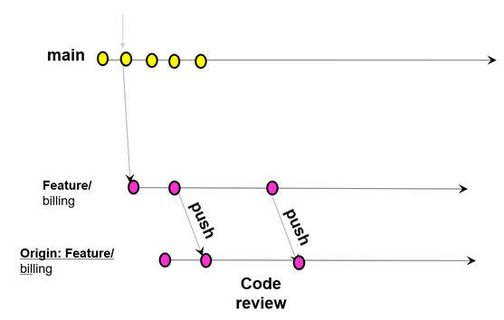

import Quizz from '@site/src/components/firebase/Quizz';

## Introduction

### What Is Git & Why Should I Use It?

> Git is the most commonly used version control system. Git tracks the changes you make to files, so you have a record of what has been done, and you can revert to specific versions should you ever need to. Git also makes collaboration easier, allowing changes by multiple people to all be merged into one source. 

### But since our ewam source code is in TGV, why should I care?

Few reasons:
1. All your configuration shall be stored in git: `package.json`, `Admin` folder, deploy scripts. So even for only that you should know about it
2. Some of your ewam code can be extrated to text and then reimported: you will see few examples with `ewam:cli`
3. eWam 7.1 is coming up with full SCM support, **get ready for it 💪**

### What is Github?
> A platform for hosting and collaborating on Git repositories


<Quizz id="twelveFactorCodeBase"
response={0}
points={50}
choices={["I", "II", "V", "VII"]}
description="### What [factor](https://12factor.net/) recommends to track the codebase in a version control system?"
explanation="We will use **git** and **github** to share all the app configuration: `package.json`, **images**, configs, doc..." />

<Quizz id="gitExperience"
points={25}
choices={["Never used it", "I know the basics", "I am familiar with it"]}
description="### What is your experience with Git?"
/>

### Configure your github profile
* Visit https://github.com/settings/profile
* Set your name
* Select an avatar, it does not have to be a picture of you but please put something
* Click on **Update profile**

<Quizz id="githubProfileCompleted"
response={0}
points={50}
choices={["Yes", "No"]}
description="### Did you complete your github profile?" />

### Glossary

Before starting the training, let's review together some definitions:

- **commit**: a Git object, a snapshot of your entire repository compressed into a SHA
- **branch**: a lightweight movable pointer to a commit
- **clone**: a local version of a repository, including all commits and branches
- **remote**: a common repository on GitHub that all team members use to exchange their changes
- **fork**: a copy of a repository on GitHub owned by a different user
- **pull request**: a place to compare and discuss the differences introduced on a branch with reviews, comments, integrated tests, and more
- **HEAD**: representing your current working directory, the HEAD pointer can be moved to different branches, tags, or commits when using `git switch`

### Reference material

You can have a look at the following interesting reference material:

- [Git handbook](https://guides.github.com/introduction/git-handbook/)
- [Training from github](https://githubtraining.github.io/training-manual/#/)
- **[Github flow](https://guides.github.com/introduction/flow/)** -> this one is particularly interesting
- [Interactive Git commands reference](http://ndpsoftware.com/git-cheatsheet.html)

## Wyde Recommended Configuration
:::tip
To [preserve a clean git history](https://coderwall.com/p/7aymfa/please-oh-please-use-git-pull-rebase) we recommend to use a rebase as default when doing a git pull. Please run:

```$ git config --global pull.rebase true```
:::

Configure your user information for all local repositories

```$ git config --global user.name "[name]"```

Sets the name you want attached to your commit transactions

```$ git config --global user.email "[email address]"```

The github **main/master** branch should be protected: no force push should be allowed.


### Commit Convention

:::info A good Commit message
Try to be consistent with your commit messages, using for example: `feat:, fix,: build:, chore:, ci:, docs:, style:, refactor:, perf:, test: `
:::

## Github flow

We recommend to follow the github flow. Have a look at the documentation from github: https://guides.github.com/introduction/flow/

## Exercise

> Wow that's a lot of theory. Things are not that hard. Let's see an example.

- Visit https://github.com/nicolas-despres/git-training and click on the fork button (top right)
- Clone your repo locally  
  
- Check your repo status using `git status`

:::info
There are multiple ways of working with git. We recommand using git-flow. 
:::


Basically each feature is in a branch, when finished you create a pull request and ask someone to review it. Here is what we will do:  


:::tip
Remember to use VSCode git graph extension, that should help you visualize what you are doing:

:::

- Create a the feature branch: `Git checkout –b feature/billing`
- Change readme.md
  - `git add readme.md`
  - `git commit –m "fix: typo"`
- Create a file `test.js`
  - `git add test.js`
  - `git commit –m "test: add unit test"`
  - `git push`
- Create a Pull request
  - The easiest way to create a PR is from the github project page: https://github.com/{your-name}/git-training/pulls
- Change readme.md
  - `git add readme.md`
  - `git commit –m "fix: detail added"`
  - `git push`

:::tip
We use git command line in this tutorial but you can as well use the VSCode Source Control actions to proceed. At the end this should give the same result.
:::

<Quizz id="gitPullRequestReviewed"
points={250}
description="Ask one of your peer to review your PR and share the link of the PR below"
/>

### Other exercises

Don't feel confident yet? Check out additional exercises here: https://gitexercises.fracz.com/


